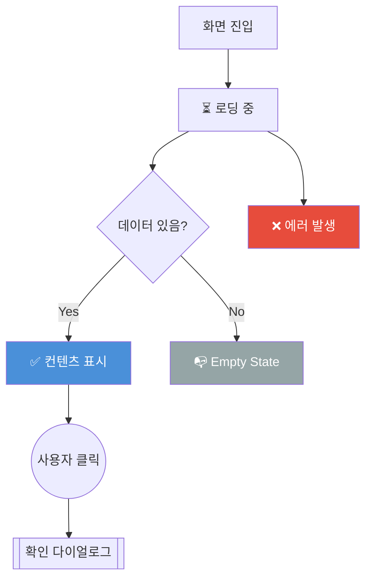

# UI Flows Documentation

각 화면의 상세 UI 인터랙션, 상태 관리, 에러 처리를 문서화합니다.

## 목적

- **타겟 독자**: PO, 디자이너, 개발자
- **목표**: 각 화면의 모든 UI 상태와 사용자 플로우를 시각화
- **용도**: 기획 검토, 디자인 QA, 개발 가이드

## 문서 구조

각 화면별 문서는 다음을 포함합니다:

### 1. 초기 진입 플로우
- 화면 진입 시 초기 상태
- 로딩 프로세스
- 데이터 fetch 여부

### 2. UI 상태
- ✅ **Success State**: 정상 데이터 표시
- ⏳ **Loading State**: 로딩 중 UI
- ❌ **Error State**: 에러 발생 시 UI
- 📭 **Empty State**: 데이터 없을 때 UI
- 🔒 **Locked State**: 권한 없거나 비활성화 상태

### 3. 사용자 액션
- 버튼/링크 클릭
- 탭 전환
- 스크롤/제스처
- 입력 이벤트

### 4. Validation & 에러 처리
- 입력값 검증
- 권한 체크
- 네트워크 에러
- 타임아웃/만료

### 5. 모달 & 다이얼로그
- 확인 팝업
- 안내 메시지
- 튜토리얼
- 알림

## 다이어그램 컨벤션

### 노드 타입
- `[사각형]`: 화면/화면 상태
- `{다이아몬드}`: 조건 분기
- `((원))`: 사용자 액션
- `[[이중 사각형]]`: 모달/다이얼로그

### 색상 코드
- 🔵 **파랑** (`fill:#4A90D9`): 정상 플로우
- 🔴 **빨강** (`fill:#E74C3C`): 에러 상태
- 🟡 **노랑** (`fill:#F39C12`): 경고/주의
- 🟢 **초록** (`fill:#27AE60`): 성공/완료
- ⚪ **회색** (`fill:#95A5A6`): 비활성/Empty

### 예시


## 작성 가이드

### 1. template.md 복사
```bash
cp ui-flows/template.md ui-flows/[화면이름].md
```

### 2. TODO 주석 채우기
- `<!-- TODO: ... -->` 부분을 실제 내용으로 교체
- 해당 화면에 없는 섹션은 삭제

### 3. 실제 상태 확인
- 코드에서 실제 상태 변수명 확인
- API 응답 구조 확인
- 에러 메시지 실제 문구 확인

### 4. 팀 리뷰
- PO: 비즈니스 로직 검증
- 디자이너: UI 상태별 디자인 확인
- 개발자: 구현 가능성 검토

## 파일 목록

- [template.md](./template.md) - 신규 화면 작성용 템플릿
- [home.md](./home.md) - Home 화면 상세 플로우
- [subscribes.md](./subscribes.md) - 수업 탐색 화면 상세 플로우
- [payment.md](./payment.md) - 결제 페이지 상세 플로우
- [payment-success.md](./payment-success.md) - 결제 완료 페이지 상세 플로우
- [reservation.md](./reservation.md) - 예약 화면 상세 플로우
- [classroom.md](./classroom.md) - 수업 진행 화면 상세 플로우
- [review.md](./review.md) - 수업 리뷰 화면 상세 플로우
