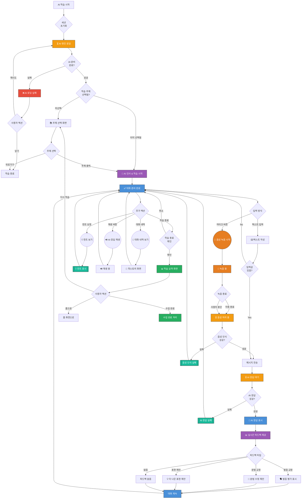

# AI 학습 화면 UI Flow

**라우트**: `/ai-learning` 또는 `/lessons/ai/:lessonId/learning`
**부모 화면**: AI 수업 상세 또는 Home (Smart Talk)
**타입**: 풀스크린 학습 화면

**Figma**: [ai학습 디자인](https://www.figma.com/design/DUFbC6C797d9jW5HsjFh9S/-PODO--APP-DESIGN?node-id=21242-6202)

## 개요

AI 튜터와 함께하는 대화형 학습 화면입니다. 음성 또는 텍스트로 AI와 대화하며 영어를 학습할 수 있으며, 실시간 발음 피드백, 문법 교정, 표현 제안 등의 기능을 제공합니다.

---

## 전체 UI Flow



---

## 상태별 상세 설명

### 1. ⏳ 로딩 상태

**표시 조건**:
- [x] AI 학습 화면 최초 진입 시
- [x] AI 엔진 초기화 중
- [x] 음성 처리 중
- [x] AI 응답 대기 중

**UI 구성**:
- 로딩 스피너 위치: 메시지 영역 하단 (타이핑 인디케이터)
- 스켈레톤 UI 사용 여부: No
- 로딩 텍스트:
  - AI 초기화: "AI 튜터를 준비하고 있어요..."
  - 음성 처리: "음성을 분석하고 있어요..."
  - AI 응답: "AI가 답변을 준비하고 있어요..." + 타이핑 애니메이션

**timeout 처리**:
- timeout 시간: 15초 (AI 응답 대기)
- timeout 시 동작: "AI 응답이 지연되고 있어요. 다시 시도해주세요." 에러 표시

---

### 2. ✅ 성공 상태 (대화 준비 완료)

**표시 조건**:
- [x] AI 엔진 초기화 완료
- [x] 학습 주제 선택 완료
- [x] 대화 세션 시작됨

**UI 구성**:

**헤더**:
- 타이틀: "AI 학습" 또는 선택한 주제명
- 뒤로가기 버튼
- 종료 버튼 (X)
- 진행 시간 표시 (예: "05:32")

**메인 대화 영역**:
- 스크롤 가능한 채팅 뷰
- AI 메시지 (왼쪽 정렬, 보라색 말풍선)
  - 텍스트 내용
  - 재생 버튼 (🔊) - AI 응답 읽어주기
  - 피드백 뱃지 (문법/발음 교정이 있을 경우)
- 사용자 메시지 (오른쪽 정렬, 파란색 말풍선)
  - 텍스트 내용
  - 발음 점수 (음성 입력의 경우)
  - 교정 제안 (있을 경우)

**하단 입력 영역**:
- 텍스트 입력 필드
- 마이크 버튼 (🎤) - 음성 입력
- 전송 버튼 (➤)
- 힌트 버튼 (💡) - 상황별 힌트 제공

**피드백 영역** (메시지 아래 또는 팝업):
- 발음 평가: "Good! 🎉" / "Try again 🔄"
- 문법 교정: "Did you mean: I **am** happy?" (수정 부분 강조)
- 표현 제안: "You can also say: I'm delighted!" (더 나은 표현)

**인터랙션 요소**:

1. **음성 입력**
   - 액션: 마이크 버튼 클릭 → 녹음 시작
   - Validation: 마이크 권한 확인
   - 결과: 음성 인식 후 텍스트로 변환 → AI에게 전송

2. **텍스트 입력**
   - 액션: 텍스트 작성 후 전송 버튼 클릭
   - Validation: 빈 문자열 체크
   - 결과: AI에게 메시지 전송 → AI 응답 대기

3. **힌트 버튼**
   - 액션: 힌트 버튼 클릭
   - Validation: 현재 대화 맥락 존재 여부
   - 결과: 상황에 맞는 표현 힌트 팝업 표시

4. **AI 응답 재생**
   - 액션: 재생 버튼 클릭
   - Validation: TTS 엔진 사용 가능 여부
   - 결과: AI 응답을 음성으로 재생

5. **피드백 클릭**
   - 액션: 문법/발음 피드백 영역 탭
   - Validation: 피드백 데이터 존재
   - 결과: 상세 설명 팝업 표시

---

### 3. ❌ 에러 상태

**에러 타입별 처리**:

#### 3.1 AI 엔진 초기화 실패
```
에러 메시지: "AI 튜터를 불러오는 데 실패했어요. 잠시 후 다시 시도해주세요."
CTA: [재시도 | 홈으로]
```

#### 3.2 음성 인식 실패
```
에러 메시지: "음성을 인식하지 못했어요. 다시 말씀해주세요."
타입: 토스트 (3초 후 자동 사라짐)
CTA: 자동으로 대화 화면으로 복귀
```

#### 3.3 마이크 권한 없음
```
에러 메시지: "마이크 권한이 필요해요. 설정에서 권한을 허용해주세요."
CTA: [설정으로 이동 | 취소]
```

#### 3.4 AI 응답 실패
```
에러 메시지: "AI 응답을 받아오는 데 실패했어요. 다시 시도해주세요."
타입: 메시지 영역에 에러 말풍선
CTA: [재시도 버튼]
```

#### 3.5 네트워크 오류
```
에러 메시지: "네트워크 연결을 확인해주세요."
타입: 상단 배너 (연결 복구 시 자동 사라짐)
CTA: [재연결]
```

---

### 4. 📭 Empty State

**표시 조건**:
- [x] 대화가 아직 시작되지 않음
- [x] AI 인사 메시지만 있는 상태

**UI 구성**:
- 이미지/아이콘: AI 캐릭터 아이콘 (중앙 상단)
- 메시지:
  - AI 인사: "Hi! I'm your AI tutor. Let's start learning English together! 😊"
  - 안내 메시지: "아래 마이크 버튼을 눌러 말하거나 텍스트로 대화를 시작하세요."
- CTA 버튼: 없음 (입력 시작 유도)

---

## Validation Rules

| 필드 | Validation 규칙 | 에러 메시지 |
|------|----------------|------------|
| 음성 입력 | 최소 1초 이상 녹음 | "너무 짧은 음성이에요. 다시 시도해주세요." |
| 음성 입력 | 최대 30초 제한 | "30초가 초과되어 자동 종료되었어요." |
| 텍스트 입력 | 1자 이상, 500자 이하 | "500자 이하로 입력해주세요." |
| 마이크 권한 | 권한 허용 필수 | "마이크 권한을 허용해주세요." |
| 네트워크 | 인터넷 연결 필요 | "네트워크 연결을 확인해주세요." |

---

## 모달 & 다이얼로그

### 1. 힌트 모달

**트리거**: 힌트 버튼 (💡) 클릭
**타입**: 바텀시트

**내용**:
- 제목: "이렇게 말해보세요"
- 내용:
  - 예시 표현 3~5개 (현재 맥락에 맞는)
  - 예: "What do you think about...?"
  - 예: "I'm interested in..."
- 버튼:
  - 주 버튼: "사용하기" → 선택한 표현을 입력창에 자동 입력
  - 보조 버튼: "닫기" → 모달 닫기

### 2. 발음 상세 피드백 모달

**트리거**: 발음 피드백 영역 클릭
**타입**: 바텀시트

**내용**:
- 제목: "발음 평가"
- 내용:
  - 단어별 발음 점수 (예: "Hello: 95점, World: 82점")
  - 발음 개선 팁 (예: "R 발음에 집중해보세요")
  - 음성 재생 버튼 (내 발음 vs. 올바른 발음)
- 버튼:
  - 주 버튼: "다시 연습하기" → 같은 문장 다시 말하기
  - 보조 버튼: "확인" → 모달 닫기

### 3. 학습 종료 확인 다이얼로그

**트리거**: 종료 버튼 (X) 클릭
**타입**: 확인

**내용**:
- 제목: "학습을 종료하시겠어요?"
- 메시지: "지금까지 학습한 내용은 저장돼요."
- 버튼:
  - 주 버튼: "계속 학습" → 다이얼로그 닫기
  - 보조 버튼: "종료" → 학습 요약 화면으로 이동

### 4. 학습 요약 모달

**트리거**: 학습 종료 후 자동 표시
**타입**: 풀스크린 또는 큰 모달

**내용**:
- 제목: "오늘 학습 완료! 🎉"
- 내용:
  - 학습 시간: "15분 30초"
  - 주고받은 메시지 수: "22개"
  - 발음 평균 점수: "87점"
  - 학습한 새 표현: "5개" (리스트 표시)
  - 개선 포인트: "문법 정확도 향상 필요"
- 버튼:
  - 주 버튼: "홈으로" → 홈 화면
  - 보조 버튼: "다시 학습" → 주제 선택 화면

---

## Edge Cases

### 1. 음성 인식이 잘못 인식된 경우

- **조건**: STT가 사용자 의도와 다른 텍스트로 변환
- **동작**:
  - 인식된 텍스트를 말풍선에 표시
  - 사용자가 말풍선을 길게 눌러 수정 가능
  - "다시 말하기" 버튼 제공
- **UI**: 인식된 텍스트 + "수정" 버튼

### 2. AI 응답이 부적절한 경우

- **조건**: AI가 이상한 답변 또는 오류 발생
- **동작**:
  - "신고하기" 버튼 표시 (말풍선 길게 누르기 메뉴)
  - 사용자 피드백 수집
  - 대화 계속 진행 가능
- **UI**: 컨텍스트 메뉴에 "신고하기" 옵션

### 3. 배경 소음이 심한 환경

- **조건**: 음성 인식 실패율이 높음
- **동작**:
  - "조용한 곳에서 다시 시도해주세요" 안내
  - 텍스트 입력 모드 권장
- **UI**: 토스트 메시지

### 4. 학습 중 앱이 백그라운드로 전환

- **조건**: 전화 수신, 다른 앱 전환 등
- **동작**:
  - 대화 세션 일시 중지
  - 포그라운드 복귀 시 "대화를 계속하시겠어요?" 다이얼로그
  - 5분 이상 백그라운드 시 세션 자동 종료
- **UI**: 재개 확인 다이얼로그

### 5. 너무 긴 침묵 (사용자가 답을 못 하는 경우)

- **조건**: 30초 이상 입력 없음
- **동작**:
  - AI가 "괜찮으세요? 힌트를 드릴까요?" 메시지 전송
  - 힌트 버튼 자동 활성화
- **UI**: AI의 도움 메시지 + 힌트 버튼 하이라이트

---

## 개발 참고사항

**주요 API**:
- `POST /api/ai/sessions` - AI 학습 세션 시작
- `POST /api/ai/messages` - 메시지 전송 및 AI 응답 받기
- `POST /api/ai/speech-to-text` - 음성 → 텍스트 변환
- `POST /api/ai/text-to-speech` - 텍스트 → 음성 변환
- `GET /api/ai/sessions/:id/summary` - 학습 요약 조회

**상태 관리**:
- 사용하는 store/context: AILearningContext, AudioContext
- 주요 상태 변수:
  - `sessionId`: 현재 학습 세션 ID
  - `messages`: 대화 메시지 배열
  - `isRecording`: 녹음 중 여부
  - `isAIThinking`: AI 응답 대기 중 여부
  - `currentTopic`: 현재 학습 주제
  - `feedbackData`: 실시간 피드백 데이터
  - `learningStats`: 학습 통계 (시간, 점수 등)

**기술 스택**:
- STT: Web Speech API 또는 Google Cloud Speech-to-Text
- TTS: Web Speech API 또는 Google Cloud Text-to-Speech
- AI 백엔드: OpenAI GPT API 또는 자체 AI 모델
- WebSocket: 실시간 타이핑 인디케이터 (선택 사항)

**Feature Flags**:
- `ENABLE_AI_LEARNING`: AI 학습 모드 활성화
- `ENABLE_VOICE_INPUT`: 음성 입력 기능 활성화
- `ENABLE_PRONUNCIATION_FEEDBACK`: 발음 평가 기능 활성화
- `ENABLE_GRAMMAR_CORRECTION`: 문법 교정 기능 활성화

---

## 디자인 참고

<!-- TODO: Figma 링크나 디자인 노트 -->
- Figma: [링크 추가 필요]
- 디자인 노트:
  - AI 메시지는 보라색 계열 말풍선 (브랜드 컬러)
  - 사용자 메시지는 파란색 계열 말풍선
  - 발음 점수는 색상 그라데이션으로 표시 (낮음: 빨강 → 높음: 초록)
  - 피드백은 비침투적으로 표시 (메시지 하단 작은 뱃지)

---

## 히스토리

| 날짜 | 작성자 | 변경 내용 |
|------|--------|----------|
| 2026-03-04 | Claude | 최초 작성 |
