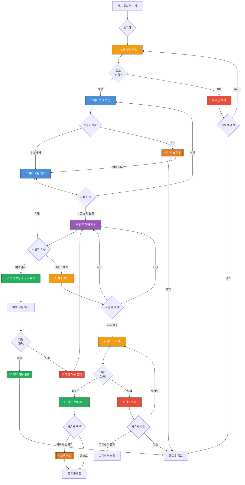

# 구독 해지 플로우 UI Flow

**라우트**: `/churn` 또는 `/my-podo/plan/cancel`
**부모 화면**: 내 플랜 관리
**타입**: 풀스크린 플로우

**Figma**: [마이포도/마이 포도 플랜/구독 해지하기 디자인](https://www.figma.com/design/DUFbC6C797d9jW5HsjFh9S/-PODO--APP-DESIGN?node-id=15927-10335)

## 개요

사용자가 구독을 해지하는 전체 플로우를 관리하는 화면입니다. 해지 사유 수집, 만류 시도, 최종 확인 등의 단계를 포함합니다.

---

## 전체 UI Flow



---

## 단계별 상세 설명

### Step 1: 📄 해지 안내 화면

**UI 구성**:

**헤더**:
- 타이틀: "구독 해지"
- 뒤로가기 버튼
- 진행 상태 표시: "1 / 4"

**본문**:
- 아이콘: 슬픈 이모지 또는 일러스트
- 제목: "정말 떠나시나요? 😢"
- 메시지:
  - "해지하시면 다음 혜택을 더 이상 받을 수 없어요:"
  - 혜택 리스트 (체크박스 아이콘):
    - "✅ 월 12회 무제한 수업"
    - "✅ AI 튜터 무제한 이용"
    - "✅ 주간 학습 리포트"
    - "✅ 우선 예약 혜택"

**해지 시점 안내**:
- "현재 플랜: 프리미엄 플랜"
- "다음 결제일: 2026-04-01"
- "해지 시점: 다음 결제일(2026-04-01)까지 사용 후 해지"
- 주의사항: "해지 전까지 모든 서비스를 정상적으로 이용할 수 있어요"

**버튼**:
- 주 버튼: "그래도 해지할게요" (회색 또는 빨간색) → Step 2
- 보조 버튼: "계속 이용하기" (브랜드 컬러) → 취소 확인

---

### Step 2: 🤔 해지 사유 입력 화면

**UI 구성**:

**헤더**:
- 타이틀: "해지 사유"
- 뒤로가기 버튼
- 진행 상태: "2 / 4"

**본문**:
- 제목: "어떤 점이 불편하셨나요?"
- 부제: "소중한 의견을 들려주세요. 더 나은 서비스를 만들겠습니다."

**사유 선택** (복수 선택 가능):
- 체크박스 리스트:
  - "🎓 수업 내용이 만족스럽지 않아요"
  - "💰 가격이 부담돼요"
  - "⏰ 수업 시간을 맞추기 어려워요"
  - "👨‍🏫 튜터와 맞지 않아요"
  - "📱 앱 사용이 불편해요"
  - "🎯 학습 효과를 느끼지 못했어요"
  - "📅 일정이 바빠서 시간이 없어요"
  - "🔄 다른 서비스로 이동해요"
  - "기타 (직접 입력)"

**기타 의견 (선택)**:
- 텍스트 입력 필드 (최대 500자)
- 플레이스홀더: "추가로 전달하고 싶은 의견을 자유롭게 작성해주세요"

**버튼**:
- 주 버튼: "다음" (1개 이상 선택 시 활성화) → Step 3
- 보조 버튼: "이전" → Step 1

---

### Step 3: 💰 만류 혜택 제안 화면 (Retention)

**UI 구성**:

**헤더**:
- 타이틀: "떠나기 전에"
- 뒤로가기 버튼
- 진행 상태: "3 / 4"

**본문**:
- 제목: "잠깐만요! 특별 혜택을 준비했어요 🎁"
- 메시지: "소중한 고객님을 위해 특별한 혜택을 드리고 싶어요"

**혜택 카드** (사유에 따라 다름):

**시나리오 1: 가격 부담**
- 혜택: "3개월 30% 할인"
- 설명: "다음 3개월간 월 34,300원에 이용하세요 (정상가 49,000원)"
- 유효기간: "지금 수락하면 즉시 적용돼요"

**시나리오 2: 시간 부족**
- 혜택: "플랜 일시정지 (최대 2개월)"
- 설명: "바쁜 기간 동안 플랜을 정지하고 나중에 다시 시작하세요"

**시나리오 3: 학습 효과 부족**
- 혜택: "1:1 학습 컨설팅 + 1개월 무료"
- 설명: "학습 전문가와 1:1 상담 후 맞춤 학습 플랜을 제공해드려요"

**시나리오 4: 기본 제안**
- 혜택: "2주 무료 연장"
- 설명: "2주간 무료로 더 사용해보시고 결정하세요"

**버튼**:
- 주 버튼: "혜택 받고 계속 이용" (초록색) → 혜택 적용
- 보조 버튼: "괜찮아요, 해지할게요" → Step 4

---

### Step 4: ⚠️ 최종 확인 화면

**UI 구성**:

**헤더**:
- 타이틀: "최종 확인"
- 뒤로가기 버튼
- 진행 상태: "4 / 4"

**본문**:
- 아이콘: 경고 아이콘 (⚠️)
- 제목: "정말로 해지하시겠어요?"
- 메시지:
  - "해지하시면 다음과 같이 처리됩니다:"
  - 해지 세부사항:
    - "✅ 2026-04-01까지 서비스 이용 가능"
    - "❌ 2026-04-01 이후 서비스 자동 종료"
    - "❌ 남은 티켓 및 혜택 모두 소멸"
    - "❌ 학습 데이터는 6개월 후 삭제"

**환불 정책 안내**:
- "💰 환불 정보:"
- "사용하지 않은 기간에 대해서는 환불이 불가능합니다. (약관 참조)"

**재가입 안내**:
- "재가입 시 혜택:"
- "30일 이내 재가입 시 이전 플랜으로 복구 가능해요"

**버튼**:
- 주 버튼: "해지 확정" (빨간색) → 해지 처리
- 보조 버튼: "취소" (회색) → Step 3

---

### Step 5: ✅ 해지 완료 화면

**UI 구성**:

**본문**:
- 아이콘: 체크 아이콘 또는 슬픈 이모지
- 제목: "해지가 완료되었어요"
- 메시지:
  - "2026-04-01까지 서비스를 계속 이용할 수 있어요"
  - "언제든 다시 찾아주시면 환영합니다 🙏"

**해지 정보 요약**:
- "해지 플랜: 프리미엄 플랜"
- "해지일: 2026-04-01"
- "마지막 사용 가능일: 2026-03-31"

**피드백 요청** (선택):
- "마지막으로 한 말씀만 더 부탁드려요"
- CTA 버튼: "피드백 남기기" (선택 사항)

**버튼**:
- 주 버튼: "홈으로" → 홈 화면
- 보조 버튼: "재가입 안내 보기" → 재가입 정보 페이지

---

## Validation Rules

| 단계 | Validation 규칙 | 에러 메시지 |
|------|----------------|------------|
| Step 2 | 최소 1개 사유 선택 | "해지 사유를 선택해주세요." |
| Step 2 | 기타 선택 시 텍스트 입력 | "기타 사유를 입력해주세요." |
| Step 4 | 최종 확인 체크박스 | "해지를 확인해주세요." |

---

## 모달 & 다이얼로그

### 1. 해지 취소 확인 다이얼로그

**트리거**: "계속 이용하기" 또는 "취소" 버튼 클릭
**타입**: 확인

**내용**:
- 제목: "해지를 취소하시겠어요?"
- 메시지: "해지 과정을 중단하고 계속 이용하시겠어요?"
- 버튼:
  - 주 버튼: "네, 계속 이용할게요" → 플로우 종료
  - 보조 버튼: "아니요" → 다이얼로그 닫기

### 2. 혜택 적용 확인 다이얼로그

**트리거**: "혜택 받고 계속 이용" 버튼 클릭
**타입**: 확인

**내용**:
- 제목: "혜택을 적용하시겠어요?"
- 메시지:
  - "다음 혜택이 즉시 적용됩니다:"
  - "3개월 30% 할인 (월 34,300원)"
- 버튼:
  - 주 버튼: "적용하기" → 혜택 적용 처리
  - 보조 버튼: "취소" → 다이얼로그 닫기

### 3. 피드백 작성 바텀시트

**트리거**: "피드백 남기기" 버튼 클릭
**타입**: 바텀시트

**내용**:
- 제목: "소중한 의견 감사합니다"
- 텍스트 입력 필드:
  - 라벨: "어떤 점이 개선되면 다시 이용하실 건가요?"
  - 플레이스홀더: "자유롭게 작성해주세요"
  - 최대 1000자
- 버튼:
  - 주 버튼: "제출" → 피드백 전송
  - 보조 버튼: "건너뛰기" → 바텀시트 닫기

---

## Edge Cases

### 1. 해지 불가 조건 (최소 사용 기간 미충족)

- **조건**: 가입 후 1개월 미만
- **동작**: 해지 플로우 진입 차단
- **UI**: "최소 사용 기간(1개월)이 지나지 않았어요. 2026-04-01부터 해지 가능합니다."

### 2. 진행 중인 수업이 있을 때

- **조건**: 예약된 수업이 남아 있음
- **동작**: 경고 메시지 표시
- **UI**: "예약된 수업 2개가 남아 있어요. 해지 시 자동 취소됩니다."

### 3. 사용하지 않은 티켓

- **조건**: 남은 수업 티켓 있음
- **동작**: 경고 메시지
- **UI**: "사용하지 않은 티켓 5개가 소멸됩니다."

### 4. 프로모션 할인 적용 중

- **조건**: 특별 할인 혜택 적용 중
- **동작**: 혜택 상실 안내
- **UI**: "현재 적용 중인 30% 할인 혜택이 사라져요."

### 5. 연간 플랜 중도 해지

- **조건**: 연간 결제 플랜
- **동작**: 환불 정책 안내
- **UI**: "연간 플랜은 중도 해지 시 환불이 불가능합니다."

---

## 개발 참고사항

**주요 API**:
- `GET /api/plans/current` - 현재 플랜 정보 조회
- `POST /api/churn/start` - 해지 플로우 시작
- `POST /api/churn/reasons` - 해지 사유 제출
- `POST /api/churn/retention-offer` - 만류 혜택 조회
- `POST /api/churn/accept-offer` - 혜택 수락
- `POST /api/churn/confirm` - 해지 확정
- `POST /api/churn/feedback` - 피드백 제출

**상태 관리**:
- 사용하는 store/context: ChurnContext, PlanContext
- 주요 상태 변수:
  - `currentStep`: 현재 단계 (1~5)
  - `selectedReasons`: 선택된 해지 사유
  - `retentionOffer`: 제공된 만류 혜택
  - `churnData`: 해지 관련 데이터

**해지 사유 코드**:
```typescript
enum ChurnReason {
  CONTENT_UNSATISFIED = 'content_unsatisfied',
  PRICE_BURDEN = 'price_burden',
  TIME_CONSTRAINT = 'time_constraint',
  TUTOR_MISMATCH = 'tutor_mismatch',
  APP_UX_ISSUE = 'app_ux_issue',
  NO_EFFECT = 'no_effect',
  BUSY_SCHEDULE = 'busy_schedule',
  SWITCHING_SERVICE = 'switching_service',
  OTHER = 'other',
}
```

**만류 혜택 타입**:
```typescript
interface RetentionOffer {
  type: 'discount' | 'pause' | 'consulting' | 'free_extension';
  title: string;
  description: string;
  value?: number; // 할인율 또는 금액
  duration?: number; // 적용 기간 (개월)
}
```

**Feature Flags**:
- `ENABLE_CHURN_RETENTION`: 만류 혜택 기능 활성화
- `ENABLE_CHURN_FEEDBACK`: 피드백 수집 기능
- `ENABLE_IMMEDIATE_CANCELLATION`: 즉시 해지 옵션 (기본: 결제일까지 사용 후 해지)

---

## 디자인 참고

- Figma: [링크 추가 필요]
- 디자인 노트:
  - 해지 버튼은 빨간색 (경고)
  - 계속 이용 버튼은 브랜드 컬러 (유지 유도)
  - 만류 혜택 카드는 눈에 띄게 디자인
  - 진행 상태 표시로 사용자 위치 파악

---

## 히스토리

| 날짜 | 작성자 | 변경 내용 |
|------|--------|----------|
| 2026-03-04 | Claude | 최초 작성 |

## Figma 관련 화면

- [탈퇴_정규 레슨권 보유한 경우](https://www.figma.com/design/DUFbC6C797d9jW5HsjFh9S/-PODO--APP-DESIGN?node-id=21853-11034)
- [환불_환불 방어 불가능한 사유](https://www.figma.com/design/DUFbC6C797d9jW5HsjFh9S/-PODO--APP-DESIGN?node-id=21853-10239)
- [환불_환불 방어 가능한 사유_잔여 홀딩일이 남은 유저](https://www.figma.com/design/DUFbC6C797d9jW5HsjFh9S/-PODO--APP-DESIGN?node-id=21852-8617)
- [환불_환불 방어 가능한 사유_잔여 홀딩일이 남지 않은 유저](https://www.figma.com/design/DUFbC6C797d9jW5HsjFh9S/-PODO--APP-DESIGN?node-id=21853-9431)
- [환불_환불 불가능한 레슨권](https://www.figma.com/design/DUFbC6C797d9jW5HsjFh9S/-PODO--APP-DESIGN?node-id=21852-8374)
- [환불_미납금이 있는 경우](https://www.figma.com/design/DUFbC6C797d9jW5HsjFh9S/-PODO--APP-DESIGN?node-id=21849-11858)
