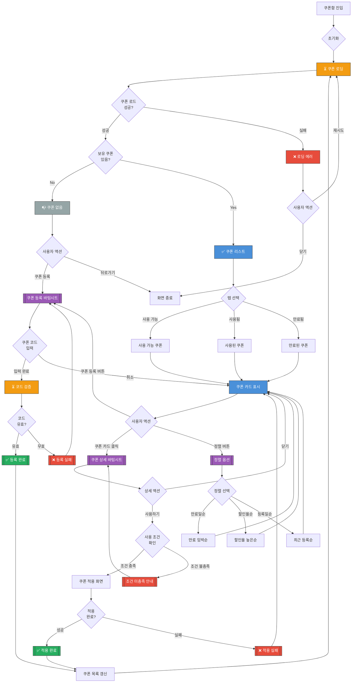

# 쿠폰함 화면 UI Flow

**라우트**: `/my-podo/coupons`
**부모 화면**: My Podo
**타입**: 풀스크린
**Figma**: [마이포도/마이 쿠폰 디자인](https://www.figma.com/design/DUFbC6C797d9jW5HsjFh9S/-PODO--APP-DESIGN?node-id=15927-13261)

## 개요

사용자가 보유한 쿠폰을 확인하고 등록/사용할 수 있는 화면입니다. 할인 쿠폰, 무료 수업 쿠폰, 프로모션 쿠폰 등을 관리합니다.

---

## 전체 UI Flow



---

## 상태별 상세 설명

### 1. ⏳ 로딩 상태

**표시 조건**:
- [x] 화면 최초 진입 시
- [x] 쿠폰 등록 후 갱신 시
- [x] Pull-to-refresh 시

**UI 구성**:
- 로딩 스피너 위치: 전체 화면 중앙 또는 스켈레톤
- 스켈레톤 UI 사용 여부: **Yes** - 쿠폰 카드 스켈레톤
- 로딩 텍스트: "쿠폰을 불러오고 있어요..."

**timeout 처리**:
- timeout 시간: 10초
- timeout 시 동작: 에러 상태로 전환

---

### 2. ✅ 성공 상태 (쿠폰 리스트)

**표시 조건**:
- [x] API 응답 성공
- [x] 1개 이상의 쿠폰 보유

**UI 구성**:

**헤더**:
- 타이틀: "쿠폰함"
- 뒤로가기 버튼
- 쿠폰 등록 버튼 (+ 아이콘)

**탭 바**:
- 사용 가능 (count) | 사용됨 (count) | 만료됨 (count)

**쿠폰 카드 리스트**:

1. **할인 쿠폰 카드**
   - 쿠폰 이름: "신규 회원 10% 할인"
   - 할인 금액/율: "10% 할인" 또는 "5,000원 할인"
   - 사용 조건: "월 플랜 구매 시"
   - 만료일: "2026-04-04까지"
   - 상태 뱃지: "사용 가능" (초록) / "만료 임박" (주황)
   - 사용하기 버튼

2. **무료 수업 쿠폰**
   - 쿠폰 이름: "무료 체험 수업권"
   - 혜택: "1회 무료"
   - 사용 조건: "신규 회원만"
   - 만료일: "2026-04-04까지"
   - 사용하기 버튼

3. **사용된 쿠폰** (사용됨 탭)
   - 회색 처리 (opacity 0.6)
   - "사용 완료" 뱃지
   - 사용일: "2026-03-01 사용"

4. **만료된 쿠폰** (만료됨 탭)
   - 회색 처리
   - "만료됨" 뱃지
   - 만료일 표시

**푸터 고정 버튼**:
- "쿠폰 등록하기" 버튼

**인터랙션 요소**:

1. **쿠폰 등록 버튼**
   - 액션: 쿠폰 등록 바텀시트 표시
   - Validation: 없음
   - 결과: 코드 입력 필드 + 등록 버튼

2. **쿠폰 카드 클릭**
   - 액션: 쿠폰 상세 바텀시트 표시
   - Validation: 없음
   - 결과: 상세 정보 + 사용하기 버튼

3. **사용하기 버튼**
   - 액션: 쿠폰 적용 플로우 시작
   - Validation: 사용 조건 확인
   - 결과: 결제/구매 화면으로 이동 (쿠폰 자동 적용)

4. **정렬 버튼**
   - 액션: 정렬 옵션 메뉴 표시
   - Validation: 없음
   - 결과: 선택한 기준으로 정렬

---

### 3. ❌ 에러 상태

**에러 타입별 처리**:

#### 3.1 네트워크 에러
```
에러 메시지: "쿠폰 정보를 불러올 수 없어요. 네트워크를 확인해주세요."
CTA: [재시도 | 닫기]
```

#### 3.2 쿠폰 코드 무효
```
에러 메시지: "유효하지 않은 쿠폰 코드예요. 다시 확인해주세요."
타입: 입력 필드 하단 빨간색 텍스트
```

#### 3.3 쿠폰 이미 사용됨
```
에러 메시지: "이미 사용된 쿠폰이에요."
타입: 토스트 메시지
```

#### 3.4 쿠폰 사용 조건 미충족
```
에러 메시지: "이 쿠폰은 월 플랜 구매 시에만 사용 가능해요."
타입: 바텀시트 안내
CTA: [확인]
```

---

### 4. 📭 Empty State

**표시 조건**:
- [x] 보유한 쿠폰이 0개
- [x] 특정 탭에 쿠폰 없음

**UI 구성**:

**전체 쿠폰 없음**:
- 이미지/아이콘: 빈 쿠폰 일러스트
- 메시지:
  - 주: "아직 등록된 쿠폰이 없어요"
  - 보조: "쿠폰 코드를 입력하고 혜택을 받아보세요!"
- CTA 버튼: "쿠폰 등록하기"

**특정 탭 없음** (예: 사용 가능 쿠폰 0개):
- 메시지: "사용 가능한 쿠폰이 없어요"
- CTA: 없음 (다른 탭으로 이동 유도)

---

## Validation Rules

| 필드 | Validation 규칙 | 에러 메시지 |
|------|----------------|------------|
| 쿠폰 코드 | 영문/숫자 조합, 8~16자 | "올바른 쿠폰 코드를 입력해주세요." |
| 쿠폰 코드 | 중복 등록 불가 | "이미 등록된 쿠폰이에요." |
| 쿠폰 사용 | 만료일 확인 | "만료된 쿠폰은 사용할 수 없어요." |
| 쿠폰 사용 | 사용 조건 확인 | "사용 조건을 충족하지 않아요." |

---

## 모달 & 다이얼로그

### 1. 쿠폰 등록 바텀시트

**트리거**: 쿠폰 등록 버튼 클릭
**타입**: 바텀시트

**내용**:
- 제목: "쿠폰 등록"
- 입력 필드:
  - 라벨: "쿠폰 코드 입력"
  - 플레이스홀더: "예: PODO2026SALE"
  - 입력 형식: 대문자 자동 변환
- 버튼:
  - 주 버튼: "등록하기" → 코드 검증 + 등록
  - 보조 버튼: "취소" → 바텀시트 닫기

**검증 실패 시**:
- 입력 필드 하단에 빨간색 에러 메시지 표시
- 예: "유효하지 않은 코드예요"

### 2. 쿠폰 상세 바텀시트

**트리거**: 쿠폰 카드 클릭
**타입**: 바텀시트

**내용**:
- 제목: 쿠폰 이름 (예: "신규 회원 10% 할인")
- 상세 정보:
  - 할인 내용: "10% 할인 (최대 5,000원)"
  - 사용 조건: "월 플랜 구매 시 적용 가능"
  - 등록일: "2026-03-01"
  - 만료일: "2026-04-04까지"
  - 유의사항: "다른 쿠폰과 중복 사용 불가"
- 버튼:
  - 주 버튼: "사용하기" → 사용 가능한 화면으로 이동
  - 보조 버튼: "닫기" → 바텀시트 닫기

### 3. 쿠폰 등록 성공 토스트

**트리거**: 쿠폰 등록 성공 시
**타입**: 토스트 (3초 자동 사라짐)

**내용**:
- 메시지: "쿠폰이 등록되었어요! 🎉"
- 아이콘: ✅

### 4. 만료 임박 안내 다이얼로그

**트리거**: 화면 진입 시 만료 임박 쿠폰 있을 경우
**타입**: 안내 (1일 1회만 표시)

**내용**:
- 제목: "곧 만료되는 쿠폰이 있어요! ⏰"
- 메시지:
  - "3일 이내에 만료되는 쿠폰이 2개 있어요."
  - 쿠폰 목록:
    - "신규 회원 10% 할인 (2일 남음)"
    - "무료 체험 수업권 (1일 남음)"
- 버튼:
  - 주 버튼: "지금 사용하기" → 첫 번째 쿠폰 상세
  - 보조 버튼: "확인" → 다이얼로그 닫기

---

## Edge Cases

### 1. 쿠폰 코드 대소문자 구분

- **조건**: 사용자가 소문자로 입력
- **동작**: 자동으로 대문자로 변환
- **UI**: 입력 즉시 대문자로 표시

### 2. 중복 사용 불가 쿠폰

- **조건**: 다른 쿠폰과 함께 사용 불가
- **동작**: 결제 화면에서 쿠폰 선택 시 다른 쿠폰 자동 해제
- **UI**: "다른 쿠폰과 중복 사용 불가" 안내

### 3. 최소 결제 금액 조건

- **조건**: "30,000원 이상 결제 시" 조건
- **동작**: 조건 미충족 시 쿠폰 사용 불가
- **UI**: "최소 30,000원 이상 결제 시 사용 가능" 안내

### 4. 특정 상품에만 적용 가능

- **조건**: "프리미엄 플랜 전용" 쿠폰
- **동작**: 다른 플랜 선택 시 쿠폰 비활성화
- **UI**: 회색 처리 + "프리미엄 플랜 전용" 뱃지

### 5. 쿠폰 만료 후 자동 삭제

- **조건**: 만료 후 30일 경과
- **동작**: 자동으로 쿠폰함에서 제거
- **UI**: 만료됨 탭에서도 30일 후 사라짐

---

## 개발 참고사항

**주요 API**:
- `GET /api/coupons` - 보유 쿠폰 목록 조회
- `POST /api/coupons/register` - 쿠폰 등록
- `POST /api/coupons/:id/apply` - 쿠폰 적용
- `GET /api/coupons/:id` - 쿠폰 상세 조회

**상태 관리**:
- 사용하는 store/context: CouponContext
- 주요 상태 변수:
  - `coupons`: 쿠폰 배열
  - `selectedTab`: 현재 탭 ('available' | 'used' | 'expired')
  - `sortBy`: 정렬 기준
  - `isLoading`: 로딩 상태

**쿠폰 데이터 구조**:
```typescript
interface Coupon {
  id: string;
  code: string; // 쿠폰 코드
  name: string; // 쿠폰 이름
  type: 'discount_percent' | 'discount_amount' | 'free_lesson';
  value: number; // 10 (10%) 또는 5000 (5000원)
  condition: string; // 사용 조건 설명
  expiryDate: string; // ISO 8601
  registeredAt: string;
  usedAt?: string; // 사용일 (사용된 경우)
  status: 'available' | 'used' | 'expired';
}
```

**Feature Flags**:
- `ENABLE_COUPON_REGISTRATION`: 쿠폰 등록 기능 활성화
- `ENABLE_COUPON_SHARING`: 쿠폰 공유 기능 (향후)

---

## 디자인 참고

- Figma: [링크 추가 필요]
- 디자인 노트:
  - 쿠폰 카드는 그라데이션 배경 (타입별 색상)
  - 만료 임박 쿠폰은 주황색 테두리
  - 사용된/만료된 쿠폰은 opacity 0.6

---

## 히스토리

| 날짜 | 작성자 | 변경 내용 |
|------|--------|----------|
| 2026-03-04 | Claude | 최초 작성 |

## Figma 관련 화면

- [웰컴백 쿠폰 팝업](https://www.figma.com/design/DUFbC6C797d9jW5HsjFh9S/-PODO--APP-DESIGN?node-id=4511-273)
- [쿠폰 선택](https://www.figma.com/design/DUFbC6C797d9jW5HsjFh9S/-PODO--APP-DESIGN?node-id=21515-15725)
