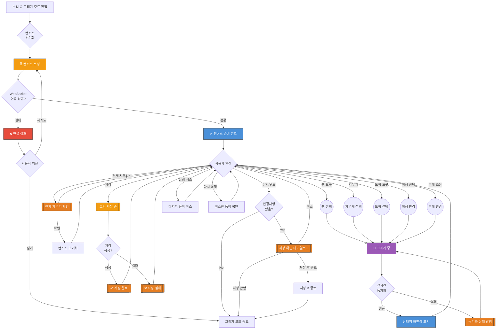

# 그림 그리기 화면 UI Flow

**라우트**: `/drawing` (또는 classroom 내 인터랙티브 모드)
**부모 화면**: Classroom
**타입**: 풀스크린 인터랙티브 화면

## 개요

수업 중 튜터와 학생이 함께 그림을 그리며 소통할 수 있는 화면입니다. 실시간 협업 드로잉 기능을 제공하며, 튜터가 설명을 위해 그림을 그리거나 학생이 그림으로 답변할 수 있습니다.

---

## 전체 UI Flow



---

## 상태별 상세 설명

### 1. ⏳ 로딩 상태

**표시 조건**:
- [x] 그리기 모드 최초 진입 시
- [x] WebSocket 연결 시도 중
- [x] 기존 그림 데이터 로드 중

**UI 구성**:
- 로딩 스피너 위치: 전체 화면 중앙 오버레이
- 스켈레톤 UI 사용 여부: No (스피너만 표시)
- 로딩 텍스트: "캔버스를 준비하고 있어요..."

**timeout 처리**:
- timeout 시간: 10초
- timeout 시 동작: 연결 실패 에러 표시 및 재시도 제안

---

### 2. ✅ 성공 상태 (캔버스 준비 완료)

**표시 조건**:
- [x] WebSocket 연결 성공
- [x] 캔버스 초기화 완료
- [x] 실시간 동기화 준비 완료

**UI 구성**:

**헤더**:
- 타이틀: "그림 그리기" 또는 튜터/학생 이름
- 닫기 버튼 (X)
- 저장 버튼 (상단 우측)

**메인 캔버스**:
- 흰색 배경의 드로잉 캔버스 (전체 화면)
- 실시간 터치/마우스 인풋 처리
- 상대방의 그림이 실시간으로 표시됨

**하단 툴바**:
1. **펜 도구** 🖊️
   - 기본 선택 상태
   - 터치/마우스로 자유롭게 그리기

2. **지우개** 🧹
   - 부분 지우기 모드
   - 지우개 크기 조절 가능

3. **도형 도구** 📐
   - 원, 사각형, 직선, 화살표 등
   - 탭하여 도형 종류 선택

4. **색상 선택기** 🎨
   - 기본 색상 팔레트 (8~12가지)
   - 선택한 색상으로 즉시 변경

5. **두께 조절** 📏
   - 얇게 / 중간 / 굵게 (3단계)
   - 슬라이더 또는 버튼 방식

6. **실행 취소 / 다시 실행** ↩️↪️
   - 마지막 N개 동작까지 취소 가능 (예: 최대 20개)

7. **전체 지우기** 🗑️
   - 확인 다이얼로그 후 캔버스 초기화

**인터랙션 요소**:

1. **드로잉 액션**
   - 액션: 펜/지우개/도형으로 캔버스에 그리기
   - Validation: WebSocket 연결 상태 확인
   - 결과: 실시간으로 상대방 화면에 동기화

2. **저장 버튼**
   - 액션: 현재 캔버스 상태를 이미지로 저장
   - Validation: 그려진 내용이 있는지 확인
   - 결과: 디바이스 갤러리에 저장 + 성공 토스트

3. **닫기 버튼**
   - 액션: 그리기 모드 종료
   - Validation: 저장하지 않은 변경사항 확인
   - 결과: 저장 확인 다이얼로그 또는 즉시 종료

4. **전체 지우기**
   - 액션: 캔버스 전체 초기화
   - Validation: 확인 다이얼로그 표시
   - 결과: 캔버스 내용 삭제 및 양쪽 화면 동기화

---

### 3. ❌ 에러 상태

**에러 타입별 처리**:

#### 3.1 WebSocket 연결 실패
```
에러 메시지: "실시간 연결에 실패했어요. 다시 시도해주세요."
CTA: [재시도 | 닫기]
```

#### 3.2 동기화 실패
```
에러 메시지: "일시적으로 동기화에 실패했어요. 계속 그릴 수 있지만 상대방에게 보이지 않을 수 있어요."
CTA: [확인]
타입: 토스트 (자동 사라짐)
```

#### 3.3 저장 실패
```
에러 메시지: "그림 저장에 실패했어요. 다시 시도해주세요."
CTA: [재시도 | 닫기]
```

#### 3.4 네트워크 끊김
```
에러 메시지: "네트워크 연결이 끊어졌어요. 연결을 확인해주세요."
CTA: [재연결 시도 | 종료]
```

---

### 4. 📭 Empty State

**표시 조건**:
- [x] 캔버스에 아무것도 그려지지 않은 초기 상태

**UI 구성**:
- 이미지/아이콘: 없음 (빈 흰색 캔버스)
- 메시지: 캔버스 중앙에 반투명 가이드 텍스트
  - "여기에 그림을 그려보세요!"
  - "튜터와 함께 그리며 대화해보세요"
- CTA 버튼: 없음 (즉시 그리기 시작)

---

## Validation Rules

| 동작 | Validation 규칙 | 에러 메시지 |
|------|----------------|------------|
| 그리기 | WebSocket 연결 상태 확인 | "연결이 끊어졌어요. 재연결을 시도해주세요." |
| 저장 | 캔버스에 그려진 내용 존재 여부 | "저장할 내용이 없어요." |
| 전체 지우기 | 캔버스에 그려진 내용 존재 여부 | (없으면 버튼 비활성화) |
| 실행 취소 | 취소 가능한 히스토리 존재 | (없으면 버튼 비활성화) |

---

## 모달 & 다이얼로그

### 1. 저장 확인 다이얼로그

**트리거**: 닫기 버튼 클릭 시 + 변경사항이 저장되지 않음
**타입**: 확인

**내용**:
- 제목: "그림을 저장하시겠어요?"
- 메시지: "저장하지 않으면 그린 내용이 사라져요."
- 버튼:
  - 주 버튼: "저장 후 종료" → 저장 API 호출 후 화면 닫기
  - 보조 버튼 1: "저장 안 함" → 즉시 화면 닫기
  - 보조 버튼 2: "취소" → 다이얼로그 닫기

### 2. 전체 지우기 확인 다이얼로그

**트리거**: 전체 지우기 버튼 클릭 시
**타입**: 확인

**내용**:
- 제목: "전체 지우기"
- 메시지: "그린 모든 내용이 삭제돼요. 계속하시겠어요?"
- 버튼:
  - 주 버튼: "지우기" → 캔버스 초기화 + 양쪽 동기화
  - 보조 버튼: "취소" → 다이얼로그 닫기

### 3. 동기화 실패 토스트

**트리거**: 실시간 동기화 중 일시적 네트워크 오류
**타입**: 안내 (자동 사라짐)

**내용**:
- 메시지: "일시적으로 동기화에 실패했어요."
- 아이콘: ⚠️
- 지속 시간: 3초

---

## Edge Cases

### 1. 수업 중 네트워크 단절

- **조건**: 그리기 중 네트워크가 끊어짐
- **동작**:
  - 로컬에서는 계속 그릴 수 있음 (오프라인 모드)
  - 재연결 시도 자동 실행 (백그라운드)
  - 재연결 성공 시 변경사항 동기화 시도
- **UI**: 상단에 "연결 중..." 배너 표시

### 2. 상대방이 먼저 그리기 모드 종료

- **조건**: 튜터 또는 학생이 그리기 모드를 먼저 종료
- **동작**:
  - 상대방 화면에 "상대방이 그리기를 종료했어요" 토스트 표시
  - 계속 그릴 수 있지만 실시간 동기화는 중단됨
- **UI**: 토스트 메시지 + 상단 상태 표시

### 3. 동시에 같은 영역을 그릴 때

- **조건**: 튜터와 학생이 거의 동시에 같은 위치에 그림
- **동작**:
  - 타임스탬프 기준으로 나중 동작이 우선 (CRDT 방식)
  - 또는 레이어 분리 (튜터=레이어1, 학생=레이어2)
- **UI**: 색상으로 구분 (튜터: 빨강, 학생: 파랑 등)

### 4. 캔버스 용량 초과

- **조건**: 너무 많이 그려서 데이터 크기가 한계 초과
- **동작**:
  - 경고 메시지 표시
  - 더 이상 그릴 수 없음
  - 일부 지우거나 초기화 요청
- **UI**: 다이얼로그 "캔버스가 가득 찼어요. 일부 내용을 지워주세요."

---

## 개발 참고사항

**주요 API**:
- `WebSocket /ws/drawing/:sessionId` - 실시간 드로잉 동기화
- `POST /api/drawing/save` - 그림 저장
- `GET /api/drawing/:sessionId` - 기존 그림 불러오기

**상태 관리**:
- 사용하는 store/context: DrawingContext, WebSocketContext
- 주요 상태 변수:
  - `canvasData`: Canvas 데이터 (base64 또는 path array)
  - `selectedTool`: 현재 선택된 도구 (pen, eraser, shape)
  - `strokeColor`: 선 색상
  - `strokeWidth`: 선 두께
  - `history`: 실행 취소/다시 실행용 히스토리 스택
  - `isSyncing`: 동기화 진행 중 여부
  - `isConnected`: WebSocket 연결 상태

**기술 스택**:
- Canvas API (Web) 또는 React Native Canvas
- WebSocket for real-time sync
- CRDT (Conflict-free Replicated Data Type) 고려

**Feature Flags**:
- `ENABLE_DRAWING_MODE`: 그리기 모드 활성화 여부
- `ENABLE_SHAPE_TOOLS`: 도형 도구 활성화 여부
- `ENABLE_CANVAS_SAVE`: 저장 기능 활성화 여부

---

## 디자인 참고

<!-- TODO: Figma 링크나 디자인 노트 -->
- Figma: [링크 추가 필요]
- 디자인 노트:
  - 색상 팔레트는 브랜드 컬러 기반
  - 툴바는 항상 하단 고정 (thumb zone 고려)
  - 실시간 동기화는 상대방 색상으로 구분 표시

---

## 히스토리

| 날짜 | 작성자 | 변경 내용 |
|------|--------|----------|
| 2026-03-04 | Claude | 최초 작성 |
