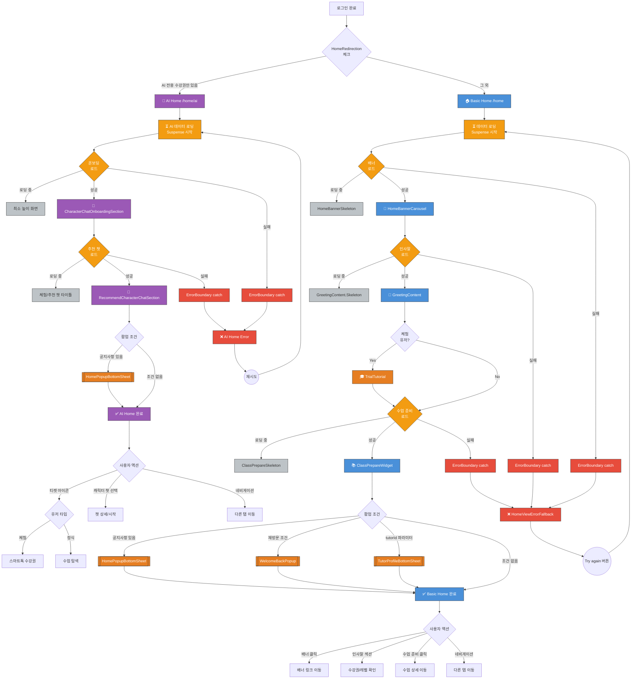

# Home 화면 UI Flow

**라우트**: `/home` (Basic), `/home/ai` (Smart Talk)
**부모 화면**: Login
**타입**: 메인 화면 (Bottom Tab)
**Figma**: [홈-레슨권 비구매자 디자인](https://www.figma.com/design/DUFbC6C797d9jW5HsjFh9S/-PODO--APP-DESIGN?node-id=455-3797)

## 개요

포도 앱의 메인 홈 화면입니다. 사용자는 여기서 수업 목록, 통계, 레벨 테스트 등에 접근할 수 있습니다.
Home은 두 가지 모드가 있습니다:
- **Basic Mode** (`/home`): 정규 수업 중심
- **Smart Talk Mode** (`/home/ai`): AI 수업 중심

---

## 전체 UI Flow



---

## 상태별 상세 설명

### 1. ⏳ 로딩 상태

**표시 조건**:
- [x] 화면 최초 진입 시
- [x] 모드 전환 시 (Basic ↔ Smart Talk)
- [x] Pull-to-refresh 시

**UI 구성**:
- 로딩 스피너 위치: 각 섹션별로 스켈레톤 UI 표시 (스피너 없음)
- 스켈레톤 UI 사용 여부: **Yes** - Suspense fallback으로 스켈레톤 표시
  - `HomeBannerSkeleton`: 배너 섹션
  - `GreetingContent.Skeleton`: 인사말 섹션
  - `ClassPrepareSkeleton`: 수업 준비 위젯
- 로딩 텍스트: 없음 (시각적 스켈레톤만 표시)

**timeout 처리**:
- timeout 시간: 코드에 명시적 타임아웃 없음 (React Query 기본값 사용 추정)
- timeout 시 동작: ErrorBoundary가 catch하여 에러 상태로 전환

---

### 2. ✅ 성공 상태 - Basic Home

**표시 조건**:
- [x] API 응답 성공
- [x] 사용자에게 유효한 수강권 존재

**UI 구성**:
- **헤더 (TopStickyContainer)**:
  - `AppInstallBanner`: 앱 설치 배너 (모바일 웹 전용)
  - `Navigation`: 네비게이션 바

- **메인 컨텐츠 (순서대로)**:
  1. `HomeBannerCarousel`: 홈 배너 캐러셀
  2. `GreetingContent`: 사용자 인사말 및 현황
  3. `TrialTutorial`: 체험 튜토리얼 (신규 체험 유저에게만 표시)
  4. `ClassPrepareWidget`: 수업 준비 위젯 (예정된 수업 정보)

- **팝업/모달 (조건부 표시)**:
  - `HomePopupBottomSheet`: 홈 팝업 (공지사항 등)
  - `WelcomeBackPopup`: 재방문 환영 팝업
  - `TutorProfileBottomSheet`: 튜터 프로필 (쿼리 파라미터 `tutorId` 있을 때)

- **푸터**:
  - Bottom Tab Navigation (전역 컴포넌트)

**인터랙션 요소**:

1. **정규 수업 보기 버튼**
   - 액션: 정규 수업 목록 화면으로 이동
   - Validation: 없음
   - 결과: `/lessons/regular` 화면 이동

2. **체험 수업 보기 버튼**
   - 액션: 체험 수업 목록 화면으로 이동
   - Validation: 없음 (GreetingContent 내부 로직에서 처리)
   - 결과: `/lessons/trial` 화면 이동

3. **수업 통계 버튼**
   - 액션: 전체 수업 통계 화면 이동
   - Validation: 없음 (GreetingContent 내부 로직에서 처리)
   - 결과: `/class-report` 화면 이동

4. **레벨 테스트 시작**
   - 액션: 레벨 테스트 화면 이동
   - Validation: 없음 (GreetingContent 내부 로직에서 처리)
   - 결과: `/selftest` 화면 이동

5. **모드 전환 버튼**
   - 액션: Smart Talk 모드로 전환
   - Validation: 없음
   - 결과: `/home/ai` 화면 이동 (리로드)

---

### 3. ✅ 성공 상태 - Smart Talk Home

**표시 조건**:
- [x] API 응답 성공
- [x] AI 수업 데이터 존재

**UI 구성**:
- **헤더**:
  - 앱 로고 (`AppIcon`)
  - 티켓 아이콘: 수강권 구매 링크
    - 체험 유저: `/subscribes/tickets/smart-talk` 링크
    - 정식 유저: `/subscribes` 링크

- **메인 컨텐츠 (순서대로)**:
  1. `CharacterChatOnboardingSection`: 캐릭터 챗 온보딩 (사용자 이름 표시)
  2. `RecommendCharacterChatSection`: 추천 캐릭터 챗 목록
     - 타이틀: 체험 유저는 "체험 챗", 정식 유저는 "추천 챗"

- **팝업/모달 (조건부 표시)**:
  - `HomePopupBottomSheet`: 홈 팝업

- **푸터**:
  - Bottom Tab Navigation (전역 컴포넌트)

**인터랙션 요소**:

1. **AI 수업 목록 보기**
   - 액션: AI 수업 목록 화면 이동
   - Validation: 없음
   - 결과: `/lessons/ai` 화면 이동

2. **AI 체험 시작**
   - 액션: AI 체험 화면 이동
   - Validation: 없음 (컴포넌트 내부 로직에서 처리)
   - 결과: AI 체험 플로우 시작

3. **모드 전환 버튼**
   - 액션: Basic 모드로 전환
   - Validation: 없음
   - 결과: `/home` 화면 이동 (리로드)

---

### 4. ❌ 에러 상태

**에러 컴포넌트**: `HomeViewErrorFallback`

**에러 메시지** (모든 에러 동일):
```
제목: "Something went wrong"
메시지: "An error occurred while loading the home page. Please try again."
버튼: "Try again" (blue-500)
```

**동작**:
- ErrorBoundary가 catch한 모든 에러를 동일하게 처리
- 네트워크, 서버, 데이터 파싱 에러 등 별도 분기 없음
- Try again 버튼 클릭 시 `resetErrorBoundary()` 호출

---

### 5. 📭 Empty State

#### 5.1 Basic Home - 수강권 없음

**표시 조건**:
- [x] 데이터 로드 성공
- [x] 사용자에게 유효한 수강권 0개

**UI 구성**: (GreetingContent 컴포넌트 내부에서 처리, 실제 Empty State는 별도 확인 필요)

#### 5.2 Smart Talk Home - AI 수업 없음

**표시 조건**:
- [x] 데이터 로드 성공
- [x] AI 수강권 없음

**UI 구성**: (RecommendCharacterChatSection 컴포넌트 내부에서 처리, 실제 Empty State는 별도 확인 필요)

---

## Validation Rules

<!-- Home 화면은 주로 읽기 전용이므로 input validation은 적음 -->

**접근 권한 Validation**:
- 로그인 필수: Yes (`getProtectedSession` 사용)
- 세션 유효성 체크: 세션 만료 시 자동 로그인 페이지 리다이렉트

---

## 모달 & 다이얼로그

### 1. 공지사항 팝업 (`HomePopupBottomSheet`)

**트리거**: API에서 공지사항 팝업 데이터가 있을 때
**타입**: BottomSheet (조건부, 여러 개 가능)

**내용**:
- 제목: 동적 (API `title_text`, 변수 치환 지원)
- 부제목: 동적 (API `sub_title_text`)
- 이미지: 동적 (API `image`)
- 버튼: 동적 (API `buttons` 배열)
  - CTA 버튼: URL로 이동
  - EXIT 버튼: 팝업 닫기
- 체크박스: "오늘 하루 보지 않기" (localStorage 저장)

**특징**:
- 여러 개의 팝업이 순차적으로 표시될 수 있음
- 생성 날짜 역순으로 정렬
- 결산 리포트 팝업은 Feature Flag에 따라 풀페이지 또는 바텀시트로 표시

---

### 2. 재방문 환영 팝업 (`WelcomeBackPopup`)

**트리거**: 재방문 조건 충족 시 (구체적 조건은 컴포넌트 내부 로직)
**타입**: BottomSheet

**내용**: (WelcomeBackPopup 컴포넌트 내부에 정의)

---

### 3. 튜터 프로필 바텀시트 (`TutorProfileBottomSheet`)

**트리거**: URL 쿼리 파라미터에 `tutorId` 있을 때
**타입**: BottomSheet

**내용**: 튜터 프로필 정보 표시

---

## Edge Cases

### 1. 모드 전환 중 에러 발생

**조건**: Basic ↔ Smart Talk 전환 시 네트워크 에러
**동작**:
- 페이지 리로드되므로 전체 에러 화면 표시
**UI**:
- ErrorBoundary의 `HomeViewErrorFallback` 표시

---

### 2. Feature Flag - ENABLE_REACT_HOME

**조건**: Feature flag에 따라 홈 구현체 전환
**동작**:
- `ENABLE_REACT_HOME=true`: React 기반 홈 (현재 문서화된 버전)
- `ENABLE_REACT_HOME=false`: 레거시 PHP 기반 홈
**UI**:
- 완전히 다른 구현체이므로 별도 문서 필요

---

## 개발 참고사항

**주요 API**:
- `userEntityQueries.getCurrentUser` - 사용자 정보
- `subscribesEntityQueries.getSubscribeMappList` - 수강권 매핑 목록
- `tutorEntityQueries.getTutorProfile` - 튜터 프로필 (tutorId 파라미터 있을 때)
- `popupsEntityQueries.getAdPopupList` - 공지사항 팝업 목록

**상태 관리**:
- React Query + Suspense + ErrorBoundary 패턴
- 서버 컴포넌트에서 prefetch 후 HydrationBoundary로 전달
- 각 섹션별 독립적 Suspense와 ErrorBoundary

**Feature Flags**:
- `ENABLE_REACT_HOME`: React 기반 홈 활성화 여부
- `PODOLINGO_ENABLED`: AI Learning 탭 표시 여부

---

## 디자인 참고

- Figma: (디자인 팀에서 제공 필요)
- 디자인 노트:
  - Basic Home과 Smart Talk Home의 시각적 차이
  - 모드 전환 시 전체 페이지 리로드

---

## 히스토리

| 날짜 | 작성자 | 변경 내용 |
|------|--------|----------|
| 2026-03-04 | Claude | 템플릿 기반 초안 작성 |
| 2026-03-04 | Claude | 추측 모달 제거, 실제 코드 기반 수정 완료 |

## Figma 관련 화면

- [홈-레슨권 구매자](https://www.figma.com/design/DUFbC6C797d9jW5HsjFh9S/-PODO--APP-DESIGN?node-id=16015-13992)
- [홈-체험레슨 구매자](https://www.figma.com/design/DUFbC6C797d9jW5HsjFh9S/-PODO--APP-DESIGN?node-id=16015-14501)
