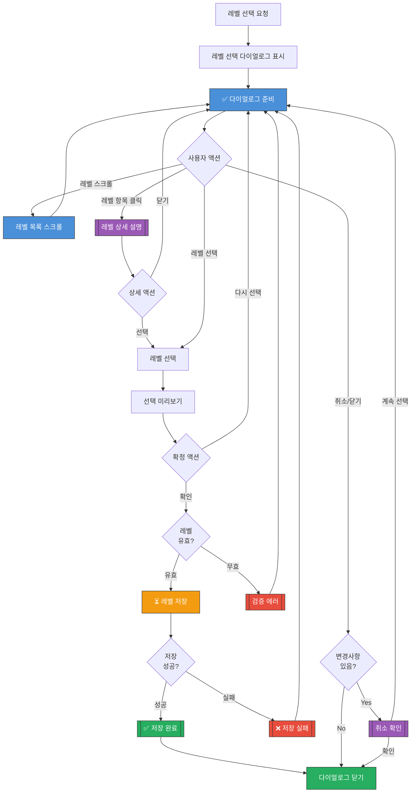

# 레벨 선택 다이얼로그 UI Flow

**라우트**: Dialog (컴포넌트)
**부모 화면**: 레벨 테스트 결과, 설정, 프로필 등
**타입**: 다이얼로그/바텀시트

## 개요

사용자가 직접 영어 레벨을 선택할 수 있는 다이얼로그입니다. 레벨 테스트 결과에 만족하지 않거나, 레벨을 변경하고 싶을 때 사용됩니다.

---

## 전체 UI Flow



---

## UI 상세 설명

### 다이얼로그 기본 구조

**타입**: 바텀시트 (모바일) 또는 중앙 모달 (데스크톱)

**크기**:
- 모바일: 화면 하단에서 올라오는 바텀시트 (최대 70% 높이)
- 데스크톱: 중앙 모달 (600px 너비 × 800px 높이)

**UI 구성**:

**헤더**:
- 제목: "레벨을 선택하세요"
- 부제목: "자신에게 맞는 레벨을 선택해주세요"
- 닫기 버튼 (X)

**현재 레벨 표시** (선택 사항):
- 작은 배너 형태:
  - "현재 레벨: Level 5 (Intermediate)"
  - 아이콘: ⭐

**검색 필드** (선택 사항):
- 플레이스홀더: "레벨 이름 또는 설명 검색"
- 예: "Beginner" 입력 시 Lv.1, Lv.2 필터링

**레벨 리스트** (스크롤 가능):

각 레벨 아이템은 카드 형태:

**Level 1 - Beginner**
- 레벨 번호: 큰 숫자 "1" (좌측)
- 레벨 이름: "Beginner"
- 한글 이름: "초급"
- 간단 설명: "기초 단어와 간단한 인사를 배워요"
- 적합 대상: "영어를 처음 시작하는 분"
- 아이콘/뱃지: 색상 코드 (연한 파랑)
- 선택 라디오 버튼 또는 체크 표시

**Level 2 - Elementary**
- 레벨 번호: "2"
- 레벨 이름: "Elementary"
- 한글 이름: "초급"
- 간단 설명: "기본 문법과 일상 표현을 익혀요"
- 적합 대상: "간단한 문장을 만들 수 있는 분"
- 색상 코드 (파랑)

**Level 3 - Pre-Intermediate**
- 레벨 번호: "3"
- 레벨 이름: "Pre-Intermediate"
- 한글 이름: "초중급"
- 간단 설명: "기본 대화가 가능하고 간단한 주제로 이야기해요"
- 적합 대상: "기본 문법을 아는 분"
- 색상 코드

**Level 4 - Intermediate**
- 레벨 번호: "4"
- 레벨 이름: "Intermediate"
- 한글 이름: "중급"
- 간단 설명: "일상 대화가 자연스럽고 의견을 표현할 수 있어요"
- 적합 대상: "일상 대화가 가능한 분"

**Level 5 - Upper Intermediate**
- 레벨 번호: "5"
- 레벨 이름: "Upper Intermediate"
- 한글 이름: "중상급"
- 간단 설명: "다양한 주제로 깊이 있는 대화가 가능해요"
- 적합 대상: "비즈니스 대화를 준비하는 분"

**Level 6 - Advanced**
- 레벨 번호: "6"
- 레벨 이름: "Advanced"
- 한글 이름: "고급"
- 간단 설명: "복잡한 주제도 자연스럽게 토론할 수 있어요"
- 적합 대상: "원어민 수준의 대화를 원하는 분"

**... (Level 7~10 유사 구조)**

**안내 메시지** (하단):
- "💡 레벨은 언제든지 변경할 수 있어요"
- "처음에는 낮은 레벨로 시작해서 차근차근 올라가는 것을 추천해요"

**버튼**:
- 주 버튼: "선택 완료" (레벨 선택 시 활성화)
- 보조 버튼: "취소" → 다이얼로그 닫기

---

## 레벨 상세 설명 바텀시트

**트리거**: 레벨 항목 클릭 또는 "자세히 보기" 버튼

**UI 구성**:

**헤더**:
- 레벨 번호 + 이름: "Level 5 - Upper Intermediate"
- 닫기 버튼

**본문**:

**섹션 1: 레벨 개요**
- 한글 이름: "중상급"
- 레벨 색상 바
- 간단 설명: 확장된 버전

**섹션 2: 학습 내용**
- 제목: "이런 것을 배워요"
- 리스트:
  - "📚 고급 문법 (조건문, 가정법 등)"
  - "💬 비즈니스 영어"
  - "📰 뉴스 및 시사 토론"
  - "🎬 영화/드라마 표현"

**섹션 3: 적합 대상**
- 제목: "이런 분께 추천해요"
- 리스트:
  - "✅ TOEIC 700점 이상"
  - "✅ 일상 대화가 편안한 분"
  - "✅ 비즈니스 영어를 준비하는 분"

**섹션 4: 샘플 문장**
- 제목: "이런 문장을 말할 수 있어요"
- 예시:
  - "I believe that technology has significantly improved our lives."
  - "Could you elaborate on your point about climate change?"

**버튼**:
- 주 버튼: "이 레벨로 선택" → 레벨 선택
- 보조 버튼: "닫기" → 바텀시트 닫기

---

## 인터랙션 요소

1. **레벨 항목 클릭**
   - 액션: 레벨 선택 (라디오 버튼 활성화)
   - Validation: 없음
   - 결과: 선택된 레벨 강조 표시

2. **레벨 상세 보기**
   - 액션: 레벨 항목 길게 누르기 또는 "자세히" 버튼
   - Validation: 없음
   - 결과: 레벨 상세 바텀시트 표시

3. **선택 완료 버튼**
   - 액션: 레벨 저장 및 다이얼로그 닫기
   - Validation: 레벨 1개 선택 필수
   - 결과: API 호출 + 레벨 업데이트

4. **검색 필드** (선택 사항)
   - 액션: 텍스트 입력으로 레벨 필터링
   - Validation: 없음
   - 결과: 검색어에 맞는 레벨만 표시

5. **취소 버튼**
   - 액션: 변경사항 취소 및 닫기
   - Validation: 변경사항 있으면 확인 필요
   - 결과: 다이얼로그 닫힘

---

## Validation Rules

| 동작 | Validation 규칙 | 에러 메시지 |
|------|----------------|------------|
| 레벨 선택 | 1개 필수 선택 | "레벨을 선택해주세요." |

---

## 에러 상태

### 레벨 저장 실패

**표시 조건**:
- [x] API 호출 실패

**UI**:
- 토스트 메시지: "레벨을 저장할 수 없어요. 다시 시도해주세요."
- 재시도 버튼 활성화

---

## 모달 & 다이얼로그

### 1. 취소 확인 다이얼로그

**트리거**: 레벨 변경 후 취소 버튼 클릭
**타입**: 확인

**내용**:
- 제목: "레벨 선택을 취소하시겠어요?"
- 메시지: "선택한 레벨이 저장되지 않아요."
- 버튼:
  - 주 버튼: "계속 선택" → 다이얼로그 닫기
  - 보조 버튼: "취소" → 레벨 선택 다이얼로그 닫기

### 2. 레벨 변경 확인 다이얼로그

**트리거**: 현재 레벨과 다른 레벨 선택 시
**타입**: 확인

**내용**:
- 제목: "레벨을 변경하시겠어요?"
- 메시지:
  - "기존 레벨: Level 5 (Intermediate)"
  - "새 레벨: Level 3 (Pre-Intermediate)"
  - "변경하면 추천 수업이 달라져요."
- 버튼:
  - 주 버튼: "변경하기" → 레벨 저장
  - 보조 버튼: "취소" → 다이얼로그 닫기

---

## Edge Cases

### 1. 현재 레벨과 동일한 레벨 선택

- **조건**: 이미 설정된 레벨과 같은 레벨 선택
- **동작**: 정상 처리 (변경 없음)
- **UI**: "이미 선택된 레벨이에요" 토스트

### 2. 레벨을 여러 단계 낮춤

- **조건**: Lv.6 → Lv.2로 대폭 하향
- **동작**: 확인 다이얼로그 표시
- **UI**: "정말로 낮은 레벨로 변경하시겠어요?" 경고

### 3. 레벨을 여러 단계 높임

- **조건**: Lv.2 → Lv.6로 대폭 상향
- **동작**: 확인 다이얼로그 표시
- **UI**: "레벨이 높아지면 수업이 어려울 수 있어요. 계속하시겠어요?"

### 4. 검색 결과 없음

- **조건**: 검색어에 맞는 레벨 없음
- **동작**: Empty State 표시
- **UI**: "검색 결과가 없어요. 다른 키워드로 검색해보세요."

### 5. 첫 수업 예약 전 레벨 변경

- **조건**: 아직 수업을 한 번도 받지 않음
- **동작**: 자유롭게 변경 가능
- **UI**: 경고 없음

---

## 개발 참고사항

**주요 API**:
- `GET /api/levels` - 레벨 목록 조회
- `GET /api/levels/:levelId` - 레벨 상세 조회
- `POST /api/users/level` - 사용자 레벨 변경

**상태 관리**:
- 사용하는 store/context: LevelContext, UserContext
- 주요 상태 변수:
  - `levels`: 레벨 목록 배열
  - `currentLevel`: 현재 사용자 레벨
  - `selectedLevel`: 선택된 레벨
  - `isChanged`: 변경사항 여부

**레벨 데이터 구조**:
```typescript
interface Level {
  id: number; // 1~10
  name: string; // "Beginner", "Intermediate", etc.
  nameKo: string; // "초급", "중급", etc.
  description: string; // 간단 설명
  detailedDescription: string; // 상세 설명
  targetAudience: string[]; // 적합 대상
  learningContent: string[]; // 학습 내용
  sampleSentences: string[]; // 샘플 문장
  color: string; // 레벨 색상 (#hex)
  minToeicScore?: number; // 최소 TOEIC 점수
}
```

**Analytics 이벤트**:
```typescript
// 다이얼로그 표시 시
trackEvent('level_select_dialog_shown', {
  currentLevel: 5,
  source: 'level_test_result',
});

// 레벨 선택 시
trackEvent('level_selected', {
  previousLevel: 5,
  newLevel: 3,
  source: 'manual_select',
});

// 레벨 변경 완료 시
trackEvent('level_changed', {
  previousLevel: 5,
  newLevel: 3,
});
```

**Feature Flags**:
- `ENABLE_LEVEL_SEARCH`: 레벨 검색 기능
- `ENABLE_LEVEL_DETAIL`: 레벨 상세 보기 기능
- `ENABLE_LEVEL_CHANGE_CONFIRMATION`: 레벨 변경 확인 다이얼로그

---

## 디자인 참고

- Figma: [링크 추가 필요]
- 디자인 노트:
  - 레벨별로 색상 그라데이션 (Lv.1: 연한 파랑 → Lv.10: 진한 파랑)
  - 선택된 레벨은 배경색과 테두리로 강조
  - 레벨 번호는 크게 표시 (가독성)
  - 스크롤 시 부드러운 애니메이션

---

## 히스토리

| 날짜 | 작성자 | 변경 내용 |
|------|--------|----------|
| 2026-03-04 | Claude | 최초 작성 |
