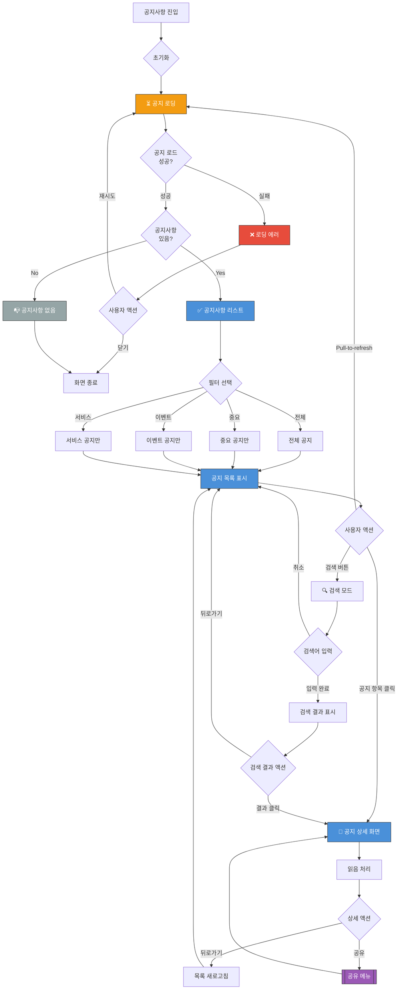

# 공지사항 화면 UI Flow

**라우트**: `/my-podo/notices`
**부모 화면**: My Podo
**타입**: 풀스크린

**Figma**: [마이포도/공지사항 디자인](https://www.figma.com/design/DUFbC6C797d9jW5HsjFh9S/-PODO--APP-DESIGN?node-id=15927-12676)

## 개요

포도 서비스의 공지사항을 확인할 수 있는 화면입니다. 시스템 점검, 이벤트, 정책 변경 등의 중요 공지를 제공합니다.

---

## 전체 UI Flow



---

## 상태별 상세 설명

### 1. ⏳ 로딩 상태

**표시 조건**:
- [x] 화면 최초 진입 시
- [x] Pull-to-refresh 시

**UI 구성**:
- 로딩 스피너 위치: 전체 화면 중앙
- 스켈레톤 UI 사용 여부: **Yes** - 공지 리스트 아이템 스켈레톤
- 로딩 텍스트: "공지사항을 불러오고 있어요..."

**timeout 처리**:
- timeout 시간: 10초
- timeout 시 동작: 에러 상태로 전환

---

### 2. ✅ 성공 상태 (공지사항 리스트)

**표시 조건**:
- [x] API 응답 성공
- [x] 1개 이상의 공지사항 존재

**UI 구성**:

**헤더**:
- 타이틀: "공지사항"
- 뒤로가기 버튼
- 검색 버튼 (🔍)

**필터 탭**:
- 전체 | 중요 | 이벤트 | 서비스

**공지사항 리스트 아이템**:
각 항목은 다음 정보를 포함:

1. **중요 공지**
   - 중요 뱃지 (🔴 또는 "중요" 태그)
   - 제목: "[긴급] 시스템 점검 안내"
   - 날짜: "2026-03-04"
   - 읽음 여부: 읽지 않은 공지는 볼드 처리 + 파란색 점
   - 상단 고정 (Pinned)

2. **일반 공지**
   - 카테고리 뱃지: [이벤트] / [서비스] / [업데이트]
   - 제목: "3월 신규 기능 업데이트"
   - 날짜: "2026-03-01"
   - 읽음 여부 표시

3. **이벤트 공지**
   - 이벤트 뱃지: 🎉
   - 제목: "봄맞이 할인 이벤트"
   - 날짜: "2026-03-01"
   - 이벤트 기간: "2026-03-01 ~ 2026-03-31"

**인터랙션 요소**:

1. **공지 항목 클릭**
   - 액션: 공지 상세 화면으로 이동
   - Validation: 없음
   - 결과: 상세 내용 표시 + 읽음 처리

2. **필터 탭 선택**
   - 액션: 선택한 카테고리 공지만 필터링
   - Validation: 없음
   - 결과: 필터링된 목록 표시

3. **검색 버튼**
   - 액션: 검색 모드로 전환
   - Validation: 없음
   - 결과: 검색창 활성화 + 키보드 표시

4. **Pull-to-refresh**
   - 액션: 목록 새로고침
   - Validation: 없음
   - 결과: 최신 공지 불러오기

---

### 3. ❌ 에러 상태

**에러 타입별 처리**:

#### 3.1 네트워크 에러
```
에러 메시지: "공지사항을 불러올 수 없어요. 네트워크를 확인해주세요."
CTA: [재시도 | 닫기]
```

#### 3.2 서버 에러
```
에러 메시지: "일시적인 오류가 발생했어요. 잠시 후 다시 시도해주세요."
CTA: [재시도 | 고객센터 문의]
```

---

### 4. 📭 Empty State

**표시 조건**:
- [x] 공지사항이 0개
- [x] 검색 결과 0건

**UI 구성**:

**공지사항 없음**:
- 이미지/아이콘: 빈 문서 아이콘
- 메시지: "등록된 공지사항이 없어요"
- CTA: 없음

**검색 결과 없음**:
- 이미지/아이콘: 검색 아이콘
- 메시지: "검색 결과가 없어요"
- 보조 메시지: "다른 키워드로 검색해보세요"
- CTA: 없음

---

## 공지 상세 화면

**UI 구성**:

**헤더**:
- 뒤로가기 버튼
- 공유 버튼

**본문**:
- 카테고리 뱃지: [중요] / [이벤트] / [서비스]
- 제목: 공지 제목
- 날짜: "2026-03-04 15:30"
- 본문 내용: HTML 또는 Markdown 렌더링
  - 이미지 지원
  - 링크 지원
  - 굵은 글씨, 이탤릭 등
- 첨부파일: PDF, 이미지 등 다운로드 가능

---

## Validation Rules

| 동작 | Validation 규칙 | 에러 메시지 |
|------|----------------|------------|
| 검색 | 최소 2자 이상 | "2자 이상 입력해주세요." |

---

## 모달 & 다이얼로그

### 1. 공유 메뉴

**트리거**: 공지 상세 화면에서 공유 버튼 클릭
**타입**: 바텀시트 또는 네이티브 공유 메뉴

**내용**:
- 공유 옵션:
  - 링크 복사
  - 카카오톡
  - 문자
  - 이메일
  - 기타 앱 공유

---

## Edge Cases

### 1. 중요 공지 상단 고정

- **조건**: "중요" 플래그가 있는 공지
- **동작**: 항상 리스트 최상단에 표시
- **UI**: 중요 뱃지 + 배경색 강조 (연한 빨강)

### 2. 읽지 않은 공지 표시

- **조건**: 사용자가 아직 읽지 않은 공지
- **동작**: 제목 볼드 처리 + 파란색 점 표시
- **UI**: 제목 왼쪽에 파란색 점 (•)

### 3. 이벤트 종료 공지

- **조건**: 이벤트가 종료된 공지
- **동작**: "종료" 뱃지 표시
- **UI**: 회색 "종료" 뱃지

### 4. 푸시 알림에서 진입

- **조건**: 푸시 알림 클릭으로 앱 진입
- **동작**: 해당 공지 상세로 바로 이동
- **UI**: 딥링크 처리

---

## 개발 참고사항

**주요 API**:
- `GET /api/notices` - 공지사항 목록 조회
- `GET /api/notices/:id` - 공지 상세 조회
- `POST /api/notices/:id/read` - 읽음 처리
- `GET /api/notices/search?q=검색어` - 공지 검색

**상태 관리**:
- 사용하는 store/context: NoticeContext
- 주요 상태 변수:
  - `notices`: 공지사항 배열
  - `selectedCategory`: 현재 필터 ('all' | 'important' | 'event' | 'service')
  - `unreadCount`: 읽지 않은 공지 수
  - `isLoading`: 로딩 상태

**공지사항 데이터 구조**:
```typescript
interface Notice {
  id: string;
  title: string;
  content: string; // HTML or Markdown
  category: 'important' | 'event' | 'service' | 'update';
  isImportant: boolean; // 상단 고정 여부
  isPinned: boolean; // 고정 여부
  publishedAt: string; // ISO 8601
  isRead: boolean; // 읽음 여부
  attachments?: Attachment[];
}

interface Attachment {
  id: string;
  name: string;
  url: string;
  type: 'image' | 'pdf' | 'document';
}
```

**Feature Flags**:
- `ENABLE_NOTICE_SEARCH`: 검색 기능 활성화
- `ENABLE_NOTICE_SHARE`: 공유 기능 활성화
- `ENABLE_PUSH_NOTIFICATIONS`: 푸시 알림 기능

---

## 디자인 참고

- Figma: [링크 추가 필요]
- 디자인 노트:
  - 중요 공지는 연한 빨강 배경
  - 읽지 않은 공지는 볼드 + 파란색 점
  - 카테고리별 뱃지 색상 구분

---

## 히스토리

| 날짜 | 작성자 | 변경 내용 |
|------|--------|----------|
| 2026-03-04 | Claude | 최초 작성 |
