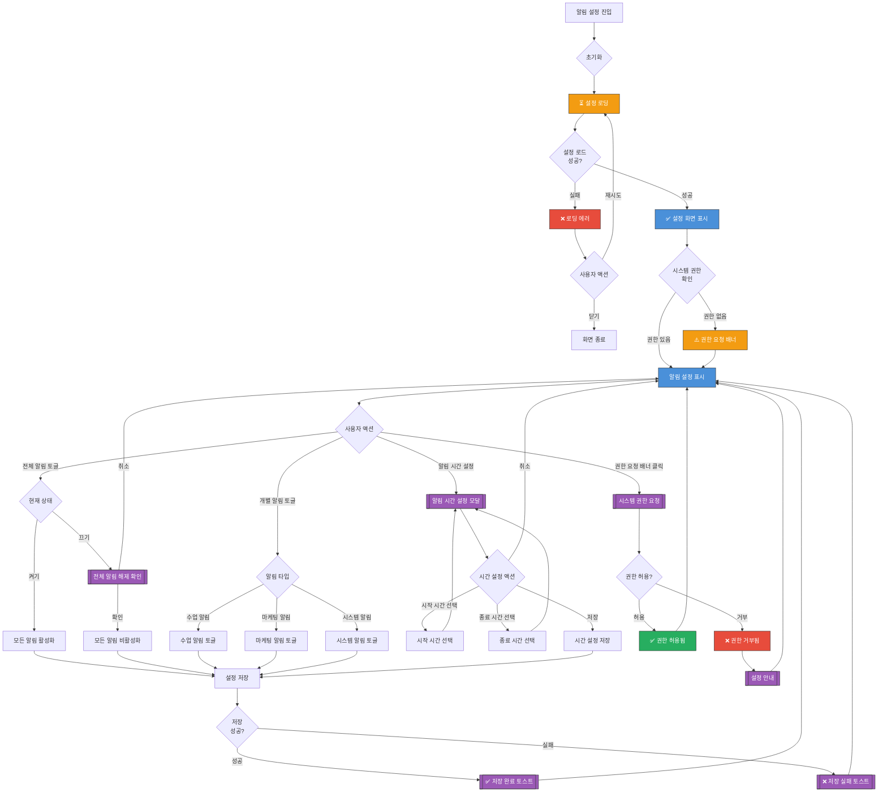

# 알림 설정 화면 UI Flow

**라우트**: `/my-podo/settings/notifications`
**부모 화면**: My Podo 설정
**타입**: 풀스크린

## 개요

사용자가 앱의 푸시 알림, 이메일, 문자 등 각종 알림 수신 설정을 관리하는 화면입니다.

---

## 전체 UI Flow



---

## 상태별 상세 설명

### 1. ⏳ 로딩 상태

**표시 조건**:
- [x] 화면 최초 진입 시
- [x] 설정 변경 후 서버 동기화 중

**UI 구성**:
- 로딩 스피너 위치: 전체 화면 중앙 또는 스켈레톤
- 스켈레톤 UI 사용 여부: **Yes** - 토글 스위치 스켈레톤
- 로딩 텍스트: "설정을 불러오고 있어요..."

**timeout 처리**:
- timeout 시간: 10초
- timeout 시 동작: 에러 상태로 전환

---

### 2. ✅ 성공 상태 (설정 화면 표시)

**표시 조건**:
- [x] API 응답 성공
- [x] 설정 정보 로드 완료

**UI 구성**:

**헤더**:
- 타이틀: "알림 설정"
- 뒤로가기 버튼

**권한 상태 배너** (권한 없을 경우):
- 배경색: 연한 주황
- 메시지: "알림을 받으려면 권한을 허용해주세요"
- CTA 버튼: "권한 허용하기"

**섹션 1: 전체 알림 설정**
- 토글 스위치: "전체 알림" ON/OFF
- 설명: "모든 알림을 한 번에 켜고 끌 수 있어요"

**섹션 2: 푸시 알림**
- **수업 관련 알림**
  - 토글: "수업 시작 알림" (수업 10분 전)
  - 토글: "수업 예약 확인" (예약 완료 시)
  - 토글: "수업 취소 알림" (취소 시)
  - 토글: "수업 리뷰 요청" (수업 종료 후)

- **학습 알림**
  - 토글: "학습 리포트 알림" (주간 리포트 발송 시)
  - 토글: "레벨 업 알림" (레벨 상승 시)
  - 토글: "연속 학습 독려" (3일 미접속 시)

- **시스템 알림**
  - 토글: "공지사항" (새 공지 등록 시)
  - 토글: "시스템 점검" (점검 예정 시)

- **마케팅 알림** (선택)
  - 토글: "이벤트 및 프로모션"
  - 토글: "추천 수업 안내"
  - 설명: "광고성 정보 수신 동의 (선택)"

**섹션 3: 알림 시간 설정**
- "알림 받지 않는 시간" 설정
- 시작 시간: "23:00"
- 종료 시간: "08:00"
- CTA 버튼: "시간 변경"

**섹션 4: 이메일 알림**
- 토글: "이메일 수신 동의"
- 수신 항목:
  - 주간 학습 리포트
  - 이벤트 및 프로모션
  - 결제 내역

**섹션 5: 문자(SMS) 알림**
- 토글: "문자 수신 동의"
- 수신 항목:
  - 수업 시작 알림
  - 결제 관련 알림

**인터랙션 요소**:

1. **전체 알림 토글**
   - 액션: 모든 알림 ON/OFF 일괄 전환
   - Validation: OFF 시 확인 다이얼로그
   - 결과: 모든 개별 알림 토글도 함께 변경

2. **개별 알림 토글**
   - 액션: 특정 알림 ON/OFF
   - Validation: 전체 알림이 OFF면 비활성화
   - 결과: 설정 저장 + 토스트

3. **알림 시간 설정 버튼**
   - 액션: 시간 선택 모달 표시
   - Validation: 없음
   - 결과: 시작/종료 시간 선택 가능

4. **권한 허용하기 버튼**
   - 액션: 시스템 권한 요청 다이얼로그 표시
   - Validation: 이미 권한 있으면 비활성화
   - 결과: 권한 허용 시 배너 사라짐

---

### 3. ❌ 에러 상태

**에러 타입별 처리**:

#### 3.1 네트워크 에러
```
에러 메시지: "설정을 불러올 수 없어요. 네트워크를 확인해주세요."
CTA: [재시도 | 닫기]
```

#### 3.2 설정 저장 실패
```
에러 메시지: "설정을 저장할 수 없어요. 다시 시도해주세요."
타입: 토스트 메시지
```

#### 3.3 권한 거부 후 재요청 불가
```
에러 메시지: "알림 권한이 차단되어 있어요. 설정 앱에서 권한을 허용해주세요."
타입: 다이얼로그
CTA: [설정 앱으로 이동 | 닫기]
```

---

## Validation Rules

| 동작 | Validation 규칙 | 에러 메시지 |
|------|----------------|------------|
| 전체 알림 OFF | 확인 필요 | "모든 알림을 받지 않으시겠어요?" |
| 개별 알림 토글 | 전체 알림 ON 상태 | (전체 OFF면 비활성화) |
| 시간 설정 | 시작 < 종료 시간 | "종료 시간은 시작 시간 이후여야 해요." |

---

## 모달 & 다이얼로그

### 1. 전체 알림 해제 확인 다이얼로그

**트리거**: 전체 알림 토글을 OFF로 전환 시
**타입**: 확인

**내용**:
- 제목: "모든 알림을 끄시겠어요?"
- 메시지:
  - "알림을 받지 않으면 중요한 수업 및 공지를 놓칠 수 있어요."
  - "수업 시작 10분 전 알림도 받지 못해요."
- 버튼:
  - 주 버튼: "계속 받기" → 다이얼로그 닫기
  - 보조 버튼: "모두 끄기" → 전체 알림 OFF

### 2. 알림 시간 설정 모달

**트리거**: "시간 변경" 버튼 클릭
**타입**: 바텀시트 또는 모달

**내용**:
- 제목: "알림 받지 않는 시간 설정"
- 설명: "설정한 시간 동안에는 알림을 받지 않아요"
- 시간 선택기:
  - 시작 시간: 시간 피커 (23:00 기본값)
  - 종료 시간: 시간 피커 (08:00 기본값)
- 버튼:
  - 주 버튼: "저장" → 설정 저장
  - 보조 버튼: "취소" → 모달 닫기

### 3. 권한 요청 다이얼로그

**트리거**: "권한 허용하기" 버튼 클릭
**타입**: 시스템 다이얼로그 (네이티브)

**내용** (iOS 예시):
- 제목: "\"포도\"에서 알림을 보내려고 합니다"
- 메시지: "알림에는 사운드, 아이콘 배지, 경고가 포함될 수 있습니다."
- 버튼:
  - "허용"
  - "허용 안 함"

### 4. 설정 앱 안내 다이얼로그

**트리거**: 권한이 차단된 상태에서 권한 요청 시
**타입**: 확인

**내용**:
- 제목: "알림 권한을 허용해주세요"
- 메시지:
  - "현재 알림 권한이 차단되어 있어요."
  - "설정 앱에서 알림을 허용해주세요."
  - 경로: 설정 > 포도 > 알림
- 버튼:
  - 주 버튼: "설정 앱으로 이동" → 설정 앱 딥링크
  - 보조 버튼: "취소" → 다이얼로그 닫기

---

## Edge Cases

### 1. 시스템 권한 거부 상태

- **조건**: OS 레벨에서 알림 권한 거부됨
- **동작**:
  - 모든 토글 비활성화 (회색 처리)
  - 권한 요청 배너 상단 고정
- **UI**: 주황색 배너 + "권한 허용하기" 버튼

### 2. 전체 알림 OFF 상태에서 개별 알림 토글 시도

- **조건**: 전체 알림이 꺼져 있음
- **동작**: 개별 토글 비활성화
- **UI**: 토글 회색 처리 + "전체 알림을 먼저 켜주세요" 툴팁

### 3. 마케팅 알림 법적 고지

- **조건**: 마케팅 알림 토글 ON/OFF 시
- **동작**: "광고성 정보 수신 동의" 명시
- **UI**: 작은 회색 텍스트로 법적 고지 표시

### 4. 야간 시간 설정 시 시작 > 종료

- **조건**: 시작 시간 23:00, 종료 시간 08:00
- **동작**: 정상 처리 (자정 넘어가는 것 허용)
- **UI**: "23:00 ~ 익일 08:00" 표시

### 5. 백그라운드에서 설정 변경

- **조건**: 설정 앱에서 권한 변경 후 앱 복귀
- **동작**: 앱 포그라운드 복귀 시 권한 상태 재확인
- **UI**: 배너 자동 업데이트

---

## 개발 참고사항

**주요 API**:
- `GET /api/settings/notifications` - 알림 설정 조회
- `PATCH /api/settings/notifications` - 알림 설정 변경
- `GET /api/permissions/notifications` - 시스템 권한 상태 조회

**상태 관리**:
- 사용하는 store/context: SettingsContext, PermissionContext
- 주요 상태 변수:
  - `notificationSettings`: 알림 설정 객체
  - `hasPermission`: 시스템 권한 여부
  - `quietHours`: 알림 받지 않는 시간 설정

**알림 설정 데이터 구조**:
```typescript
interface NotificationSettings {
  allEnabled: boolean; // 전체 알림
  push: {
    classStart: boolean; // 수업 시작 알림
    classReservation: boolean; // 예약 확인
    classCancellation: boolean; // 취소 알림
    classReview: boolean; // 리뷰 요청
    weeklyReport: boolean; // 주간 리포트
    levelUp: boolean; // 레벨 업
    reminderInactive: boolean; // 연속 학습 독려
    announcement: boolean; // 공지사항
    maintenance: boolean; // 시스템 점검
    marketing: boolean; // 마케팅 알림
  };
  email: {
    enabled: boolean; // 이메일 수신
    weeklyReport: boolean;
    marketing: boolean;
    billing: boolean;
  };
  sms: {
    enabled: boolean; // 문자 수신
    classStart: boolean;
    billing: boolean;
  };
  quietHours: {
    enabled: boolean;
    startTime: string; // "23:00"
    endTime: string; // "08:00"
  };
}
```

**Feature Flags**:
- `ENABLE_QUIET_HOURS`: 알림 받지 않는 시간 기능
- `ENABLE_EMAIL_NOTIFICATIONS`: 이메일 알림 기능
- `ENABLE_SMS_NOTIFICATIONS`: 문자 알림 기능

---

## 디자인 참고

- Figma: [링크 추가 필요]
- 디자인 노트:
  - 토글 스위치는 브랜드 컬러
  - 권한 배너는 주황색 배경
  - 섹션별로 구분선으로 분리

---

## 히스토리

| 날짜 | 작성자 | 변경 내용 |
|------|--------|----------|
| 2026-03-04 | Claude | 최초 작성 |
