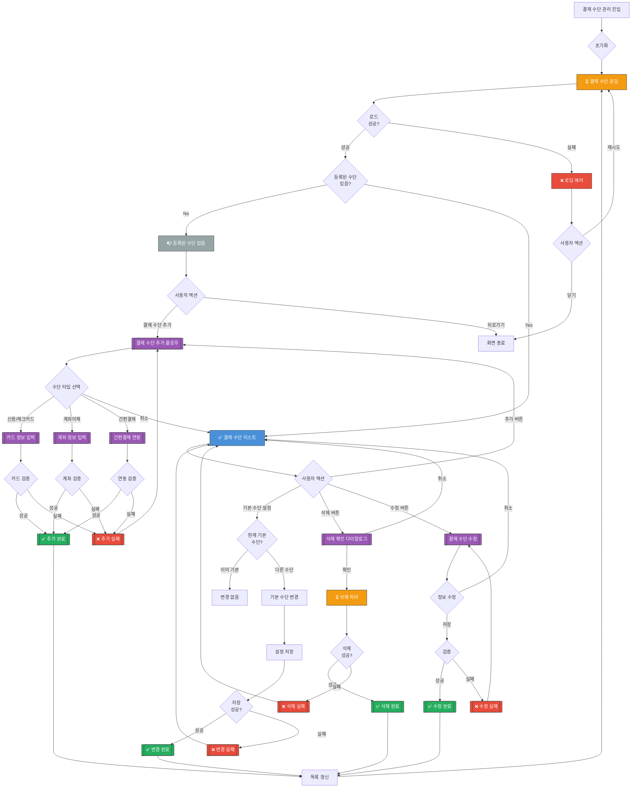

# 결제 수단 관리 화면 UI Flow

**라우트**: `/my-podo/payment-methods`
**부모 화면**: My Podo
**타입**: 풀스크린

**Figma**: [마이포도/결제수단 디자인](https://www.figma.com/design/DUFbC6C797d9jW5HsjFh9S/-PODO--APP-DESIGN?node-id=15927-13987)

## 개요

사용자가 등록한 결제 수단(카드, 계좌 등)을 관리하고 기본 결제 수단을 설정하는 화면입니다.

---

## 전체 UI Flow



---

## 상태별 상세 설명

### 1. ⏳ 로딩 상태

**표시 조건**:
- [x] 화면 최초 진입 시
- [x] 결제 수단 추가/삭제 후 갱신 시

**UI 구성**:
- 로딩 스피너 위치: 전체 화면 중앙 또는 스켈레톤
- 스켈레톤 UI 사용 여부: **Yes** - 카드 리스트 스켈레톤
- 로딩 텍스트: "결제 수단을 불러오고 있어요..."

**timeout 처리**:
- timeout 시간: 10초
- timeout 시 동작: 에러 상태로 전환

---

### 2. ✅ 성공 상태 (결제 수단 리스트)

**표시 조건**:
- [x] API 응답 성공
- [x] 1개 이상의 결제 수단 등록됨

**UI 구성**:

**헤더**:
- 타이틀: "결제 수단 관리"
- 뒤로가기 버튼

**결제 수단 카드 리스트**:

1. **신용/체크카드**
   - 카드사 로고 (예: 신한, 삼성, 현대 등)
   - 카드 번호 (마스킹): "**** **** **** 1234"
   - 카드 별칭: "내 신한카드" (사용자 지정 가능)
   - 기본 결제 수단 뱃지: "기본" (초록색)
   - 유효기간: "12/26"
   - 버튼:
     - "기본으로 설정" (기본 아닐 경우)
     - "수정"
     - "삭제"

2. **계좌이체**
   - 은행 로고
   - 계좌번호 (마스킹): "신한 1234-***-567"
   - 기본 결제 수단 뱃지 (해당 시)
   - 버튼: "수정" / "삭제"

3. **간편결제** (네이버페이, 카카오페이 등)
   - 서비스 로고
   - 연동 계정: "카카오페이 (hong***@naver.com)"
   - 기본 결제 수단 뱃지 (해당 시)
   - 버튼: "연동 해제"

**푸터 고정 버튼**:
- "결제 수단 추가" 버튼

**안내 메시지**:
- "다음 결제 시 기본 결제 수단이 자동으로 사용돼요"

**인터랙션 요소**:

1. **결제 수단 추가 버튼**
   - 액션: 결제 수단 추가 바텀시트 표시
   - Validation: 최대 등록 개수 확인 (예: 최대 5개)
   - 결과: 타입 선택 → 정보 입력 → 등록 완료

2. **기본으로 설정 버튼**
   - 액션: 해당 수단을 기본 결제 수단으로 설정
   - Validation: 이미 기본 수단이 아닌지 확인
   - 결과: 기본 수단 변경 + 토스트

3. **수정 버튼**
   - 액션: 결제 수단 정보 수정 화면
   - Validation: 수정 가능한 필드 확인
   - 결과: 별칭, 유효기간 등 수정 가능

4. **삭제 버튼**
   - 액션: 삭제 확인 다이얼로그 표시
   - Validation: 기본 수단인 경우 경고
   - 결과: 삭제 완료 + 목록 갱신

---

### 3. ❌ 에러 상태

**에러 타입별 처리**:

#### 3.1 네트워크 에러
```
에러 메시지: "결제 수단을 불러올 수 없어요. 네트워크를 확인해주세요."
CTA: [재시도 | 닫기]
```

#### 3.2 카드 정보 검증 실패
```
에러 메시지: "유효하지 않은 카드 정보예요. 다시 확인해주세요."
타입: 입력 필드 하단 빨간색 텍스트
```

#### 3.3 중복 등록 시도
```
에러 메시지: "이미 등록된 결제 수단이에요."
타입: 토스트 메시지
```

#### 3.4 결제 수단 추가 한도 초과
```
에러 메시지: "결제 수단은 최대 5개까지 등록할 수 있어요."
타입: 다이얼로그
CTA: [확인]
```

#### 3.5 기본 수단 삭제 시도
```
에러 메시지: "기본 결제 수단은 삭제할 수 없어요. 다른 수단을 기본으로 설정한 후 삭제해주세요."
타입: 토스트 메시지
```

---

### 4. 📭 Empty State

**표시 조건**:
- [x] 등록된 결제 수단이 0개

**UI 구성**:
- 이미지/아이콘: 빈 카드 일러스트
- 메시지:
  - 주: "등록된 결제 수단이 없어요"
  - 보조: "결제 수단을 추가하고 편리하게 결제하세요"
- CTA 버튼: "결제 수단 추가하기"

---

## Validation Rules

| 필드 | Validation 규칙 | 에러 메시지 |
|------|----------------|------------|
| 카드 번호 | 16자리 숫자 | "올바른 카드 번호를 입력해주세요." |
| 유효기간 | MM/YY 형식, 미래 날짜 | "유효기간을 확인해주세요." |
| CVC | 3~4자리 숫자 | "CVC 번호를 확인해주세요." |
| 생년월일 | YYMMDD 형식 | "생년월일을 확인해주세요." |
| 카드 비밀번호 | 앞 2자리 | "카드 비밀번호 앞 2자리를 입력해주세요." |
| 계좌번호 | 숫자만, 은행별 자릿수 | "올바른 계좌번호를 입력해주세요." |
| 중복 등록 | 같은 카드/계좌 불가 | "이미 등록된 결제 수단이에요." |

---

## 모달 & 다이얼로그

### 1. 결제 수단 추가 바텀시트

**트리거**: "결제 수단 추가" 버튼 클릭
**타입**: 바텀시트

**내용**:
- 제목: "결제 수단 선택"
- 옵션:
  - "신용/체크카드" (카드 아이콘)
  - "계좌이체" (은행 아이콘)
  - "간편결제" (네이버페이, 카카오페이 아이콘)
- 각 옵션 클릭 시 → 해당 추가 플로우로 이동

### 2. 카드 정보 입력 바텀시트

**트리거**: "신용/체크카드" 선택
**타입**: 풀스크린 또는 큰 바텀시트

**내용**:
- 제목: "카드 정보 입력"
- 입력 필드:
  - 카드 번호: "1234 5678 9012 3456" (자동 포맷)
  - 유효기간: "MM/YY"
  - CVC: "***"
  - 생년월일: "YYMMDD"
  - 카드 비밀번호 앞 2자리: "**"
  - 별칭 (선택): "예: 내 신한카드"
- 체크박스: "기본 결제 수단으로 설정"
- 버튼:
  - 주 버튼: "등록하기" → 카드 검증 + 등록
  - 보조 버튼: "취소" → 바텀시트 닫기

### 3. 삭제 확인 다이얼로그

**트리거**: "삭제" 버튼 클릭
**타입**: 확인

**내용**:
- 제목: "결제 수단을 삭제하시겠어요?"
- 메시지:
  - "삭제하면 다시 복구할 수 없어요."
  - 카드 정보: "신한카드 **** 1234"
- 버튼:
  - 주 버튼: "취소" → 다이얼로그 닫기
  - 보조 버튼: "삭제" (빨간색) → 삭제 처리

### 4. 기본 수단 변경 확인 다이얼로그

**트리거**: "기본으로 설정" 버튼 클릭
**타입**: 확인 (선택 사항, 즉시 변경도 가능)

**내용**:
- 제목: "기본 결제 수단을 변경하시겠어요?"
- 메시지:
  - "기존: 신한카드 **** 1234"
  - "변경: 삼성카드 **** 5678"
- 버튼:
  - 주 버튼: "변경하기" → 기본 수단 변경
  - 보조 버튼: "취소" → 다이얼로그 닫기

### 5. 등록 성공 토스트

**트리거**: 결제 수단 등록 성공 시
**타입**: 토스트 (3초 자동 사라짐)

**내용**:
- 메시지: "결제 수단이 등록되었어요! ✅"

---

## Edge Cases

### 1. 기본 결제 수단 삭제 시도

- **조건**: 기본 수단을 삭제하려 함
- **동작**: 에러 메시지 표시
- **UI**: "기본 결제 수단은 삭제할 수 없어요. 다른 수단을 기본으로 설정한 후 삭제해주세요."

### 2. 결제 수단이 1개만 있을 때 삭제

- **조건**: 유일한 결제 수단을 삭제
- **동작**: 경고 메시지 + 확인 필요
- **UI**: "마지막 결제 수단이에요. 삭제하면 자동 결제가 불가능해요."

### 3. 카드 유효기간 만료

- **조건**: 등록된 카드 유효기간 지남
- **동작**: 카드에 경고 뱃지 표시
- **UI**: "만료됨" 빨간색 뱃지 + "수정" 버튼 강조

### 4. 간편결제 연동 해제

- **조건**: 네이버페이/카카오페이 연동 해제
- **동작**: 재연동 시 인증 과정 필요
- **UI**: "연동 해제" 버튼 → 확인 다이얼로그

### 5. 해외 카드 등록 시도

- **조건**: 해외 발행 카드
- **동작**: 지원 여부에 따라 등록 가능/불가능
- **UI**: "해외 카드는 일부 기능이 제한될 수 있어요" 안내

---

## 개발 참고사항

**주요 API**:
- `GET /api/payment-methods` - 결제 수단 목록 조회
- `POST /api/payment-methods` - 결제 수단 추가
- `PATCH /api/payment-methods/:id` - 결제 수단 수정
- `DELETE /api/payment-methods/:id` - 결제 수단 삭제
- `POST /api/payment-methods/:id/set-default` - 기본 수단 설정

**PG사 연동**:
- 카드 정보는 PG사로 직접 전송 (서버 미경유)
- PG사: 토스페이먼츠, 나이스페이, KG이니시스 등
- 카드 번호 등 민감 정보는 암호화 전송

**상태 관리**:
- 사용하는 store/context: PaymentContext, BillingContext
- 주요 상태 변수:
  - `paymentMethods`: 결제 수단 배열
  - `defaultMethodId`: 기본 결제 수단 ID
  - `isLoading`: 로딩 상태

**결제 수단 데이터 구조**:
```typescript
interface PaymentMethod {
  id: string;
  type: 'card' | 'bank' | 'simple_payment';
  isDefault: boolean;
  alias?: string; // 사용자 지정 별칭

  // 카드인 경우
  cardInfo?: {
    issuer: string; // 카드사
    number: string; // 마스킹된 번호 "**** **** **** 1234"
    expiryDate: string; // "12/26"
  };

  // 계좌인 경우
  bankInfo?: {
    bankName: string;
    accountNumber: string; // 마스킹
  };

  // 간편결제인 경우
  simplePaymentInfo?: {
    provider: 'naver' | 'kakao' | 'payco';
    linkedEmail: string; // 마스킹
  };

  createdAt: string;
}
```

**Feature Flags**:
- `ENABLE_BANK_TRANSFER`: 계좌이체 기능
- `ENABLE_SIMPLE_PAYMENT`: 간편결제 기능
- `ENABLE_FOREIGN_CARDS`: 해외 카드 지원

---

## 디자인 참고

- Figma: [링크 추가 필요]
- 디자인 노트:
  - 카드 카드는 카드사 브랜드 색상 적용
  - 기본 수단은 초록색 뱃지로 강조
  - 보안을 위해 카드 번호 마스킹 필수

---

## 히스토리

| 날짜 | 작성자 | 변경 내용 |
|------|--------|----------|
| 2026-03-04 | Claude | 최초 작성 |

## Figma 관련 화면

- [마이포도/결제수단/결제수단 추가](https://www.figma.com/design/DUFbC6C797d9jW5HsjFh9S/-PODO--APP-DESIGN?node-id=15927-14373)
