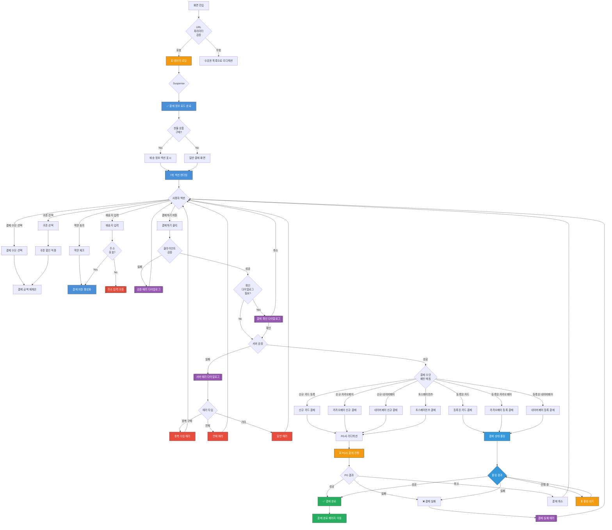

# 결제 페이지 UI Flow

**라우트**: `/subscribes/payment/[subscribeId]`
**부모 화면**: 수업 탐색 (`/subscribes/tickets`, `/subscribes/tickets-v2`)
**타입**: 풀스크린 페이지
**Figma**: [🎨 카카오페이 결제 디자인](https://www.figma.com/design/DUFbC6C797d9jW5HsjFh9S/-PODO--APP-DESIGN?node-id=21863-11683)

## 개요

사용자가 선택한 수강권을 결제할 수 있는 화면입니다.
결제 수단 선택, 쿠폰 적용, 배송지 입력(현물 상품), 약관 동의 등 결제에 필요한 모든 정보를 입력받습니다.

**주요 결제 타입**:
- **정기구독 (SUBSCRIBE)**: 매월 자동 결제되는 수강권
- **일괄결제 (LUMP_SUM)**: 할부로 전체 금액 일시 결제
- **현물 상품 (IPAD)**: 아이패드 등 실물 배송 상품 포함

**지원 결제 수단**:
- 신용카드 (등록된 카드 / 신규 카드)
- 카카오페이 (등록된 계정 / 신규 결제)
- 네이버페이 (등록된 계정 / 신규 결제)

---

## 전체 UI Flow



---

## 상태별 상세 설명

### 1. ⏳ 로딩 상태

**표시 조건**:
- [x] 화면 최초 진입 시 데이터 로드
- [x] 결제 처리 중 (PG사 리디렉션, 폴링 대기)
- [x] 쿠폰 선택 후 할인 금액 재계산

**UI 구성**:
- 로딩 스피너 위치: 전체 오버레이 (`GlobalLoadingBoundary`)
- 스켈레톤 UI 사용 여부: No (Suspense fallback 사용)
- 로딩 텍스트: 없음 (스피너만 표시)

**로딩 트리거**:
1. **초기 로딩**:
   ```tsx
   <Suspense fallback={<GlobalLoadingBoundary isLoading={true} />}>
   ```

2. **결제 진행 중**:
   ```tsx
   const isPaymentProcessing =
     processingPayment === 'PROCESSING' ||
     pollingState.status === 'in-progress' ||
     paymentActionWithLoggingMutation.isPending ||
     serverSideValidatePayment.isPending
   ```

**timeout 처리**:
- timeout 시간: React Suspense 기본값
- timeout 시 동작: 자동으로 `/subscribes/tickets`로 리디렉션 (에러 발생 시)

---

### 2. ✅ 성공 상태 (정상 컨텐츠)

**표시 조건**:
- [x] URL 파라미터 검증 성공 (`subscribeId` 유효)
- [x] 수강권 데이터 로드 성공
- [x] 사용자 인증 정보 유효

**UI 구성**:

#### 헤더
- 제목: "결제"
- 뒤로 가기 버튼: 이전 화면(수강권 목록)으로 이동
  - 페이백 프로모션: `/subscribes/tickets/payback`
  - 일반: `/subscribes/tickets`

#### 메인 컨텐츠 (7개 섹션)

1. **수강권 요약 (`SubscribeTicketSummarySection`)**
   - 수강권 이름
   - 수강 기간
   - 포함 레슨 수
   - 기본 가격

2. **배송 상품 정보 (`DeliveryProductInformationSection`)** *(현물 상품만)*
   - 표시 조건: `paymentModel.isDeliveryPayment === true`
   - 배송 상품 목록
   - 배송비 정보

3. **배송지 입력 (`DeliveryAddressFormSection`)** *(현물 상품만)*
   - 표시 조건: `paymentModel.isDeliveryPayment === true`
   - 우편번호 검색
   - 주소 입력
   - 상세 주소 입력
   - Form Provider: `RegisterDeliveryInformationFormProvider`

4. **결제 수단 선택 (`PaymentMethodSection`)**
   - 정기구독: 카드 등록 필수
     - 신용카드 (등록된 카드 / 신규 카드)
     - 카카오페이 (등록된 계정 / 신규)
     - 네이버페이 (등록된 계정 / 신규)
   - 일괄결제: 모든 결제 수단 사용 가능
   - Form Provider: `RegisterCardFormProvider`

5. **쿠폰 선택 (`CouponSection`)**
   - 사용 가능한 쿠폰 목록 BottomSheet
   - 선택한 쿠폰 정보 표시
   - 할인 금액 자동 계산

6. **결제 금액 (`PaymentSummary`)**
   - 정기구독:
     - 원래 가격: `월 XX,XXX원`
     - 할인 금액: `- XX,XXX원` (쿠폰 적용 시)
     - 최종 금액: `월 XX,XXX원`
     - 결제일: `매월 N일`
   - 일괄결제:
     - 총 금액: `XXX,XXX원`
     - 할부 개월: `N개월`
     - 월 할부금: `월 XX,XXX원`

7. **약관 동의 (`PaymentTermsAgreeSection`)**
   - 필수 약관 체크박스
   - 약관 상세 보기 링크
   - 결제 타입별 약관 다름:
     - 정기구독
     - 일괄결제
     - 스마트톡
     - 프로모션 타입별

#### 푸터 (CTA 버튼)
- 위치: 하단 고정 (`BottomStickyContainer`)
- 텍스트 (동적):
  - 폴링 중: "구매 진행중"
  - 정기구독 + 쿠폰 없음: `월 XX,XXX원 결제하기`
  - 정기구독 + 쿠폰 있음: `~~월 XX,XXX원~~ 월 XX,XXX원 결제하기`
  - 일괄결제 + 쿠폰 없음: `월 XX,XXX원 결제하기` (할부금)
  - 일괄결제 + 쿠폰 있음: 할인 전/후 가격 표시
- 비활성화 조건:
  - 약관 미동의
  - 결제 수단 미선택 (정기구독 시)
  - 배송지 미입력 (현물 상품 시)
  - 결제 진행 중

**인터랙션 요소**:

1. **결제 수단 선택**
   - 액션: 신용카드, 카카오페이, 네이버페이 중 선택
   - Validation:
     - 정기구독: 결제 수단 등록 필수
   - 결과: 선택한 결제 수단으로 UI 업데이트

2. **쿠폰 선택**
   - 액션: 쿠폰 목록 BottomSheet 열기 → 쿠폰 선택
   - Validation: 사용 가능한 쿠폰만 선택 가능
   - 결과:
     - 할인 금액 재계산
     - 결제 금액 업데이트
     - CTA 버튼 텍스트 변경

3. **배송지 입력** *(현물 상품만)*
   - 액션: 우편번호 검색 → 주소/상세 주소 입력
   - Validation:
     - 우편번호 필수
     - 주소 필수
     - 상세 주소 필수
   - 결과: Form validation 통과 시 결제 가능

4. **약관 동의**
   - 액션: 필수 약관 체크박스 선택
   - Validation: 모든 필수 약관 동의 필요
   - 결과: 약관 동의 시 결제 버튼 활성화

5. **결제하기 버튼 클릭**
   - 액션: CTA 버튼 클릭
   - Validation: 아래 "Validation Rules" 섹션 참조
   - 결과: 결제 프로세스 시작

---

### 3. ❌ 에러 상태

**에러 타입별 처리**:

#### 3.1 클라이언트 검증 에러

**트리거**: `validatePayment()` 실패

**에러 케이스**:
1. **약관 미동의**
   ```
   조건: isTermsAgreed === false
   메시지: "약관에 동의해주세요"
   CTA: [확인]
   ```

2. **결제 수단 미선택** (정기구독)
   ```
   조건: paymentMethodType === null && paymentType === 'SUBSCRIBE'
   메시지: "결제 수단을 선택해주세요"
   CTA: [확인]
   ```

3. **배송지 미입력** (현물 상품)
   ```
   조건: isDeliveryPayment && (zipCode || address || detailAddress 없음)
   메시지: "배송지를 입력해주세요"
   CTA: [확인]
   ```

#### 3.2 서버 검증 에러

**트리거**: `serverSideValidatePayment.mutateAsync()` 실패

**에러 케이스**:
1. **중복 수업 구매**
   ```
   resultCdName: 'DUPLICATE_LESSON'
   메시지: "이미 구매한 수업입니다"
   CTA: [확인]
   ```

2. **연체 미결제**
   ```
   resultCdName: 'DELINQUENT_PAYMENT'
   메시지: "미결제 금액이 있습니다. 먼저 결제해주세요"
   CTA: [확인]
   ```

#### 3.3 PG사 결제 에러

**트리거**: PG사 리디렉션 후 실패 응답

**에러 케이스**:
- 카드 한도 초과
- 카드 정지
- 비밀번호 오류
- 잔액 부족
- 네트워크 오류

```
에러 메시지: PG사에서 반환한 에러 메시지
CTA: [재시도 | 다른 결제 수단 선택]
```

#### 3.4 네트워크 에러
```
에러 메시지: "네트워크 연결을 확인해주세요"
CTA: [재시도]
```

---

### 4. 📭 Empty State

결제 페이지는 Empty State가 없습니다.
수강권 데이터가 없으면 자동으로 `/subscribes/tickets`로 리디렉션됩니다.

---

## Validation Rules

### 클라이언트 검증 (`validatePayment`)

| 검증 항목 | 조건 | 에러 메시지 |
|----------|------|------------|
| 약관 동의 | `isTermsAgreed === true` | "약관에 동의해주세요" |
| 결제 수단 선택<br/>(정기구독) | `paymentMethodType !== null`<br/>`paymentType === 'SUBSCRIBE'` | "결제 수단을 선택해주세요" |
| 배송지 입력<br/>(현물 상품) | `zipCode && address && detailAddress`<br/>`isDeliveryPayment === true` | "배송지를 입력해주세요" |

### 서버 검증 (`serverSideValidatePayment`)

| 검증 항목 | API | 에러 코드 |
|----------|-----|----------|
| 중복 구매 방지 | `POST /api/payment/validate` | `DUPLICATE_LESSON` |
| 연체 확인 | `POST /api/payment/validate` | `DELINQUENT_PAYMENT` |

---

## 결제 수단별 처리 패턴

### 정기구독 (SUBSCRIBE)

| 결제 수단 | 등록 여부 | 처리 함수 | PG 리디렉션 | 폴링 |
|----------|----------|----------|------------|-----|
| 신용카드 | 신규 | `handlePaymentForNewCreditCard` | O | X |
| 신용카드 | 등록됨 | `handlePaymentForRegisteredCreditCard` | X | O |
| 카카오페이 | 신규 | `handlePaymentForNewKakaoPay` | O | X |
| 카카오페이 | 등록됨 | `handlePaymentForRegisteredKakaoPay` | X | O |
| 네이버페이 | 신규 | `handlePaymentForNewNaverPay` | O | X |
| 네이버페이 | 등록됨 | `handlePaymentForRegisteredNaverPay` | X | O |

### 일괄결제 (LUMP_SUM) / 현물 상품 (IPAD)

| 결제 수단 | 처리 함수 | PG 리디렉션 |
|----------|----------|------------|
| 신용카드 | `handlePaymentForTossPayments` | O |
| 카카오페이 | `handlePaymentForNewKakaoPay` | O |
| 네이버페이 | `handlePaymentForNewNaverPay` | O |

---

## 모달 & 다이얼로그

### 1. 결제 확인 다이얼로그 (`openBeforePaymentConfirmDialog`)

**트리거**: `paymentModel.isShowConfirmDialogBeforePayment === true`

**타입**: 확인

**내용**:
- 제목: "결제 확인"
- 메시지:
  ```
  수강권: [수강권 이름]
  결제 수단: [카드/카카오페이/네이버페이]
  결제 금액: [월 XX,XXX원 / 총 XXX,XXX원]
  ```
- 버튼:
  - 주 버튼: "결제하기" → 결제 진행
  - 보조 버튼: "취소" → 다이얼로그 닫기

### 2. 서버 검증 에러 다이얼로그

**트리거**: `serverSideValidatePayment` 에러

**타입**: 안내

**내용**:
- 제목: (없음)
- 메시지:
  - `DUPLICATE_LESSON`: "이미 구매한 수업입니다"
  - `DELINQUENT_PAYMENT`: "미결제 금액이 있습니다. 먼저 결제해주세요"
- 버튼:
  - 주 버튼: "확인" → 다이얼로그 닫기

### 3. 쿠폰 선택 BottomSheet

**트리거**: "쿠폰 선택" 버튼 클릭

**타입**: BottomSheet

**내용**:
- 제목: "쿠폰 선택"
- 사용 가능한 쿠폰 목록
- 각 쿠폰:
  - 쿠폰명
  - 할인 금액 / 할인율
  - 유효 기간
  - 사용 조건
- 버튼:
  - 주 버튼: "적용하기" → 쿠폰 적용
  - 보조 버튼: "취소" → BottomSheet 닫기

### 4. 약관 상세 BottomSheet (`PaymentTermsInformationBottomSheet`)

**트리거**: 약관 항목 클릭

**타입**: BottomSheet

**내용**:
- 제목: 약관 이름
- 약관 전문 (스크롤 가능)
- 버튼:
  - 주 버튼: "확인" → BottomSheet 닫기

---

## Edge Cases

### 1. 결제 진행 중 이탈

- **조건**: 사용자가 PG사 페이지에서 뒤로 가기
- **동작**: 결제 취소로 처리
- **UI**: 원래 결제 페이지로 돌아옴, 재시도 가능

### 2. 폴링 타임아웃

- **조건**: 등록된 결제 수단 사용 시 폴링이 일정 시간 초과
- **동작**: 폴링 중단, 에러 표시
- **UI**: "결제 처리 중 오류가 발생했습니다" → [재시도]

### 3. URL 파라미터 조작

- **조건**: 잘못된 `subscribeId` 또는 권한 없는 수강권 접근
- **동작**: 자동으로 `/subscribes/tickets`로 리디렉션
- **UI**: (에러 메시지 없이 자동 리디렉션)

### 4. 중복 결제 방지

- **조건**: 결제 버튼 연속 클릭
- **동작**: 첫 클릭만 처리, 이후 클릭 무시
- **UI**: 결제 진행 중 버튼 비활성화 + "구매 진행중" 텍스트

### 5. 쿠폰 적용 후 금액 변경

- **조건**: 쿠폰 선택 → 할인 금액 재계산
- **동작**: API 호출하여 정확한 할인 금액 계산
- **UI**:
  - 로딩 상태 표시
  - 할인 금액 업데이트
  - CTA 버튼 텍스트 변경

### 6. 배송지 정보 URL에서 미리 전달

- **조건**: `searchParams`에 `zip_code`, `address`, `detail_address` 포함
- **동작**: Form 초기값으로 설정
- **UI**: 배송지 입력 폼에 값 미리 채워짐

### 7. 페이백 프로모션

- **조건**: `promotionType === 'PAYBACK'`
- **동작**:
  - 뒤로 가기 URL: `/subscribes/tickets/payback`
  - 약관에 페이백 관련 내용 추가
- **UI**: 페이백 프로모션 안내 표시

---

## 개발 참고사항

**주요 API**:
- `GET /api/subscribes/[subscribeId]` - 수강권 정보 조회
- `GET /api/payment/discount` - 쿠폰 할인 금액 계산
- `POST /api/payment/validate` - 서버 검증 (중복/연체)
- `POST /api/payment/[결제 수단]` - 결제 요청
- `GET /api/payment/polling/[transactionId]` - 결제 상태 폴링

**상태 관리**:
- Form Providers:
  - `RegisterCardFormProvider`: 신용카드 정보 입력
  - `RegisterDeliveryInformationFormProvider`: 배송지 정보 입력
- Local State:
  - `paymentMethodType`: 선택한 결제 수단
  - `selectedCoupon`: 선택한 쿠폰
  - `isTermsAgreed`: 약관 동의 여부
  - `processingPayment`: 결제 진행 상태 (NOT_PROCESSING | PROCESSING | FINISHED)
- React Query:
  - `usePaymentPageViewModel`: 결제 페이지 비즈니스 로직
  - Mutation: `paymentActionWithLoggingMutation`, `serverSideValidatePayment`

**Feature Flags**:
- 없음

**GA4 이벤트**:
- `sendGA4PurchaseStartEvent`: 결제 시작 시 전송
  - `transactionId`, `value`, `currency`, `items`, `userId`, `userName`, `userPhone`, `userEmail`

**주요 컴포넌트**:
- `SubscribePaymentPage`: 메인 페이지 컴포넌트
- `SubscribeTicketSummarySection`: 수강권 요약
- `DeliveryProductInformationSection`: 배송 상품 정보
- `DeliveryAddressFormSection`: 배송지 입력
- `PaymentMethodSection`: 결제 수단 선택
- `CouponSection`: 쿠폰 선택
- `PaymentSummary`: 결제 금액 요약
- `PaymentTermsAgreeSection`: 약관 동의
- `PaymentTerms`: 약관 전문 (하단 고정)

**debounce**:
- 결제 버튼 클릭: 1000ms debounce로 중복 클릭 방지

---

## 디자인 참고

- Figma: (추가 필요)
- 디자인 노트:
  - 섹션 간 간격: 32px
  - 하단 CTA 버튼 고정
  - 약관 전문은 스크롤 가능한 하단 영역

---

## 히스토리

| 날짜 | 작성자 | 변경 내용 |
|------|--------|----------|
| 2026-03-04 | Claude | 최초 작성 |
