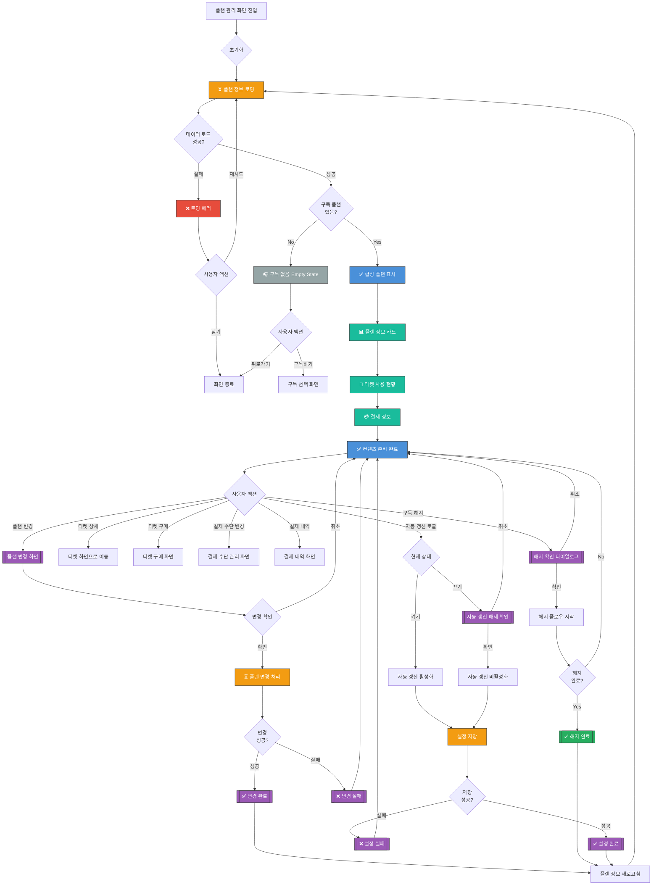

# 내 플랜/티켓 관리 화면 UI Flow

**라우트**: `/my-podo/plan`
**부모 화면**: My Podo
**타입**: 풀스크린

**Figma**: [마이포도/마이 포도 플랜 디자인](https://www.figma.com/design/DUFbC6C797d9jW5HsjFh9S/-PODO--APP-DESIGN?node-id=21451-5669)

## 개요

사용자의 현재 구독 플랜과 보유 티켓을 통합 관리하는 화면입니다. 플랜 변경, 티켓 사용 현황 확인, 결제 정보 관리 등의 기능을 제공합니다.

---

## 전체 UI Flow



---

## 상태별 상세 설명

### 1. ⏳ 로딩 상태

**표시 조건**:
- [x] 화면 최초 진입 시
- [x] 플랜 변경 후 갱신 시
- [x] 설정 변경 후 갱신 시

**UI 구성**:
- 로딩 스피너 위치: 전체 화면 중앙 또는 섹션별 스켈레톤
- 스켈레톤 UI 사용 여부: **Yes** - 플랜 카드, 티켓 카드, 결제 카드 스켈레톤
- 로딩 텍스트: "플랜 정보를 불러오고 있어요..."

**timeout 처리**:
- timeout 시간: 10초
- timeout 시 동작: 에러 상태로 전환

---

### 2. ✅ 성공 상태 (활성 플랜 표시)

**표시 조건**:
- [x] API 응답 성공
- [x] 활성화된 구독 플랜 존재

**UI 구성**:

**헤더**:
- 타이틀: "내 플랜"
- 뒤로가기 버튼

**섹션 1: 플랜 정보 카드**
- 플랜 이름: "프리미엄 플랜" / "베이직 플랜" / "Smart Talk 플랜"
- 플랜 아이콘 / 뱃지
- 다음 결제일: "2026-04-01 결제 예정"
- 다음 결제 금액: "월 49,000원"
- 상태 뱃지:
  - "정상" (초록)
  - "결제 실패" (빨강)
  - "해지 예정" (주황)
- **CTA 버튼**: "플랜 변경" / "업그레이드"

**섹션 2: 티켓 사용 현황**
- 제목: "이번 달 티켓 사용 현황"
- 진행 바:
  - 예: "5회 / 12회 사용" (41% 진행)
  - 시각적 프로그레스 바
- 남은 티켓: "7회 남음"
- **CTA 버튼**: "티켓 상세 보기" → 티켓 화면으로 이동

**섹션 3: 결제 정보**
- 결제 수단: "카드 **** 1234"
- 다음 결제일: "2026-04-01"
- 다음 결제 금액: "49,000원"
- **CTA 버튼**: "결제 수단 변경" / "결제 내역 보기"

**섹션 4: 자동 갱신 설정**
- 토글 스위치: "자동 갱신" ON/OFF
- 설명: "다음 결제일에 자동으로 갱신돼요"

**섹션 5: 추가 옵션**
- "구독 혜택 안내" 링크
- "플랜 FAQ" 링크
- "구독 해지" 링크 (빨간색 텍스트)

**인터랙션 요소**:

1. **플랜 변경 버튼**
   - 액션: 플랜 변경 화면으로 이동
   - Validation: 현재 플랜 상태 확인
   - 결과: 업그레이드/다운그레이드 옵션 표시

2. **티켓 상세 보기 버튼**
   - 액션: 티켓 화면으로 이동
   - Validation: 없음
   - 결과: 보유 티켓 목록 화면

3. **결제 수단 변경 버튼**
   - 액션: 결제 수단 관리 화면으로 이동
   - Validation: 없음
   - 결과: 카드 추가/변경/삭제 화면

4. **자동 갱신 토글**
   - 액션: 자동 갱신 ON/OFF 전환
   - Validation: OFF 시 확인 다이얼로그 표시
   - 결과: 설정 저장 + 토스트 메시지

5. **구독 해지 링크**
   - 액션: 해지 확인 다이얼로그 표시
   - Validation: 해지 가능 여부 확인
   - 결과: 해지 플로우 시작 (churn.md)

---

### 3. ❌ 에러 상태

**에러 타입별 처리**:

#### 3.1 네트워크 에러
```
에러 메시지: "플랜 정보를 불러올 수 없어요. 네트워크 연결을 확인해주세요."
CTA: [재시도 | 닫기]
```

#### 3.2 결제 실패 상태
```
플랜 카드에 빨간색 배너:
"지난 결제가 실패했어요. 결제 수단을 확인해주세요."
CTA: [결제 수단 변경 | 재결제]
```

#### 3.3 플랜 변경 실패
```
에러 메시지: "플랜 변경에 실패했어요. 다시 시도해주세요."
타입: 토스트 메시지
```

#### 3.4 자동 갱신 설정 실패
```
에러 메시지: "설정을 저장할 수 없어요. 다시 시도해주세요."
타입: 토스트 메시지
```

---

### 4. 📭 Empty State (구독 없음)

**표시 조건**:
- [x] API 응답 성공했지만 활성 플랜 없음
- [x] 과거 구독 이력은 있을 수 있음

**UI 구성**:
- 이미지/아이콘: 빈 플랜 일러스트레이션
- 메시지:
  - 주 메시지: "아직 구독 중인 플랜이 없어요"
  - 보조 메시지: "포도와 함께 영어 학습을 시작해보세요!"
- CTA 버튼: "플랜 둘러보기" → 구독 선택 화면으로 이동

**과거 구독 이력 표시** (선택 사항):
- "과거 구독 이력" 섹션
- 이전 플랜 이름 + 기간 표시
- "재구독하기" 버튼

---

## Validation Rules

| 동작 | Validation 규칙 | 에러 메시지 |
|------|----------------|------------|
| 플랜 변경 | 현재 플랜 상태 정상 | "결제 실패 상태에서는 플랜을 변경할 수 없어요." |
| 플랜 다운그레이드 | 남은 티켓 확인 | "사용하지 않은 티켓이 있어요. 티켓을 먼저 사용해주세요." |
| 자동 갱신 OFF | 해지 예정 상태로 전환 | "다음 결제일 이후 자동으로 해지돼요." |
| 구독 해지 | 최소 사용 기간 확인 | "최소 사용 기간(1개월)이 지나지 않았어요." |

---

## 모달 & 다이얼로그

### 1. 플랜 변경 확인 다이얼로그

**트리거**: 플랜 변경 화면에서 새 플랜 선택 후
**타입**: 확인

**내용**:
- 제목: "플랜을 변경하시겠어요?"
- 메시지:
  - 현재 플랜: "베이직 플랜 (월 29,000원)"
  - 새 플랜: "프리미엄 플랜 (월 49,000원)"
  - 변경 시점: "즉시 적용 (차액 결제 필요)"
  - 차액: "+20,000원 결제 필요"
- 버튼:
  - 주 버튼: "변경하기" → 결제 화면 또는 즉시 변경
  - 보조 버튼: "취소" → 다이얼로그 닫기

### 2. 자동 갱신 해제 확인 다이얼로그

**트리거**: 자동 갱신 토글을 OFF로 전환 시
**타입**: 확인

**내용**:
- 제목: "자동 갱신을 해제하시겠어요?"
- 메시지:
  - "다음 결제일(2026-04-01) 이후 자동으로 구독이 해지돼요."
  - "해지 전까지 모든 서비스를 이용할 수 있어요."
- 버튼:
  - 주 버튼: "계속 구독" → 다이얼로그 닫기
  - 보조 버튼: "자동 갱신 해제" → 설정 변경

### 3. 구독 해지 확인 다이얼로그

**트리거**: 구독 해지 링크 클릭
**타입**: 확인

**내용**:
- 제목: "정말 구독을 해지하시겠어요?"
- 메시지:
  - "해지하면 다음 혜택을 받을 수 없어요:"
  - "- 월 12회 무제한 수업"
  - "- AI 튜터 무제한 이용"
  - "- 학습 리포트 제공"
- 버튼:
  - 주 버튼: "계속 구독" → 다이얼로그 닫기
  - 보조 버튼: "해지하기" → 해지 플로우 시작 (churn.md)

### 4. 결제 실패 안내 다이얼로그

**트리거**: 화면 진입 시 결제 실패 상태인 경우 자동 표시
**타입**: 안내

**내용**:
- 제목: "결제에 실패했어요"
- 메시지:
  - "지난 결제(2026-03-01)가 실패했어요."
  - "결제 수단을 확인하거나 재결제를 시도해주세요."
  - "3일 이내 결제하지 않으면 서비스 이용이 제한될 수 있어요."
- 버튼:
  - 주 버튼: "재결제" → 결제 화면
  - 보조 버튼: "결제 수단 변경" → 결제 수단 관리 화면
  - 닫기 버튼: "나중에" → 다이얼로그 닫기

---

## Edge Cases

### 1. 플랜 변경 시 남은 티켓 처리

- **조건**: 다운그레이드 시 새 플랜 티켓 수보다 많은 티켓 보유
- **동작**:
  - 경고 메시지: "남은 티켓 5회가 사라져요. 계속하시겠어요?"
  - 사용자가 명시적으로 확인해야 진행 가능
- **UI**: 경고 다이얼로그 (주황색)

### 2. 결제 실패 후 재시도

- **조건**: 자동 결제 실패 후 수동 재결제 시도
- **동작**:
  - 결제 수단 검증
  - 실패 원인 안내 (한도 초과, 카드 만료 등)
  - 다른 결제 수단으로 시도 가능
- **UI**: 결제 실패 원인 표시 + 대안 제시

### 3. 구독 해지 후 재가입

- **조건**: 해지 후 30일 이내 재가입 시도
- **동작**:
  - "30일 이내 재가입 시 이전 플랜으로 자동 복구돼요" 안내
  - 할인 혜택 제공 (선택 사항)
- **UI**: 재가입 안내 배너

### 4. 프로모션 코드 적용 중인 플랜

- **조건**: 할인 프로모션 적용 중
- **동작**:
  - 플랜 카드에 "프로모션 적용 중" 뱃지
  - 원가 + 할인가 표시
  - 프로모션 종료일 안내
- **UI**: 할인 뱃지 + 가격 표시

### 5. 여러 플랜 동시 구독

- **조건**: 정규 플랜 + Smart Talk 플랜 동시 보유
- **동작**:
  - 각 플랜을 별도 카드로 표시
  - 총 결제 금액 합산 표시
  - 개별 관리 가능
- **UI**: 플랜 카드 2개 + 총액 표시 섹션

---

## 개발 참고사항

**주요 API**:
- `GET /api/plans/current` - 현재 활성 플랜 조회
- `GET /api/plans/tickets/usage` - 티켓 사용 현황 조회
- `POST /api/plans/change` - 플랜 변경 요청
- `PATCH /api/plans/auto-renewal` - 자동 갱신 설정 변경
- `POST /api/plans/cancel` - 구독 해지 요청
- `GET /api/billing/payment-methods` - 결제 수단 조회
- `GET /api/billing/history` - 결제 내역 조회

**상태 관리**:
- 사용하는 store/context: PlanContext, BillingContext
- 주요 상태 변수:
  - `currentPlan`: 현재 플랜 정보
  - `ticketUsage`: 티켓 사용 현황
  - `billingInfo`: 결제 정보
  - `autoRenewal`: 자동 갱신 설정
  - `paymentStatus`: 결제 상태 ('success' | 'failed' | 'pending')

**플랜 데이터 구조**:
```typescript
interface Plan {
  id: string;
  name: string; // "베이직 플랜" | "프리미엄 플랜" | "Smart Talk 플랜"
  type: 'basic' | 'premium' | 'smarttalk';
  price: number; // 월 금액
  ticketsPerMonth: number; // 월 제공 티켓 수
  startDate: string; // ISO 8601
  nextBillingDate: string;
  status: 'active' | 'payment_failed' | 'cancelled';
  autoRenewal: boolean;
}

interface TicketUsage {
  used: number;
  total: number;
  remaining: number;
  percentage: number; // 사용률 (0-100)
}
```

**Feature Flags**:
- `ENABLE_PLAN_CHANGE`: 플랜 변경 기능 활성화
- `ENABLE_AUTO_RENEWAL_TOGGLE`: 자동 갱신 토글 기능 활성화
- `SHOW_PROMOTION_BADGE`: 프로모션 뱃지 표시 여부

---

## 디자인 참고

<!-- TODO: Figma 링크나 디자인 노트 -->
- Figma: [링크 추가 필요]
- 디자인 노트:
  - 플랜 카드는 그라데이션 배경 (플랜별 색상)
  - 티켓 사용 현황은 프로그레스 바로 시각화
  - 결제 실패 시 빨간색 배너로 강조
  - 구독 해지는 눈에 띄지 않게 하단에 작은 링크로 표시

---

## 히스토리

| 날짜 | 작성자 | 변경 내용 |
|------|--------|----------|
| 2026-03-04 | Claude | 최초 작성 |

## Figma 관련 화면

- [마이포도/마이 포도 플랜/수강증 발급](https://www.figma.com/design/DUFbC6C797d9jW5HsjFh9S/-PODO--APP-DESIGN?node-id=15927-11084)
- [레슨권 연장](https://www.figma.com/design/DUFbC6C797d9jW5HsjFh9S/-PODO--APP-DESIGN?node-id=20588-7970)
- [레슨권 변경](https://www.figma.com/design/DUFbC6C797d9jW5HsjFh9S/-PODO--APP-DESIGN?node-id=21853-10805)
- [위약금 조회](https://www.figma.com/design/DUFbC6C797d9jW5HsjFh9S/-PODO--APP-DESIGN?node-id=21853-10609)
