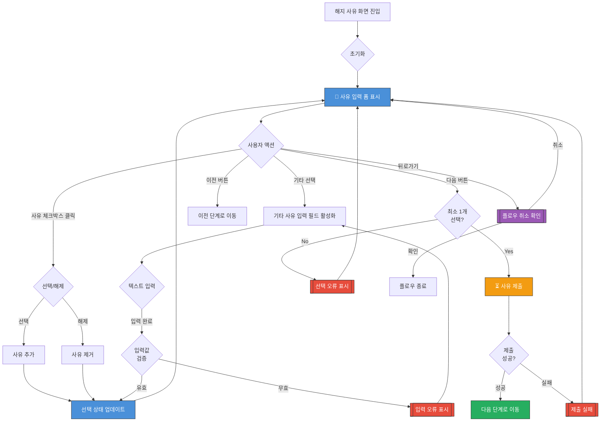

# 해지 사유 입력 화면 UI Flow

**라우트**: `/churn/reason`
**부모 화면**: 구독 해지 플로우
**타입**: 풀스크린

## 개요

구독 해지 플로우 내에서 사용자로부터 해지 사유를 수집하는 화면입니다. 서비스 개선을 위한 중요한 피드백 수집 단계입니다.

> **참고**: 이 화면은 `churn.md`의 Step 2에 해당하는 상세 문서입니다.

---

## 전체 UI Flow



---

## 상태별 상세 설명

### 1. 📝 사유 입력 폼 표시

**표시 조건**:
- [x] 화면 진입 시 즉시 표시

**UI 구성**:

**헤더**:
- 타이틀: "해지 사유"
- 뒤로가기 버튼
- 진행 상태 표시: "2 / 4" (전체 해지 플로우 내 위치)

**안내 메시지**:
- 제목: "어떤 점이 불편하셨나요?"
- 부제목: "소중한 의견을 들려주세요. 더 나은 서비스를 만들겠습니다."
- 이모지: 🤔 또는 💭

**선택 안내**:
- "복수 선택 가능" (회색 작은 텍스트)

**사유 선택 리스트** (체크박스):

각 항목은 다음 구성:
- 체크박스 + 아이콘 + 텍스트

1. **🎓 수업 내용이 만족스럽지 않아요**
   - 하위 항목 (선택 시 펼쳐짐):
     - "수업 레벨이 맞지 않아요"
     - "커리큘럼이 체계적이지 않아요"
     - "교재가 마음에 들지 않아요"

2. **💰 가격이 부담돼요**
   - 하위 항목:
     - "다른 서비스보다 비싸요"
     - "가성비가 떨어져요"
     - "경제적 여유가 없어요"

3. **⏰ 수업 시간을 맞추기 어려워요**
   - 하위 항목:
     - "원하는 시간대에 예약이 어려워요"
     - "일정이 불규칙해요"
     - "시차가 맞지 않아요"

4. **👨‍🏫 튜터와 맞지 않아요**
   - 하위 항목:
     - "튜터 퀄리티가 떨어져요"
     - "튜터가 자주 바뀌어요"
     - "원하는 튜터 예약이 어려워요"

5. **📱 앱 사용이 불편해요**
   - 하위 항목:
     - "앱이 자주 오류가 나요"
     - "UI/UX가 불편해요"
     - "기능이 부족해요"

6. **🎯 학습 효과를 느끼지 못했어요**
   - 하위 항목:
     - "실력 향상이 없어요"
     - "동기부여가 되지 않아요"
     - "학습 방식이 맞지 않아요"

7. **📅 일정이 바빠서 시간이 없어요**
   - 하위 항목 없음

8. **🔄 다른 서비스로 이동해요**
   - 하위 항목:
     - "더 나은 서비스를 찾았어요"
     - "오프라인 학습으로 전환해요"
     - "회사/학교 프로그램을 이용해요"

9. **기타**
   - 텍스트 입력 필드 활성화

**추가 의견 (선택 사항)**:
- 섹션 제목: "더 전달하고 싶은 말씀이 있으신가요? (선택)"
- 텍스트 에리어:
  - 플레이스홀더: "자유롭게 작성해주세요"
  - 최대 글자 수: 500자
  - 글자 수 카운터 표시: "0 / 500"

**버튼**:
- 주 버튼: "다음" (최소 1개 선택 시 활성화)
  - 비활성화 상태: 회색, 클릭 불가
  - 활성화 상태: 브랜드 컬러
- 보조 버튼: "이전" → 이전 단계 (해지 안내 화면)

**인터랙션 요소**:

1. **사유 체크박스 클릭**
   - 액션: 선택/해제 토글
   - Validation: 없음 (복수 선택 가능)
   - 결과: 선택 상태 업데이트, 하위 항목 펼침/접힘

2. **하위 항목 선택**
   - 액션: 상세 사유 선택
   - Validation: 상위 항목이 선택되어야 함
   - 결과: 상세 사유 저장

3. **기타 사유 입력**
   - 액션: "기타" 체크 시 텍스트 필드 활성화
   - Validation: 최소 10자 이상 입력
   - 결과: 사용자 입력 내용 저장

4. **추가 의견 입력**
   - 액션: 자유 텍스트 입력
   - Validation: 최대 500자 제한
   - 결과: 의견 저장

5. **다음 버튼**
   - 액션: 사유 제출 및 다음 단계 이동
   - Validation: 최소 1개 사유 선택 필수
   - 결과: API 제출 → 만류 혜택 화면으로 이동

---

## Validation Rules

| 필드 | Validation 규칙 | 에러 메시지 |
|------|----------------|------------|
| 사유 선택 | 최소 1개 필수 | "해지 사유를 선택해주세요." |
| 기타 사유 | "기타" 선택 시 10자 이상 | "기타 사유를 10자 이상 입력해주세요." |
| 기타 사유 | 최대 200자 | "200자 이하로 입력해주세요." |
| 추가 의견 | 최대 500자 | "500자 이하로 입력해주세요." |

---

## 에러 상태

### 사유 미선택 에러

**표시 조건**:
- [x] "다음" 버튼 클릭 시 사유가 1개도 선택되지 않음

**UI**:
- 안내 메시지 하단에 빨간색 텍스트:
  - "❌ 해지 사유를 최소 1개 선택해주세요."
- 사유 리스트 테두리 빨간색으로 강조

### 기타 사유 미입력 에러

**표시 조건**:
- [x] "기타" 체크 시 텍스트 미입력 또는 10자 미만

**UI**:
- 텍스트 필드 하단에 빨간색 텍스트:
  - "❌ 기타 사유를 10자 이상 입력해주세요."
- 텍스트 필드 테두리 빨간색

### API 제출 실패 에러

**표시 조건**:
- [x] 사유 제출 API 호출 실패

**UI**:
- 토스트 메시지:
  - "사유를 제출할 수 없어요. 다시 시도해주세요."
- 재시도 버튼 표시

---

## 모달 & 다이얼로그

### 1. 플로우 취소 확인 다이얼로그

**트리거**: 뒤로가기 버튼 또는 시스템 뒤로가기
**타입**: 확인

**내용**:
- 제목: "해지를 취소하시겠어요?"
- 메시지: "입력하신 내용이 저장되지 않아요."
- 버튼:
  - 주 버튼: "계속 작성" → 다이얼로그 닫기
  - 보조 버튼: "나가기" → 플로우 종료

### 2. 하위 항목 선택 바텀시트 (선택 사항)

**트리거**: 사유 항목 클릭 (대안: 인라인 펼침)
**타입**: 바텀시트

**내용**:
- 제목: 선택한 사유 (예: "수업 내용이 만족스럽지 않아요")
- 하위 항목 리스트 (라디오 버튼):
  - "수업 레벨이 맞지 않아요"
  - "커리큘럼이 체계적이지 않아요"
  - "교재가 마음에 들지 않아요"
- 버튼:
  - 주 버튼: "선택" → 상세 사유 저장
  - 보조 버튼: "닫기"

---

## Edge Cases

### 1. 모든 사유 선택

- **조건**: 사용자가 모든 사유를 선택
- **동작**: 정상 처리
- **UI**: 선택 제한 없음

### 2. 기타 사유만 선택

- **조건**: 기타만 체크 + 텍스트 입력
- **동작**: 정상 처리
- **UI**: 다른 사유 없이도 다음 단계 진행 가능

### 3. 추가 의견만 작성 (사유 미선택)

- **조건**: 추가 의견만 입력, 사유 선택 안 함
- **동작**: 에러 표시
- **UI**: "해지 사유를 선택해주세요" 에러 메시지

### 4. 하위 항목 선택 후 상위 항목 해제

- **조건**: 하위 항목 선택 → 상위 항목 체크 해제
- **동작**: 하위 항목도 함께 해제
- **UI**: 자동 해제 처리

### 5. 긴 텍스트 입력

- **조건**: 추가 의견에 500자 초과 입력
- **동작**: 500자에서 자동 잘림 또는 입력 차단
- **UI**: "500자를 초과할 수 없어요" 에러 메시지

---

## 개발 참고사항

**주요 API**:
- `POST /api/churn/reasons` - 해지 사유 제출
  - Request Body:
    ```json
    {
      "reasons": ["price_burden", "time_constraint"],
      "subReasons": ["other_service_cheaper", "irregular_schedule"],
      "otherReason": "기타 사유 텍스트",
      "additionalComment": "추가 의견 텍스트"
    }
    ```

**상태 관리**:
- 사용하는 store/context: ChurnContext
- 주요 상태 변수:
  - `selectedReasons`: 선택된 주 사유 배열
  - `selectedSubReasons`: 선택된 하위 사유 배열
  - `otherReasonText`: 기타 사유 텍스트
  - `additionalComment`: 추가 의견
  - `isFormValid`: 폼 유효성 상태

**사유 코드 정의**:
```typescript
enum ChurnReason {
  CONTENT_UNSATISFIED = 'content_unsatisfied',
  PRICE_BURDEN = 'price_burden',
  TIME_CONSTRAINT = 'time_constraint',
  TUTOR_MISMATCH = 'tutor_mismatch',
  APP_UX_ISSUE = 'app_ux_issue',
  NO_EFFECT = 'no_effect',
  BUSY_SCHEDULE = 'busy_schedule',
  SWITCHING_SERVICE = 'switching_service',
  OTHER = 'other',
}

enum ChurnSubReason {
  // CONTENT_UNSATISFIED
  LEVEL_MISMATCH = 'level_mismatch',
  CURRICULUM_ISSUE = 'curriculum_issue',
  MATERIAL_ISSUE = 'material_issue',

  // PRICE_BURDEN
  EXPENSIVE = 'expensive',
  LOW_VALUE = 'low_value',
  FINANCIAL_ISSUE = 'financial_issue',

  // TIME_CONSTRAINT
  BOOKING_DIFFICULTY = 'booking_difficulty',
  IRREGULAR_SCHEDULE = 'irregular_schedule',
  TIMEZONE_ISSUE = 'timezone_issue',

  // TUTOR_MISMATCH
  TUTOR_QUALITY = 'tutor_quality',
  TUTOR_CHANGE = 'tutor_change',
  TUTOR_BOOKING = 'tutor_booking',

  // ... 등등
}
```

**Analytics 이벤트**:
```typescript
// 사유 선택 시
trackEvent('churn_reason_selected', {
  reason: 'price_burden',
  step: 2,
});

// 사유 제출 시
trackEvent('churn_reasons_submitted', {
  reasons: ['price_burden', 'time_constraint'],
  hasOtherReason: true,
  hasAdditionalComment: true,
});
```

**Feature Flags**:
- `ENABLE_SUB_REASONS`: 하위 사유 선택 기능
- `ENABLE_ADDITIONAL_COMMENT`: 추가 의견 입력 기능
- `REQUIRE_DETAILED_REASON`: 상세 사유 필수 입력 (기본: false)

---

## 디자인 참고

- Figma: [링크 추가 필요]
- 디자인 노트:
  - 체크박스는 브랜드 컬러
  - 선택된 항목은 배경색 강조
  - 하위 항목은 인덴트로 시각적 계층 표현
  - 기타 입력 필드는 선택 시 부드럽게 나타남 (애니메이션)

---

## 히스토리

| 날짜 | 작성자 | 변경 내용 |
|------|--------|----------|
| 2026-03-04 | Claude | 최초 작성 |
