# 리뷰 완료 (Review Complete) UI Flow

**라우트**: `/lessons/classroom/[classID]/review-complete?referrer={optional}`
**부모 화면**: 수업 리뷰 (`/lessons/classroom/[classID]/review`)
**타입**: 풀스크린

**Figma**: [리뷰 완료 (복습) 디자인](https://www.figma.com/design/DUFbC6C797d9jW5HsjFh9S/-PODO--APP-DESIGN?node-id=21498-8538)

## 개요

복습 퀴즈를 완료한 후 표시되는 축하 화면입니다. 2초 대기 후 다음 단계로 전환되며, Feature Flag에 따라 NPS 서베이 또는 간단한 축하 메시지를 표시합니다. 사용자를 다음 레슨 예약으로 유도하는 것이 주요 목적입니다.

---

## 전체 UI Flow

```mermaid
graph TD
    %% ===== 초기 진입 =====
    Start[화면 진입] --> ValidateParams{classID<br/>파라미터 검증}
    ValidateParams -->|실패| NotFound[404 Not Found]
    ValidateParams -->|성공| FetchTutor[튜터 정보 조회]

    %% ===== 튜터 정보 조회 =====
    FetchTutor --> TryCompleted[1차: getCompletedLecture]
    TryCompleted --> CompletedCheck{조회 성공?}
    CompletedCheck -->|Yes| GotTutorId[tutorId 획득]
    CompletedCheck -->|No| TryReserved[2차: getReservedLessons]

    TryReserved --> ReservedCheck{해당 수업 찾음?}
    ReservedCheck -->|Yes| GotTutorId
    ReservedCheck -->|No| DefaultTutor[기본값: tutorId=0<br/>tutorName='튜터']

    GotTutorId --> FetchProfile[getTutorProfile]
    FetchProfile --> ProfileCheck{프로필 조회<br/>성공?}
    ProfileCheck -->|Yes| GotTutorName[tutorName 획득]
    ProfileCheck -->|No| DefaultTutor

    %% ===== 화면 렌더링 =====
    GotTutorName --> RenderView[뷰 렌더링]
    DefaultTutor --> RenderView

    RenderView --> InitialScreen[🎉 축하 아이콘 표시]
    InitialScreen --> Wait2Sec[2초 대기]

    %% ===== Feature Flag 분기 =====
    Wait2Sec --> CheckNpsFlag{NPS Feature Flag<br/>활성화?}
    CheckNpsFlag -->|Yes| NpsSurvey[📊 NPS 서베이 플로우]
    CheckNpsFlag -->|No| CongratScreen[✅ 잘했어요 화면]

    %% ===== NPS 서베이 =====
    NpsSurvey --> NpsFlow[NpsSurveyFlow 컴포넌트]
    NpsFlow --> NpsComplete[서베이 완료]
    NpsComplete --> NavigateHome1[홈으로 이동]

    %% ===== 잘했어요 화면 =====
    CongratScreen --> ShowMessage[축하 메시지 표시<br/>+ 애니메이션]
    ShowMessage --> ShowCTA[다음 레슨 예약 CTA<br/>페이드인]

    ShowCTA --> UserAction((다음 레슨 예약하기))
    UserAction --> NavigateHome2[홈으로 이동<br/>/home or /home/ai]

    %% ===== 스타일링 =====
    classDef normal fill:#4A90D9,stroke:#333,color:#fff
    classDef error fill:#E74C3C,stroke:#333,color:#fff
    classDef warning fill:#F39C12,stroke:#333,color:#fff
    classDef success fill:#27AE60,stroke:#333,color:#fff
    classDef empty fill:#95A5A6,stroke:#333,color:#fff
    classDef modal fill:#9B59B6,stroke:#333,color:#fff

    class CongratScreen,ShowMessage,GotTutorName success
    class NotFound error
    class Wait2Sec,InitialScreen warning
    class NpsSurvey,NpsFlow modal
```



---

## 상태별 상세 설명

### 1. ⏳ 초기 로딩 및 튜터 정보 조회

**표시 조건**:
- [x] 화면 최초 진입 시
- [x] 서버에서 튜터 정보 조회 중

**프로세스**:
1. **1차 시도**: `getCompletedLecture({ classId })` 호출
   - 성공 시: `tutor_id` 추출
   - 실패 시: 2차 시도

2. **2차 시도**: `getReservedLessons()` 호출 후 해당 수업 찾기
   - `lectures.find(l => l.class_id === classID)`
   - 성공 시: `tutor_id` 추출
   - 실패 시: 기본값 사용

3. **튜터 프로필 조회**: `getTutorProfile({ tutorId })`
   - 성공 시: `tutor_name` 추출
   - 실패 시: 기본값 "튜터" 사용

**기본값**:
- `tutorId = 0`
- `tutorName = '튜터'`

**에러 핸들링**:
- 모든 API 실패는 try-catch로 감싸서 무시
- 어떤 경우든 화면은 정상 렌더링 (기본값 사용)

---

### 2. 🎉 초기 축하 화면 (0-2초)

**표시 조건**:
- [x] 화면 진입 직후
- [x] 2초 동안 표시

**UI 구성**:
- **중앙**:
  - CheerupIconLottie (180x180px)
  - 루프 애니메이션
  - 축하 아이콘

**애니메이션**:
- Framer Motion `layout` 애니메이션
- 부드러운 전환 (duration: 0.3s, ease: linear)

**타이머**:
```typescript
setTimeout(() => {
  if (isNpsEnabled) {
    setShowNps(true)
  } else {
    setShowNextScreen(true)
  }
}, 2000)
```

---

### 3. ✅ 잘했어요 화면 (NPS 비활성화)

**표시 조건**:
- [x] NPS Feature Flag 비활성화
- [x] 2초 대기 후 페이드인

**UI 구성**:
- **중앙 컨텐츠**:
  - CheerupIconLottie (180x180px) - 계속 표시
  - 제목: "잘했어요!" (h1, center)
  - 설명: "물들어 온김에 노저어보아요. 다음 레슨 예약도 진행해볼까요?" (h3, gray-500, medium, center)

- **하단 CTA** (Sticky):
  - 버튼: "다음 레슨 예약하기" (xLarge, 전체 너비)
  - 액션: 홈으로 이동 (`preserveParams: true`)
    - `hasOnlyCharacterChatSubscriptionTicket === true` → `/home/ai`
    - `false` → `/home`

**애니메이션**:
- 메시지: 페이드인 (opacity 0 → 1, delay: 0.3s)
- CTA: 페이드인 (opacity 0 → 1, delay: 0.3s)
- 아이콘: layout 애니메이션으로 재배치

**이벤트 로깅**:
```typescript
{
  name: UI_IDS.btn.bookNextLesson,
  location: 'lesson_review_complete',
  action: 'navigate'
}
```

---

### 4. 📊 NPS 서베이 플로우 (NPS 활성화)

**표시 조건**:
- [x] NPS Feature Flag 활성화 (`TBD_260219_NPS_INAPP`)
- [x] 2초 대기 후 표시

**UI 구성**:
- `NpsSurveyFlow` 컴포넌트 렌더링
- Props 전달:
  - `classId`: 수업 ID
  - `tutorId`: 튜터 ID
  - `tutorName`: 튜터 이름
  - `nextLessonHomeType`: 다음 홈 타입 ('ai' | 'home')
  - `referrer`: 유입 경로

**NPS 서베이 내용** (추정):
1. 만족도 점수 (0-10)
2. 추가 피드백 (선택)
3. 서베이 완료 후 자동 홈 이동

---

## Validation Rules

### URL 파라미터 검증

| 파라미터 | 검증 규칙 | 에러 처리 |
|----------|----------|----------|
| `classID` | 문자열 → 정수 변환 가능 | notFound() |
| `referrer` | (선택) 문자열 | 기본값: '' |

Zod 스키마: `paramsSchema = z.object({ classID: z.string().transform((val) => parseInt(val)) })`

---

## Edge Cases

### 1. 튜터 정보 조회 실패
- **조건**: `getCompletedLecture`, `getReservedLessons`, `getTutorProfile` 모두 실패
- **동작**: 기본값 사용 (`tutorId=0`, `tutorName='튜터'`)
- **UI**: 정상 표시 (NPS 서베이에 기본값 전달)

### 2. NPS Feature Flag 중간 변경
- **조건**: 화면 진입 후 Feature Flag가 변경됨
- **동작**: 초기 로드 시점의 Flag 값으로 고정 (`useEffect` 의존성 없음)
- **UI**: 변경 사항 반영 안 됨

### 3. 2초 대기 중 사용자 이탈
- **조건**: 사용자가 2초 안에 뒤로가기
- **동작**: `useEffect` cleanup으로 타이머 취소
- **UI**: 메모리 누수 방지

### 4. Character Chat 전용 구독
- **조건**: `hasOnlyCharacterChatSubscriptionTicket === true`
- **동작**: "다음 레슨 예약하기" 버튼이 `/home/ai`로 이동
- **UI**: AI 수업 전용 홈으로 안내

### 5. referrer 파라미터
- **조건**: URL에 `referrer` 쿼리 있음 (예: `referrer=lesson_report`)
- **동작**: NPS 서베이에 전달되어 유입 경로 추적
- **UI**: 사용자에게 보이지 않음 (분석용)

### 6. Suspense fallback
- **조건**: 뷰 로딩 중
- **동작**: `fallback={null}` → 화면 비어있음
- **UI**: 빠른 로딩으로 사용자에게 거의 보이지 않음

---

## 개발 참고사항

**주요 API**:
- `GET /api/lesson/completed?classId={id}` - 완료된 수업 정보 (튜터 ID 추출)
- `GET /api/lesson/reserved` - 예약된 수업 목록 (fallback용)
- `GET /api/tutor/profile?tutorId={id}` - 튜터 프로필 (이름 추출)

**상태 관리**:
- Local state:
  - `showNextScreen`: 2초 후 메시지 표시 여부
  - `showNps`: NPS 서베이 표시 여부
- Props:
  - `classID`, `tutorId`, `tutorName`: 서버에서 전달
  - `nextLessonHomeType`: 사용자 구독 타입에 따라 결정
  - `referrer`: 유입 경로 추적용

**Feature Flags**:
- `TBD_260219_NPS_INAPP`: NPS 인앱 서베이 활성화 여부
  - Enabled → `NpsSurveyFlow` 렌더링
  - Disabled → "잘했어요!" 화면 렌더링

**라우팅**:
- 진입: `/lessons/classroom/{classID}/review` → 퀴즈 완료 후 자동 이동
- 다음: `/home` 또는 `/home/ai` (구독 타입에 따라)

**애니메이션**:
- Framer Motion 사용
- 주요 애니메이션:
  - `layout`: 요소 위치/크기 변경 시 부드러운 전환
  - `initial/animate`: 페이드인 효과
  - `transition`: 타이밍 제어 (delay, duration, ease)

**성능 최적화**:
- Server-side: 튜터 정보 미리 조회 (프리페치 없음, 서버에서 직접 fetch)
- Client-side: Suspense fallback null (빠른 렌더링)
- 타이머: cleanup으로 메모리 누수 방지

---

## 디자인 참고

- Figma: [추가 필요]
- 디자인 노트:
  - CheerupIconLottie: 180x180px
  - 메시지 간격: 20px
  - 텍스트 정렬: 중앙
  - CTA: 하단 고정 (BottomStickyContainer)
  - 애니메이션 duration: 0.3s
  - 페이드인 delay: 0.3s

---

## NPS 서베이 플로우 (참고)

NPS 활성화 시 `NpsSurveyFlow` 컴포넌트가 전체 화면을 대체합니다.

**예상 플로우**:
1. **만족도 점수** (0-10)
   - "오늘 수업을 얼마나 추천하시겠어요?"
   - 0-6: Detractor (불만족)
   - 7-8: Passive (보통)
   - 9-10: Promoter (만족)

2. **피드백** (선택)
   - 점수에 따라 다른 질문
   - Detractor: "어떤 점이 아쉬웠나요?"
   - Promoter: "어떤 점이 좋았나요?"

3. **완료**
   - 감사 메시지
   - 자동으로 홈 이동

---

## 히스토리

| 날짜 | 작성자 | 변경 내용 |
|------|--------|----------|
| 2026-03-04 | junse | 최초 작성 |
