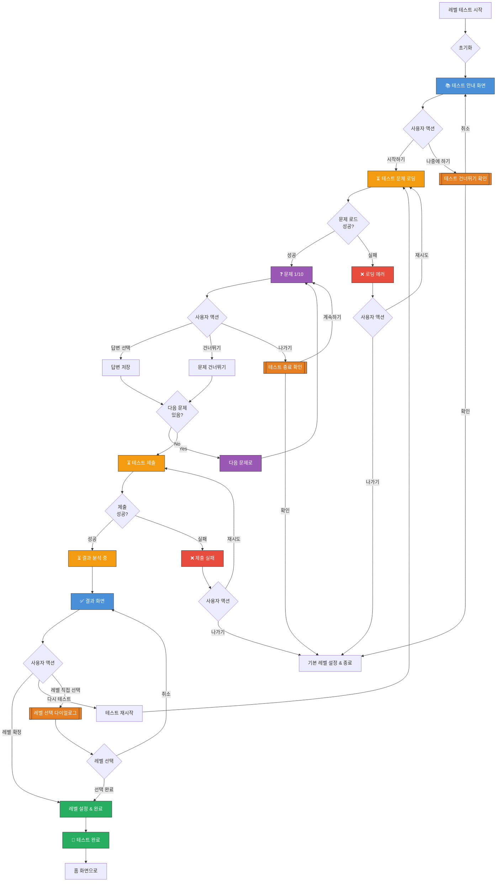

# 레벨 테스트/자가진단 화면 UI Flow

**라우트**: `/selftest` 또는 `/level-test`
**부모 화면**: Home 또는 My Podo
**타입**: 풀스크린 플로우

**Figma**: [온보딩 디자인](https://www.figma.com/design/DUFbC6C797d9jW5HsjFh9S/-PODO--APP-DESIGN?node-id=21049-6218)

## 개요

사용자의 영어 실력을 측정하여 적합한 레벨을 추천하는 테스트 화면입니다. 신규 가입 시 또는 레벨 재측정 요청 시 진행됩니다.

---

## 전체 UI Flow



---

## 단계별 상세 설명

### 1. 📚 테스트 안내 화면

**UI 구성**:

**헤더**:
- 타이틀: "레벨 테스트"
- 닫기 버튼 (X)

**본문**:
- 아이콘: 책 또는 시험지 일러스트
- 제목: "나에게 맞는 레벨을 찾아볼까요?"
- 설명:
  - "간단한 테스트로 영어 실력을 확인하고"
  - "딱 맞는 레벨의 수업을 추천받아보세요!"

**테스트 정보**:
- 카드 형태로 표시:
  - 📝 총 문제 수: "10문제"
  - ⏱️ 예상 소요 시간: "약 5분"
  - 📊 측정 레벨: "Beginner ~ Advanced (Lv.1 ~ Lv.10)"
  - 💡 문제 유형: "문법, 어휘, 독해, 듣기"

**주의사항**:
- 작은 회색 텍스트:
  - "• 편안한 마음으로 답변해주세요"
  - "• 모르는 문제는 건너뛸 수 있어요"
  - "• 테스트는 언제든 다시 볼 수 있어요"

**버튼**:
- 주 버튼: "시작하기" (브랜드 컬러) → 테스트 문제 로딩
- 보조 버튼: "나중에 할게요" (회색) → 건너뛰기 확인

---

### 2. ❓ 문제 화면

**UI 구성**:

**헤더**:
- 진행 표시: "3 / 10" (숫자) + 프로그레스 바
- 나가기 버튼 (X)

**문제 영역**:

**문제 타입 1: 문법 선택**
- 문제 번호: "Q3"
- 문제 유형 뱃지: [문법]
- 지문:
  - "다음 빈칸에 알맞은 것을 고르세요"
  - "I ____ to the store yesterday."
- 선택지 (4개):
  - A. go
  - B. went
  - C. going
  - D. gone
- 각 선택지는 버튼 형태

**문제 타입 2: 어휘 선택**
- 문제 유형 뱃지: [어휘]
- 지문:
  - "다음 밑줄 친 단어의 의미로 적절한 것은?"
  - "The **evident** solution was accepted by everyone."
- 선택지:
  - A. Hidden
  - B. Obvious
  - C. Difficult
  - D. Complex

**문제 타입 3: 독해**
- 문제 유형 뱃지: [독해]
- 지문: 짧은 문단 (3~5문장)
- 질문: "What is the main idea of the passage?"
- 선택지 (4개)

**문제 타입 4: 듣기** (선택 사항)
- 문제 유형 뱃지: [듣기]
- 오디오 플레이어:
  - 재생 버튼 (🔊)
  - 재생 횟수 제한: 최대 2회
- 질문: "What did the speaker say?"
- 선택지 (4개)

**하단 버튼**:
- "건너뛰기" (회색 텍스트 버튼) → 다음 문제로
- "다음" (선택 완료 시 활성화) → 다음 문제로

**인터랙션**:

1. **선택지 클릭**
   - 액션: 답변 선택
   - Validation: 없음 (선택 자유)
   - 결과: 선택된 답변 강조 (브랜드 컬러 배경)

2. **다음 버튼**
   - 액션: 답변 저장 + 다음 문제로 이동
   - Validation: 선택지 1개 선택 필요
   - 결과: 다음 문제 표시

3. **건너뛰기 버튼**
   - 액션: 답변 없이 다음 문제로
   - Validation: 없음
   - 결과: 해당 문제 점수 없음

4. **나가기 버튼**
   - 액션: 테스트 중도 종료 확인
   - Validation: 없음
   - 결과: 확인 다이얼로그 표시

---

### 3. ⏳ 결과 분석 중 화면

**UI 구성**:
- 전체 화면 중앙에 애니메이션
- 로딩 스피너 + 분석 아이콘
- 메시지:
  - "결과를 분석하고 있어요..."
  - "잠시만 기다려주세요 ✨"
- 예상 시간: 2~3초

---

### 4. ✅ 결과 화면

**UI 구성**:

**헤더**:
- 타이틀: "테스트 결과"
- 닫기 버튼

**축하 메시지**:
- 아이콘: 트로피 또는 별 이모지 🏆
- 제목: "테스트를 완료했어요!"
- 부제: "당신의 영어 레벨을 확인해보세요"

**레벨 결과 카드** (크게 강조):
- 레벨 표시: "Level 5"
- 레벨 이름: "Intermediate"
- 레벨 설명: "일상 대화가 가능하며 기본적인 의사소통이 원활해요"
- 그래프/차트:
  - 전체 레벨 스펙트럼 (Lv.1 ~ Lv.10)
  - 현재 레벨 위치 강조

**세부 점수**:
- 문법: "8 / 10 점" (80%) + 프로그레스 바
- 어휘: "7 / 10 점" (70%)
- 독해: "6 / 10 점" (60%)
- 듣기: "9 / 10 점" (90%)
- 종합: "75점"

**추천 수업**:
- "이런 수업을 추천해요:"
- 수업 카드 3개 (Level 5에 적합한 수업)

**버튼**:
- 주 버튼: "이 레벨로 시작하기" → 레벨 확정
- 보조 버튼 1: "다시 테스트하기" → 테스트 재시작
- 보조 버튼 2: "레벨 직접 선택" → 레벨 선택 다이얼로그

---

## Validation Rules

| 동작 | Validation 규칙 | 에러 메시지 |
|------|----------------|------------|
| 문제 풀이 | 답변 선택 (선택 사항) | 없음 (건너뛰기 가능) |
| 테스트 제출 | 최소 5문제 이상 답변 | "최소 5문제 이상 풀어주세요." |

---

## 모달 & 다이얼로그

### 1. 테스트 건너뛰기 확인 다이얼로그

**트리거**: 안내 화면에서 "나중에 할게요" 클릭
**타입**: 확인

**내용**:
- 제목: "레벨 테스트를 건너뛰시겠어요?"
- 메시지:
  - "테스트를 건너뛰면 기본 레벨(Lv.3)로 설정돼요."
  - "나중에 언제든 테스트를 다시 볼 수 있어요."
- 버튼:
  - 주 버튼: "테스트 할게요" → 다이얼로그 닫기
  - 보조 버튼: "건너뛰기" → 기본 레벨 설정 & 종료

### 2. 테스트 중도 종료 확인 다이얼로그

**트리거**: 문제 풀이 중 나가기 버튼 클릭
**타입**: 확인

**내용**:
- 제목: "테스트를 그만 두시겠어요?"
- 메시지:
  - "지금까지 푼 문제는 저장되지 않아요."
  - "처음부터 다시 시작해야 해요."
- 버튼:
  - 주 버튼: "계속 풀기" → 다이얼로그 닫기
  - 보조 버튼: "그만 두기" → 기본 레벨 설정 & 종료

### 3. 레벨 선택 다이얼로그

**트리거**: 결과 화면에서 "레벨 직접 선택" 클릭
**타입**: 바텀시트

**내용**:
- 제목: "레벨을 선택하세요"
- 레벨 리스트 (스크롤):
  - Lv.1 - Beginner (초급)
  - Lv.2 - Elementary (초급)
  - Lv.3 - Pre-Intermediate (초중급)
  - ...
  - Lv.10 - Advanced (고급)
- 각 레벨 클릭 시 선택
- 버튼:
  - 주 버튼: "선택 완료" → 레벨 설정
  - 보조 버튼: "취소" → 다이얼로그 닫기

---

## Edge Cases

### 1. 테스트 중 네트워크 끊김

- **조건**: 문제 풀이 중 네트워크 끊김
- **동작**: 로컬 저장 후 재연결 시 복구
- **UI**: "네트워크 연결을 확인해주세요" 토스트

### 2. 모든 문제 건너뛰기

- **조건**: 10문제 모두 건너뛰기
- **동작**: 제출 불가, 경고 메시지
- **UI**: "최소 5문제 이상 풀어주세요"

### 3. 듣기 문제 오디오 재생 실패

- **조건**: 오디오 로딩 실패
- **동작**: 해당 문제 건너뛰기 자동 처리
- **UI**: "오디오를 불러올 수 없어요. 다음 문제로 넘어갑니다."

### 4. 결과가 레벨 경계에 위치

- **조건**: 점수가 두 레벨 사이 (예: Lv.4와 Lv.5 경계)
- **동작**: 낮은 레벨 추천 (Lv.4)
- **UI**: "두 레벨 중 하나를 선택할 수 있어요" 옵션 제공

### 5. 재테스트 시 이전 결과 보존

- **조건**: 이미 레벨 테스트 완료 후 재테스트
- **동작**: 새 결과로 업데이트
- **UI**: "이전 레벨: Lv.5 → 새 레벨: Lv.6" 변경 사항 표시

---

## 개발 참고사항

**주요 API**:
- `GET /api/level-test/questions` - 테스트 문제 조회
- `POST /api/level-test/submit` - 테스트 제출
- `GET /api/level-test/result/:testId` - 결과 조회
- `POST /api/level-test/confirm-level` - 레벨 확정

**상태 관리**:
- 사용하는 store/context: LevelTestContext, UserContext
- 주요 상태 변수:
  - `questions`: 문제 배열
  - `currentQuestionIndex`: 현재 문제 번호
  - `answers`: 답변 배열
  - `testResult`: 테스트 결과
  - `isSubmitting`: 제출 중 여부

**테스트 데이터 구조**:
```typescript
interface Question {
  id: string;
  type: 'grammar' | 'vocabulary' | 'reading' | 'listening';
  text: string; // 문제 지문
  audioUrl?: string; // 듣기 문제용
  options: {
    id: string;
    text: string;
  }[];
  correctAnswer: string; // 정답 (클라이언트에서는 숨김)
}

interface TestResult {
  level: number; // 1~10
  levelName: string; // "Intermediate"
  totalScore: number; // 종합 점수
  scores: {
    grammar: number;
    vocabulary: number;
    reading: number;
    listening: number;
  };
  recommendedLessons: Lesson[];
}
```

**Feature Flags**:
- `ENABLE_LISTENING_TEST`: 듣기 문제 포함 여부
- `ENABLE_LEVEL_SKIP`: 테스트 건너뛰기 허용 여부
- `ENABLE_LEVEL_MANUAL_SELECT`: 레벨 직접 선택 허용

---

## 디자인 참고

- Figma: [링크 추가 필요]
- 디자인 노트:
  - 문제 화면은 깔끔하고 집중할 수 있는 디자인
  - 결과 화면은 축하 분위기 연출
  - 레벨 표시는 색상 그라데이션 (Lv.1: 연한 파랑 → Lv.10: 진한 파랑)

---

## 히스토리

| 날짜 | 작성자 | 변경 내용 |
|------|--------|----------|
| 2026-03-04 | Claude | 최초 작성 |

## Figma 관련 화면

- [두번째 온보딩](https://www.figma.com/design/DUFbC6C797d9jW5HsjFh9S/-PODO--APP-DESIGN?node-id=21178-5942)
