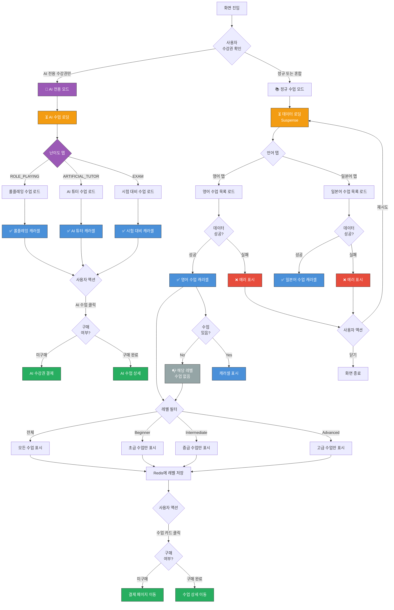

# 수업 탐색 (Subscribes) 화면 UI Flow

**라우트**: `/subscribes`
**부모 화면**: Home, Bottom Tab Navigation
**타입**: 메인 화면 (Bottom Tab)

**Figma**: [수업 디자인](https://www.figma.com/design/DUFbC6C797d9jW5HsjFh9S/-PODO--APP-DESIGN?node-id=21275-11149)

## 개요

사용자가 수강 가능한 수업 코스들을 탐색하고 구매할 수 있는 화면입니다.
사용자의 수강권 상태에 따라 두 가지 모드로 표시됩니다:
- **정규 수업 모드**: 영어/일본어 언어별 탭으로 구성
- **AI 전용 모드**: AI 스마트톡 수업만 표시 (AI 전용 수강권 보유 시)

---

## 전체 UI Flow



---

## 상태별 상세 설명

### 1. ⏳ 로딩 상태

**표시 조건**:
- [x] 화면 최초 진입 시
- [x] 언어 탭 전환 시
- [x] 난이도 탭 전환 시 (AI 모드)

**UI 구성**:
- 로딩 스피너 위치: 전체 페이지 중앙
- 스켈레톤 UI 사용 여부: Yes
- 컴포넌트: `SubscribePageLoadingView`

**구현**:
```tsx
<Suspense fallback={<SubscribePageLoadingView />}>
  {/* 실제 컨텐츠 */}
</Suspense>
```

**timeout 처리**:
- timeout 시간: 브라우저 기본 (React Suspense)
- timeout 시 동작: ErrorBoundary로 fallback

---

### 2. ✅ 성공 상태 (정상 컨텐츠)

**표시 조건**:
- [x] API 응답 성공 및 데이터 존재
- [x] `subscribes.length > 0` (정규 모드)
- [x] `subscribes.lessonGroups.length > 0` (AI 모드)

**UI 구성 - 정규 수업 모드**:

#### 헤더
- **언어 탭**: 영어 / 일본어
- 탭 선택 시 해당 언어 수업만 표시
- 초기값: 첫 번째 수강권 언어 또는 영어

#### 메인 컨텐츠
각 수업 그룹별로 섹션 구성:

1. **섹션 헤더**
   - 그룹명 (예: "비즈니스 영어", "일상 회화")
   - Business 타입: Lottie 아이콘 표시
   - 레벨 필터 (uiConfig.showFilters === true인 경우만)
     - 전체 / Beginner / Intermediate / Advanced

2. **수업 카드 캐러셀**
   - 수평 스크롤 가능
   - 각 카드 정보:
     - 썸네일 이미지
     - 수업명
     - 설명
     - 수업 시간 (분)
     - 레벨 표시
     - 레슨 수
     - 구매 여부 표시

**UI 구성 - AI 전용 모드**:

#### 헤더
- **난이도 탭**: 롤플레잉 / AI 튜터 / 시험 대비
- 탭 선택 시 해당 난이도 수업만 표시

#### 메인 컨텐츠
각 레벨별 그룹:
- 캐러셀 구조는 정규 모드와 동일
- AI 수업 카드는 `curriculumType: SMART_TALK`로 표시

**인터랙션 요소**:

1. **언어 탭 전환**
   - 액션: 선택한 언어의 수업 목록으로 전환
   - Validation: 없음
   - 결과: 해당 언어 수업 로드 및 표시

2. **레벨 필터 선택**
   - 액션: 선택한 레벨의 수업만 필터링
   - Validation: 없음
   - 결과:
     - 화면에 필터링된 수업만 표시
     - "전체"가 아닌 경우 Redis에 사용자 선호 레벨 저장

3. **수업 카드 클릭**
   - 액션: 수업 상세 또는 결제 페이지로 이동
   - Validation: 구매 여부 확인
   - 결과:
     - 미구매: `/subscribes/tickets` → `/subscribes/payment/[id]`
     - 구매 완료: 수업 상세 페이지 또는 예약 페이지

---

### 3. ❌ 에러 상태

**에러 타입별 처리**:

#### 3.1 네트워크 에러
```
컴포넌트: SubscribePageErrorView (ErrorBoundary)
에러 메시지: "네트워크 연결을 확인해주세요"
CTA: [재시도]
```

#### 3.2 API 에러 (4xx, 5xx)
```
컴포넌트: SubscribePageErrorView
에러 메시지: "일시적인 오류가 발생했습니다"
CTA: [재시도]
```

#### 3.3 데이터 파싱 에러
```
컴포넌트: SubscribePageErrorView
에러 메시지: "데이터를 불러올 수 없습니다"
CTA: [재시도]
```

**에러 처리 방식**:
```tsx
<ErrorBoundary FallbackComponent={SubscribePageErrorView}>
  {/* 실제 컨텐츠 */}
</ErrorBoundary>
```

---

### 4. 📭 Empty State

**표시 조건**:
- [x] 특정 레벨 필터 선택 시 해당 레벨 수업이 0건
- [x] `subscribe.lesson_groups.length === 0`

**UI 구성**:
- 동작: 해당 섹션 자체를 렌더링하지 않음
- 메시지: 별도 Empty State 메시지 없음
- 다른 레벨로 전환 가능

**코드**:
```tsx
if (subscribe.lesson_groups.length === 0) {
  return null
}
```

---

## Validation Rules

해당 화면은 입력 폼이 없으므로 validation 불필요.

---

## 모달 & 다이얼로그

이 화면에서 직접 표시되는 모달은 없음.

수업 카드 클릭 시 다른 화면으로 네비게이션하거나, 하위 화면(tickets, payment)에서 모달 표시.

---

## Edge Cases

### 1. AI 전용 수강권만 보유한 경우

- **조건**: `hasOnlyCharacterChatSubscriptionTicket === true`
- **동작**: 정규 수업 탐색 불가, AI 전용 모드로만 표시
- **UI**:
  - 언어 탭 대신 난이도 탭 (롤플레잉/AI튜터/시험)
  - 체험 유저인 경우 `isTrial` 플래그 활성화

### 2. 저장된 레벨 선호도가 있는 경우

- **조건**: `savedLevel`이 존재하고, 현재 수업 그룹에 해당 레벨이 있음
- **동작**: 초기 렌더링 시 저장된 레벨로 필터링된 상태로 표시
- **UI**: 해당 레벨 탭이 선택된 상태로 시작

### 3. Business 타입 수업 그룹

- **조건**: `iconType === 'business'`
- **동작**: 그룹명 옆에 Lottie 애니메이션 아이콘 표시
- **UI**: `/images/icons/business-icon.json` 재생

### 4. UI Config 기반 동적 UI

- **조건**: `subscribe.uiConfig` 값에 따라
- **동작**:
  - `showFilters`: 레벨 필터 표시 여부
  - `theme.background`: 섹션 배경색
  - `theme.textColor`: 텍스트 색상
- **UI**: 서버에서 받은 설정값으로 동적 스타일 적용

### 5. 체험 스마트톡 유저

- **조건**: `isTrialTicket === 'Y' && curriculumType === 'SMART_TALK'`
- **동작**: AI 수업 카드에 "체험" 배지 표시
- **UI**: 구매 완료 상태가 아닌 것으로 표시하여 결제 유도

---

## 개발 참고사항

**주요 API**:
- `GET /api/v1/lecture-course-list` - 정규 수업 목록 조회
  - Query params: `langType` (EN | JP)
- `GET /api/v1/ai-lecture-course-list` - AI 수업 목록 조회
  - Query params: `langType`, `difficulty` (ROLE_PLAYING | ARTIFICIAL_TUTOR | EXAM)

**상태 관리**:
- React Query (TanStack Query):
  - `subscribesEntityQueries.getLectureCourseList`
  - `subscribesEntityQueries.getAiLectureCourseList`
- Local State:
  - `activeTab`: 현재 선택된 레벨 필터 (useState)
- Redis (서버):
  - `setUserLevel(userId, level)`: 사용자 레벨 선호도 저장

**Feature Flags**:
- 없음 (현재 화면에 적용되는 Feature Flag 없음)

**주요 컴포넌트**:
- `SubscribeListTab`: 메인 래퍼 컴포넌트 + 탭 네비게이션
- `LanguageTabs`: 영어/일본어 탭 컨테이너
- `CharacterChatTabs`: AI 난이도별 탭 컨테이너
- `LanguageSubscribeList`: 정규 수업 목록 렌더링
- `CharacterChatSubscribeList`: AI 수업 목록 렌더링
- `SubscribeLessonCard`: 개별 수업 카드
- `SubscribePageLoadingView`: 로딩 스켈레톤
- `SubscribePageErrorView`: 에러 폴백

---

## 디자인 참고

- Figma: (추가 필요)
- 디자인 노트:
  - 수평 스크롤 캐러셀 UI
  - 레벨별 색상 구분 없음 (서버 설정 기반)
  - Business 아이콘은 Lottie 애니메이션

---

## 히스토리

| 날짜 | 작성자 | 변경 내용 |
|------|--------|----------|
| 2026-03-04 | Claude | 최초 작성 |
