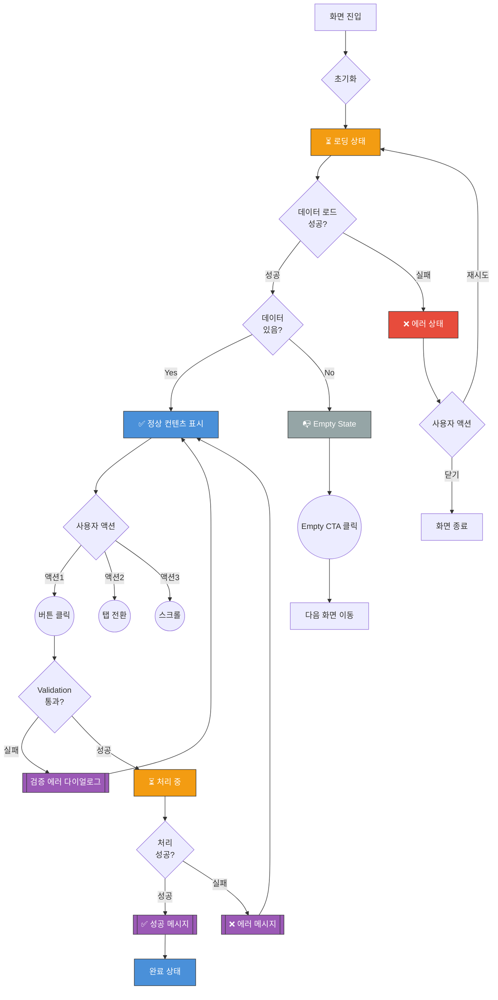

# [화면 이름] UI Flow

<!-- TODO: 화면 이름과 라우트 정보를 채워주세요 -->
**라우트**: `/path/to/screen`
**부모 화면**: 이전 화면 이름
**타입**: [메인 화면 | 모달 | 풀스크린 | 바텀시트]

## 개요

<!-- TODO: 이 화면의 목적과 주요 기능을 간단히 설명 -->
이 화면은 [사용자가 ~을 할 수 있는] 화면입니다.

---

## 전체 UI Flow



---

## 상태별 상세 설명

### 1. ⏳ 로딩 상태

**표시 조건**:
<!-- TODO: 언제 로딩 상태가 표시되는지 -->
- [ ] 화면 최초 진입 시
- [ ] 데이터 갱신 시
- [ ] 사용자 액션 처리 중

**UI 구성**:
- 로딩 스피너 위치: [상단 | 중앙 | 전체 오버레이]
- 스켈레톤 UI 사용 여부: [Yes | No]
- 로딩 텍스트: "<!-- TODO: 로딩 메시지 -->"

**timeout 처리**:
- timeout 시간: <!-- TODO: N초 -->
- timeout 시 동작: [에러 표시 | 재시도 제안]

---

### 2. ✅ 성공 상태 (정상 컨텐츠)

**표시 조건**:
<!-- TODO: 정상 데이터 표시 조건 -->
- [ ] API 응답 성공 및 데이터 존재

**UI 구성**:
<!-- TODO: 화면 구성 요소들을 나열 -->
- 헤더: [제목, 버튼 등]
- 메인 컨텐츠: [리스트 | 카드 | 폼 등]
- 푸터/액션 버튼: [버튼들]

**인터랙션 요소**:
<!-- TODO: 사용자가 클릭/입력할 수 있는 요소들 -->
1. **[버튼/링크 이름]**
   - 액션: [무엇을 하는지]
   - Validation: [있다면 검증 조건]
   - 결과: [다음 화면 | 모달 표시 | 상태 변경]

2. **[다른 인터랙션 요소]**
   - 액션:
   - Validation:
   - 결과:

---

### 3. ❌ 에러 상태

**에러 타입별 처리**:

#### 3.1 네트워크 에러
```
에러 메시지: "<!-- TODO: 실제 에러 메시지 -->"
CTA: [재시도 | 닫기]
```

#### 3.2 권한 에러
```
에러 메시지: "<!-- TODO: 실제 에러 메시지 -->"
CTA: [설정으로 이동 | 닫기]
```

#### 3.3 서버 에러 (5xx)
```
에러 메시지: "<!-- TODO: 실제 에러 메시지 -->"
CTA: [재시도 | 고객센터 문의]
```

#### 3.4 데이터 에러 (응답 파싱 실패 등)
```
에러 메시지: "<!-- TODO: 실제 에러 메시지 -->"
CTA: [재시도 | 닫기]
```

---

### 4. 📭 Empty State

**표시 조건**:
<!-- TODO: Empty State 표시 조건 -->
- [ ] 데이터 로드 성공했지만 결과 0건
- [ ] 필터링 결과 0건
- [ ] 아직 생성된 항목 없음

**UI 구성**:
- 이미지/아이콘: <!-- TODO: 어떤 이미지 -->
- 메시지: "<!-- TODO: Empty 메시지 -->"
- CTA 버튼: "<!-- TODO: 버튼 텍스트 -->"
- CTA 액션: [다음 화면으로 이동 | 생성 화면으로 이동]

---

## Validation Rules

<!-- TODO: 입력 폼이 있다면 validation 규칙 정의 -->

| 필드 이름 | Validation 규칙 | 에러 메시지 |
|----------|----------------|------------|
| 예: 이메일 | 이메일 형식, 필수 | "올바른 이메일을 입력해주세요" |
| 예: 비밀번호 | 8자 이상, 필수 | "비밀번호는 8자 이상이어야 합니다" |

---

## 모달 & 다이얼로그

<!-- TODO: 이 화면에서 표시되는 모든 모달/다이얼로그 -->

### [모달 이름]

**트리거**: <!-- 언제 표시되는지 -->
**타입**: [확인 | 안내 | 입력]

**내용**:
- 제목: "<!-- TODO -->"
- 메시지: "<!-- TODO -->"
- 버튼:
  - 주 버튼: "<!-- TODO -->" → [액션]
  - 보조 버튼: "<!-- TODO -->" → [액션]

---

## Edge Cases

<!-- TODO: 특수한 경우들을 정의 -->

### 1. [케이스 이름]
- **조건**:
- **동작**:
- **UI**:

### 2. [다른 케이스]
- **조건**:
- **동작**:
- **UI**:

---

## 개발 참고사항

<!-- TODO: 개발자를 위한 추가 정보 -->

**주요 API**:
- `GET /api/...` - 데이터 조회
- `POST /api/...` - 데이터 생성

**상태 관리**:
- 사용하는 store/context:
- 주요 상태 변수:

**Feature Flags**:
- `FLAG_NAME`: 설명

---

## 디자인 참고

<!-- TODO: Figma 링크나 디자인 노트 -->
- Figma: [링크]
- 디자인 노트:

---

## 히스토리

| 날짜 | 작성자 | 변경 내용 |
|------|--------|----------|
| YYYY-MM-DD | 이름 | 최초 작성 |
