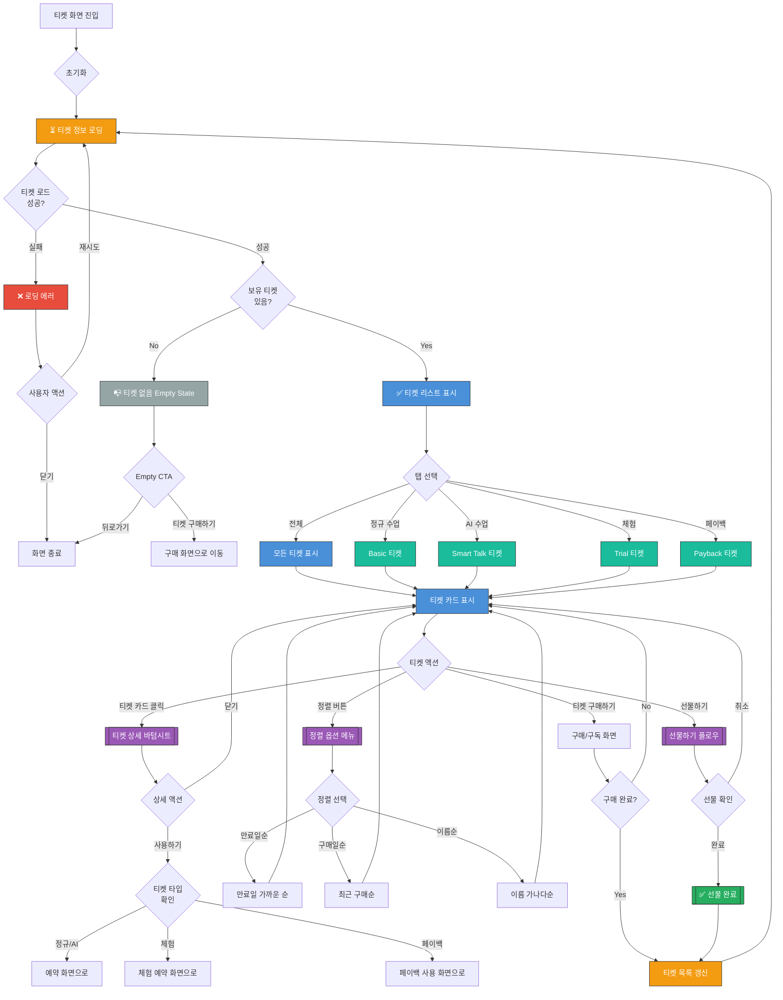

# 티켓 선택 화면 UI Flow

**라우트**: `/tickets` 또는 `/my-podo/tickets`
**부모 화면**: My Podo 또는 Home
**타입**: 풀스크린
**Figma**: [🎨 레슨권 구매 디자인](https://www.figma.com/design/DUFbC6C797d9jW5HsjFh9S/-PODO--APP-DESIGN?node-id=16011-8441)

## 개요

사용자가 보유한 수업 티켓 및 수강권을 확인하고 선택할 수 있는 화면입니다. 일반 수업권(Basic), AI 수업권(Smart Talk), 체험권(Trial), 페이백 티켓 등 다양한 티켓 타입을 지원합니다.

---

## 전체 UI Flow



---

## 상태별 상세 설명

### 1. ⏳ 로딩 상태

**표시 조건**:
- [x] 화면 최초 진입 시
- [x] 티켓 정보 갱신 시
- [x] 구매/선물 후 목록 새로고침 시

**UI 구성**:
- 로딩 스피너 위치: 전체 화면 중앙 또는 각 티켓 카드 위치에 스켈레톤
- 스켈레톤 UI 사용 여부: **Yes** - 티켓 카드 형태의 스켈레톤
- 로딩 텍스트: "티켓 정보를 불러오고 있어요..."

**timeout 처리**:
- timeout 시간: 10초
- timeout 시 동작: 에러 상태로 전환 + 재시도 버튼 제공

---

### 2. ✅ 성공 상태 (티켓 리스트 표시)

**표시 조건**:
- [x] 티켓 API 응답 성공
- [x] 1개 이상의 티켓 보유

**UI 구성**:

**헤더**:
- 타이틀: "내 티켓"
- 뒤로가기 버튼
- 정렬 버튼 (우측 상단)

**탭 바** (선택 사항):
- 전체 | 정규 수업 | AI 수업 | 체험 | 페이백
- 각 탭에 보유 개수 표시 (예: "정규 수업 (5)")

**티켓 카드 리스트**:
각 티켓 카드는 다음 정보를 포함:

1. **정규 수업권 카드 (Basic)**
   - 티켓 이름: "1개월 정규 수업권"
   - 남은 수업 횟수: "12회 남음"
   - 만료일: "2026-04-04까지"
   - 상태 뱃지: "사용 가능" (초록) / "만료 임박" (주황) / "만료됨" (회색)
   - 사용하기 버튼

2. **AI 수업권 카드 (Smart Talk)**
   - 티켓 이름: "Smart Talk 무제한"
   - 사용 가능 기간: "2026-03-04 ~ 2026-04-04"
   - AI 캐릭터 아이콘
   - 사용하기 버튼

3. **체험권 카드 (Trial)**
   - 티켓 이름: "무료 체험 수업권"
   - 남은 횟수: "1회"
   - 유효 기간: "발급일로부터 7일"
   - 사용하기 버튼

4. **페이백 티켓**
   - 티켓 이름: "페이백 티켓"
   - 페이백 금액: "5,000원"
   - 사용 조건: "다음 결제 시 자동 차감"
   - 상태: "사용 가능" / "사용됨"

**푸터 영역**:
- "티켓 구매하기" 버튼 (고정 하단 버튼)

**인터랙션 요소**:

1. **티켓 카드 클릭**
   - 액션: 티켓 상세 바텀시트 표시
   - Validation: 없음
   - 결과: 티켓 상세 정보 + 사용하기/선물하기 옵션

2. **사용하기 버튼**
   - 액션: 해당 티켓으로 수업 예약 플로우 시작
   - Validation: 티켓 만료일, 남은 횟수 확인
   - 결과: 예약 화면으로 이동 (티켓 ID 전달)

3. **정렬 버튼**
   - 액션: 정렬 옵션 메뉴 표시
   - Validation: 없음
   - 결과: 만료일순/구매일순/이름순 정렬 적용

4. **선물하기 버튼** (상세 바텀시트 내)
   - 액션: 티켓 선물 플로우 시작
   - Validation: 선물 가능한 티켓인지 확인
   - 결과: 선물 받을 사람 선택 화면

5. **티켓 구매하기 버튼**
   - 액션: 구독/구매 화면으로 이동
   - Validation: 없음
   - 결과: 구독 플랜 선택 화면 또는 티켓 구매 화면

---

### 3. ❌ 에러 상태

**에러 타입별 처리**:

#### 3.1 네트워크 에러
```
에러 메시지: "티켓 정보를 불러올 수 없어요. 네트워크 연결을 확인해주세요."
CTA: [재시도 | 닫기]
```

#### 3.2 서버 에러 (5xx)
```
에러 메시지: "일시적인 오류가 발생했어요. 잠시 후 다시 시도해주세요."
CTA: [재시도 | 고객센터 문의]
```

#### 3.3 권한 에러
```
에러 메시지: "티켓 정보에 접근할 수 없어요. 다시 로그인해주세요."
CTA: [로그인 화면으로]
```

#### 3.4 티켓 사용 불가 에러
```
에러 메시지: "이 티켓은 현재 사용할 수 없어요. (만료됨 또는 이미 사용됨)"
타입: 토스트 메시지
CTA: 자동으로 리스트로 복귀
```

---

### 4. 📭 Empty State

**표시 조건**:
- [x] API 응답 성공했지만 보유한 티켓이 0개
- [x] 필터링/탭 선택 결과 0건

**UI 구성**:

**시나리오 1: 전체 티켓 없음**
- 이미지/아이콘: 빈 티켓 일러스트레이션
- 메시지:
  - 주 메시지: "아직 보유한 티켓이 없어요"
  - 보조 메시지: "티켓을 구매하고 수업을 시작해보세요!"
- CTA 버튼: "티켓 구매하기" → 구독/구매 화면으로 이동

**시나리오 2: 특정 탭에만 티켓 없음**
- 이미지/아이콘: 작은 아이콘
- 메시지: "해당 타입의 티켓이 없어요"
- CTA 버튼: "다른 티켓 보기" → 전체 탭으로 전환

---

## Validation Rules

| 동작 | Validation 규칙 | 에러 메시지 |
|------|----------------|------------|
| 티켓 사용 | 만료일 확인 | "만료된 티켓은 사용할 수 없어요." |
| 티켓 사용 | 남은 횟수 확인 | "남은 횟수가 없는 티켓이에요." |
| 티켓 선물 | 선물 가능 여부 확인 | "이 티켓은 선물할 수 없어요." |
| 티켓 선물 | 사용 전 티켓만 가능 | "이미 사용 중인 티켓은 선물할 수 없어요." |

---

## 모달 & 다이얼로그

### 1. 티켓 상세 바텀시트

**트리거**: 티켓 카드 클릭
**타입**: 바텀시트

**내용**:
- 제목: 티켓 이름 (예: "1개월 정규 수업권")
- 상세 정보:
  - 구매일: "2026-03-01"
  - 만료일: "2026-04-01"
  - 남은 횟수: "12회"
  - 사용 조건: "월 12회까지 수업 가능"
  - 환불 정책: "환불 불가" 또는 환불 조건 표시
- 버튼:
  - 주 버튼: "사용하기" → 예약 화면으로 이동
  - 보조 버튼 1: "선물하기" → 선물 플로우 (선물 가능한 경우만)
  - 보조 버튼 2: "닫기" → 바텀시트 닫기

### 2. 정렬 옵션 메뉴

**트리거**: 정렬 버튼 클릭
**타입**: 바텀시트 또는 드롭다운

**내용**:
- 옵션:
  - "만료일 가까운 순" (기본 선택)
  - "최근 구매순"
  - "이름 가나다순"
- 현재 선택된 항목에 체크 표시

### 3. 선물하기 확인 다이얼로그

**트리거**: 선물하기 플로우 완료 직전
**타입**: 확인

**내용**:
- 제목: "티켓을 선물하시겠어요?"
- 메시지:
  - "받는 사람: 홍길동 (010-1234-5678)"
  - "티켓: 1개월 정규 수업권"
  - "선물하면 내 계정에서 티켓이 제거돼요."
- 버튼:
  - 주 버튼: "선물하기" → API 호출 + 성공 토스트
  - 보조 버튼: "취소" → 다이얼로그 닫기

### 4. 만료 임박 안내 다이얼로그

**트리거**: 만료일이 3일 이내인 티켓이 있을 경우 화면 진입 시 자동 표시
**타입**: 안내

**내용**:
- 제목: "만료 임박 티켓이 있어요! ⏰"
- 메시지: "3일 이내에 만료되는 티켓이 2개 있어요. 빨리 사용해보세요!"
- 티켓 목록:
  - "1개월 정규 수업권 (3일 남음)"
  - "무료 체험권 (1일 남음)"
- 버튼:
  - 주 버튼: "지금 사용하기" → 첫 번째 만료 임박 티켓 선택
  - 보조 버튼: "확인" → 다이얼로그 닫기

---

## Edge Cases

### 1. 만료된 티켓과 유효한 티켓이 섞여 있을 때

- **조건**: 만료된 티켓도 리스트에 표시
- **동작**:
  - 만료된 티켓은 회색 처리 (opacity 0.5)
  - "만료됨" 뱃지 표시
  - 사용하기 버튼 비활성화
  - 클릭 시 "만료된 티켓이에요" 토스트
- **UI**: 회색 카드 + 만료됨 뱃지

### 2. 동일한 타입의 티켓을 여러 개 보유

- **조건**: 같은 이름의 티켓 2개 이상
- **동작**:
  - 만료일이 가까운 순서대로 정렬
  - 각 카드에 "1/3" (3개 중 1번째) 표시
  - 상세 보기에서 "다른 티켓 보기" 버튼 제공
- **UI**: 카드 우측 상단에 "1/3" 뱃지

### 3. 페이백 티켓 자동 사용 조건

- **조건**: 페이백 티켓 보유 + 새 구매 시도
- **동작**:
  - 결제 화면에서 페이백 자동 적용 안내
  - "5,000원 페이백 티켓이 자동 적용돼요" 메시지
  - 사용자가 수동으로 해제 가능
- **UI**: 결제 화면에 페이백 적용 섹션

### 4. 티켓 선물 후 취소 요청

- **조건**: 선물한 티켓을 다시 돌려받고 싶은 경우
- **동작**:
  - 선물 후 24시간 이내만 취소 가능
  - 받는 사람이 아직 사용하지 않은 경우만
  - 고객센터 문의 안내
- **UI**: "선물 취소는 고객센터로 문의해주세요" 안내

### 5. 체험권 중복 발급 방지

- **조건**: 이미 체험권을 사용한 이력이 있는 사용자
- **동작**:
  - 체험권 재발급 불가
  - "이미 체험 수업을 이용하셨어요" 메시지
- **UI**: 체험권 섹션에 안내 메시지

---

## 개발 참고사항

**주요 API**:
- `GET /api/tickets` - 보유 티켓 목록 조회
- `GET /api/tickets/:id` - 티켓 상세 조회
- `POST /api/tickets/:id/use` - 티켓 사용 (예약과 연동)
- `POST /api/tickets/:id/gift` - 티켓 선물하기
- `DELETE /api/tickets/:id` - 티켓 삭제 (환불 시)

**상태 관리**:
- 사용하는 store/context: TicketContext, UserContext
- 주요 상태 변수:
  - `tickets`: 티켓 배열
  - `selectedTab`: 현재 선택된 탭 ('all' | 'regular' | 'ai' | 'trial' | 'payback')
  - `sortBy`: 정렬 기준 ('expiry' | 'purchase' | 'name')
  - `isLoading`: 로딩 상태
  - `error`: 에러 메시지

**티켓 타입 정의**:
```typescript
type TicketType = 'regular' | 'ai' | 'trial' | 'payback';

interface Ticket {
  id: string;
  name: string;
  type: TicketType;
  remainingCount?: number; // 남은 횟수 (회차권인 경우)
  expiryDate: string; // ISO 8601
  purchaseDate: string;
  status: 'active' | 'expiring_soon' | 'expired' | 'used';
  isGiftable: boolean; // 선물 가능 여부
}
```

**Feature Flags**:
- `ENABLE_TICKET_GIFT`: 티켓 선물 기능 활성화
- `ENABLE_PAYBACK_TICKETS`: 페이백 티켓 기능 활성화
- `SHOW_EXPIRED_TICKETS`: 만료된 티켓 표시 여부

---

## 디자인 참고

<!-- TODO: Figma 링크나 디자인 노트 -->
- Figma: [링크 추가 필요]
- 디자인 노트:
  - 티켓 카드는 타입별로 색상 구분 (정규: 파랑, AI: 보라, 체험: 초록, 페이백: 주황)
  - 만료 임박 티켓은 주황색 테두리로 강조
  - 카드 그림자 효과로 입체감 표현

---

## 히스토리

| 날짜 | 작성자 | 변경 내용 |
|------|--------|----------|
| 2026-03-04 | Claude | 최초 작성 |
