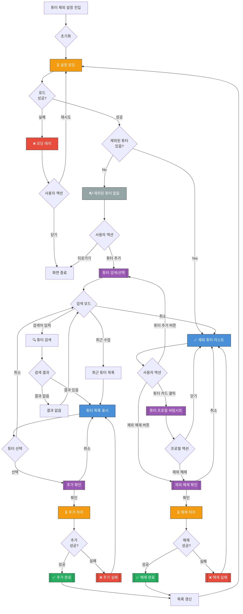

# 튜터 제외 설정 화면 UI Flow

**라우트**: `/my-podo/tutor-exclusion`
**부모 화면**: My Podo 설정
**타입**: 풀스크린

## 개요

사용자가 특정 튜터를 수업 매칭에서 제외할 수 있는 화면입니다. 원하지 않는 튜터와의 수업을 방지합니다.

---

## 전체 UI Flow



---

## 상태별 상세 설명

### 1. ⏳ 로딩 상태

**표시 조건**:
- [x] 화면 최초 진입 시
- [x] 튜터 추가/해제 후 갱신 시

**UI 구성**:
- 로딩 스피너 위치: 전체 화면 중앙 또는 스켈레톤
- 스켈레톤 UI 사용 여부: **Yes** - 튜터 카드 스켈레톤
- 로딩 텍스트: "설정을 불러오고 있어요..."

**timeout 처리**:
- timeout 시간: 10초
- timeout 시 동작: 에러 상태로 전환

---

### 2. ✅ 성공 상태 (제외 튜터 리스트)

**표시 조건**:
- [x] API 응답 성공
- [x] 1명 이상의 제외된 튜터 존재

**UI 구성**:

**헤더**:
- 타이틀: "튜터 제외 설정"
- 뒤로가기 버튼

**안내 메시지**:
- "제외한 튜터는 수업 매칭 시 자동으로 제외돼요"
- "최대 10명까지 제외할 수 있어요 (현재 3/10)"

**제외된 튜터 리스트**:
각 튜터 카드는 다음 정보를 포함:

1. **튜터 카드**
   - 프로필 사진
   - 이름: "Sarah Kim"
   - 국적: 🇺🇸 미국
   - 간단 소개: "5년 경력의 영어 전문 강사"
   - 제외 일시: "2026-03-01 제외"
   - 제외 사유 (선택): "수업 스타일이 맞지 않음"
   - 버튼:
     - "제외 해제" (빨간색 테두리)
     - "프로필 보기"

**푸터 고정 버튼**:
- "튜터 추가" 버튼

**인터랙션 요소**:

1. **튜터 추가 버튼**
   - 액션: 튜터 검색/선택 바텀시트 표시
   - Validation: 최대 10명 제한 확인
   - 결과: 튜터 검색 → 선택 → 추가 완료

2. **제외 해제 버튼**
   - 액션: 제외 해제 확인 다이얼로그 표시
   - Validation: 없음
   - 결과: 해제 완료 + 목록 갱신

3. **프로필 보기 버튼**
   - 액션: 튜터 프로필 바텀시트 표시
   - Validation: 없음
   - 결과: 튜터 상세 정보 + 제외 해제 옵션

4. **튜터 카드 클릭**
   - 액션: 프로필 보기와 동일
   - Validation: 없음
   - 결과: 바텀시트 표시

---

### 3. ❌ 에러 상태

**에러 타입별 처리**:

#### 3.1 네트워크 에러
```
에러 메시지: "설정을 불러올 수 없어요. 네트워크를 확인해주세요."
CTA: [재시도 | 닫기]
```

#### 3.2 최대 제외 인원 초과
```
에러 메시지: "튜터는 최대 10명까지 제외할 수 있어요."
타입: 토스트 메시지
```

#### 3.3 이미 제외된 튜터
```
에러 메시지: "이미 제외된 튜터예요."
타입: 토스트 메시지
```

#### 3.4 튜터 추가 실패
```
에러 메시지: "튜터를 추가할 수 없어요. 다시 시도해주세요."
타입: 토스트 메시지
```

---

### 4. 📭 Empty State

**표시 조건**:
- [x] 제외된 튜터가 0명

**UI 구성**:
- 이미지/아이콘: 빈 리스트 일러스트
- 메시지:
  - 주: "제외한 튜터가 없어요"
  - 보조: "원하지 않는 튜터를 제외하고 더 나은 수업을 만들어보세요"
- CTA 버튼: "튜터 추가하기"

---

## 튜터 검색/선택 바텀시트

**UI 구성**:

**헤더**:
- 제목: "튜터 선택"
- 닫기 버튼

**탭**:
- 검색 | 최근 수업 튜터

**검색 탭**:
- 검색창: "튜터 이름으로 검색"
- 검색 결과 리스트:
  - 튜터 프로필 사진 + 이름 + 국적
  - 간단 소개
  - "선택" 버튼

**최근 수업 탭**:
- 최근 수업한 튜터 목록 (최근 30일)
- 각 튜터:
  - 프로필 사진 + 이름 + 국적
  - 마지막 수업일: "2026-03-01"
  - "선택" 버튼

---

## Validation Rules

| 동작 | Validation 규칙 | 에러 메시지 |
|------|----------------|------------|
| 튜터 추가 | 최대 10명 제한 | "튜터는 최대 10명까지 제외할 수 있어요." |
| 튜터 추가 | 중복 추가 불가 | "이미 제외된 튜터예요." |
| 검색 | 최소 2자 이상 | "2자 이상 입력해주세요." |

---

## 모달 & 다이얼로그

### 1. 튜터 추가 확인 다이얼로그

**트리거**: 튜터 선택 후 "선택" 버튼 클릭
**타입**: 확인

**내용**:
- 제목: "이 튜터를 제외하시겠어요?"
- 튜터 정보:
  - 프로필 사진
  - 이름: "Sarah Kim"
  - 국적: "🇺🇸 미국"
- 메시지: "이 튜터는 앞으로 수업 매칭에서 제외돼요."
- 제외 사유 선택 (선택 사항):
  - 드롭다운 또는 버튼:
    - "수업 스타일이 맞지 않음"
    - "시간대가 맞지 않음"
    - "개인적인 사유"
    - "기타"
- 버튼:
  - 주 버튼: "제외하기" → 튜터 추가 처리
  - 보조 버튼: "취소" → 다이얼로그 닫기

### 2. 제외 해제 확인 다이얼로그

**트리거**: "제외 해제" 버튼 클릭
**타입**: 확인

**내용**:
- 제목: "제외를 해제하시겠어요?"
- 튜터 정보:
  - 이름: "Sarah Kim"
- 메시지: "이 튜터가 다시 수업 매칭에 포함돼요."
- 버튼:
  - 주 버튼: "해제하기" → 제외 해제 처리
  - 보조 버튼: "취소" → 다이얼로그 닫기

### 3. 튜터 프로필 바텀시트

**트리거**: "프로필 보기" 버튼 또는 튜터 카드 클릭
**타입**: 바텀시트

**내용**:
- 튜터 프로필 사진
- 이름 + 국적
- 자기소개
- 경력: "5년"
- 전문 분야: "비즈니스 영어, 발음 교정"
- 수업 스타일: "친절하고 편안한 분위기"
- 제외 일시: "2026-03-01 제외"
- 제외 사유: "수업 스타일이 맞지 않음"
- 버튼:
  - 주 버튼: "제외 해제" → 제외 해제 확인 다이얼로그
  - 보조 버튼: "닫기" → 바텀시트 닫기

### 4. 성공 토스트

**트리거**: 튜터 추가/해제 성공 시
**타입**: 토스트 (3초 자동 사라짐)

**내용**:
- 추가 시: "튜터가 제외되었어요"
- 해제 시: "제외가 해제되었어요"

---

## Edge Cases

### 1. 제외 인원 한도 도달

- **조건**: 이미 10명 제외됨
- **동작**: 추가 버튼 비활성화
- **UI**: "최대 10명까지 제외할 수 있어요 (10/10)" + 회색 버튼

### 2. 현재 예약된 수업의 튜터 제외

- **조건**: 예약된 수업이 있는 튜터
- **동작**: 경고 메시지 표시
- **UI**: "이미 예약된 수업은 유지돼요. 새 수업부터 제외됩니다."

### 3. 튜터 제외 후 즉시 재매칭

- **조건**: 제외 직후 수업 예약 시도
- **동작**: 제외된 튜터는 매칭 대상에서 제외
- **UI**: 매칭 화면에서 해당 튜터 안 보임

### 4. 모든 튜터 제외 시도

- **조건**: 사용 가능한 튜터를 모두 제외
- **동작**: 경고 메시지
- **UI**: "일부 튜터를 제외 해제해야 수업을 예약할 수 있어요."

### 5. 제외 사유 통계

- **조건**: 관리자 목적
- **동작**: 제외 사유 데이터 수집
- **UI**: 사용자에게는 노출되지 않음 (백엔드 처리)

---

## 개발 참고사항

**주요 API**:
- `GET /api/tutor-exclusion` - 제외 튜터 목록 조회
- `POST /api/tutor-exclusion` - 튜터 제외 추가
- `DELETE /api/tutor-exclusion/:tutorId` - 제외 해제
- `GET /api/tutors/search?q=이름` - 튜터 검색
- `GET /api/tutors/recent` - 최근 수업 튜터 조회

**상태 관리**:
- 사용하는 store/context: TutorExclusionContext, TutorContext
- 주요 상태 변수:
  - `excludedTutors`: 제외된 튜터 배열
  - `excludedCount`: 제외된 튜터 수
  - `maxExcludedCount`: 최대 제외 가능 수 (10)
  - `isLoading`: 로딩 상태

**제외 튜터 데이터 구조**:
```typescript
interface ExcludedTutor {
  tutorId: string;
  tutorName: string;
  tutorProfileImage: string;
  tutorNationality: string;
  tutorIntro: string;
  excludedAt: string; // ISO 8601
  excludeReason?: string; // 제외 사유
}
```

**Feature Flags**:
- `ENABLE_TUTOR_EXCLUSION`: 튜터 제외 기능 활성화
- `ENABLE_EXCLUDE_REASON`: 제외 사유 수집 기능

---

## 디자인 참고

- Figma: [링크 추가 필요]
- 디자인 노트:
  - 제외 해제 버튼은 빨간색 테두리 (경고 느낌)
  - 튜터 카드는 프로필 중심 디자인
  - 제외 사유는 선택 사항이지만 수집 권장

---

## 히스토리

| 날짜 | 작성자 | 변경 내용 |
|------|--------|----------|
| 2026-03-04 | Claude | 최초 작성 |
