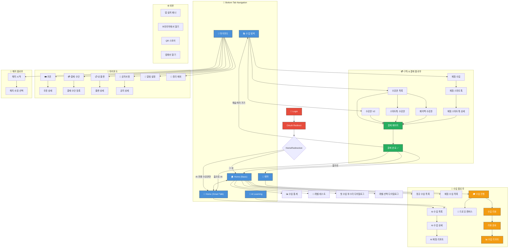

# Podo App - Screen Flow Diagram

## 전체 화면 플로우



## 핵심 사용자 플로우 요약

### 1. 신규 유저 플로우
```
Login → Home → 수업 탐색 → 체험 수업 선택 → 결제 → 예약 → 수업 진행 → 리뷰
```

### 2. 기존 유저 - 정규 수업
```
Home → 정규 수업 목록 → 예약 → 수업 진행 → 리뷰 → 리포트
```

### 3. AI 스마트톡 플로우
```
Home(AI) → AI 수업 목록 → AI 수업 상세 → 스마트톡 수강권 → 결제
```

### 4. 마이페이지 플로우
```
마이포도 → 내 플랜 / 쿠폰 / 결제수단 / 알림설정 / 튜터제외
         → 해지 → 해지 사유
```

## 라우트 - 화면 매핑 테이블

| 화면 | 라우트 | 설명 |
|------|--------|------|
| Login | `/login` | 로그인 |
| Home (Basic) | `/home` | 기본 홈 |
| Home (Smart Talk) | `/home/ai` | AI 홈 |
| 수업 탐색 | `/subscribes` | 구독/수업 탐색 |
| 수강권 목록 | `/subscribes/tickets` | 수강권 패키지 |
| 수강권 V2 | `/subscribes/tickets-v2` | 새 수강권 UI |
| 스마트톡 수강권 | `/subscribes/tickets/smart-talk` | AI 수강권 |
| 페이백 수강권 | `/subscribes/tickets/payback` | 페이백 옵션 |
| 체험 수업 | `/subscribes/trial` | 무료 체험 |
| 체험 스마트톡 | `/subscribes/trial/smart-talk` | AI 무료 체험 |
| 결제 | `/subscribes/payment/[id]` | 결제 페이지 |
| 결제 완료 | `/subscribes/payment/[id]/success` | 결제 확인 |
| 예약 | `/reservation` | 수업 예약 |
| 정규 수업 | `/lessons/regular` | 정규 수업 목록 |
| 체험 수업 | `/lessons/trial` | 체험 수업 목록 |
| AI 수업 | `/lessons/ai` | AI 수업 목록 |
| AI 수업 상세 | `/lessons/ai/[id]` | AI 코스 상세 |
| AI 체험 리포트 | `/lessons/ai/trial-report/[uuid]` | AI 체험 결과 |
| 수업 진행 | `/lessons/classroom/[id]` | 수업 화면 |
| 드로잉 | `/drawing/[id]` | 드로잉 캔버스 |
| 수업 리뷰 | `/lessons/classroom/[id]/review` | 수업 후기 |
| 리뷰 완료 | `/lessons/classroom/[id]/review-complete` | 후기 완료 |
| 수업 리포트 | `/lessons/classroom/[id]/report` | 수업 분석 |
| AI Learning | `/ai-learning` | AI 학습 허브 |
| 마이포도 | `/my-podo` | 마이페이지 |
| 쿠폰 | `/my-podo/coupon` | 쿠폰 목록 |
| 쿠폰 상세 | `/my-podo/coupon/[id]` | 쿠폰 상세 |
| 결제 수단 | `/my-podo/payment-methods` | 결제 수단 관리 |
| 결제 수단 등록 | `/my-podo/payment-methods/register` | 카드 등록 |
| 내 플랜 | `/my-podo/plan` | 구독 현황 |
| 플랜 상세 | `/my-podo/plan/[id]` | 구독 상세 |
| 공지사항 | `/my-podo/notices` | 공지 목록 |
| 공지 상세 | `/my-podo/notices/[id]` | 공지 내용 |
| 알림 설정 | `/my-podo/notification-settings` | 알림 설정 |
| 튜터 제외 | `/my-podo/tutor-exclusion` | 튜터 차단 |
| 수업 통계 | `/class-report` | 전체 수업 통계 |
| 레벨 테스트 | `/selftest` | 영어 레벨 측정 |
| 해지 | `/podo/churn` | 해지 시작 |
| 해지 사유 | `/podo/churn/quit-reason` | 해지 이유 선택 |

## Feature Flags
- `RESERVATION_MIGRATION`: `/booking` ↔ `/reservation` 전환
- `PODOLINGO_ENABLED`: AI Learning 탭 표시 여부
- `ENABLE_REACT_HOME`: 홈 구현체 전환
